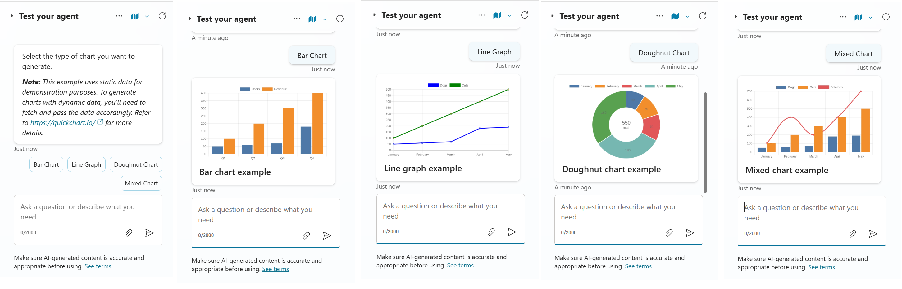

# Chart in Copilot

This snippet demonstrates how to render charts in Copilot agents using an HTTP based chart rendering API.

> [!IMPORTANT]
> **This example uses an open source [QuickChart](https://quickchart.io) HTTP based chart rendering API. If you don't prefer to use a third-party service, you can implement your own API. The custom API should accept chart related data via an HTTP URL and return the chart as an image..**

## Authors

Snippet|Author(s)
--------|---------
Chart Topic | [Shrutika Patil](https://github.com/shrutika-patil20) ([@Shrutika Patil](https://www.linkedin.com/in/shrutikamendhe) )

## Minimal path to awesome

1. Open a copilot in **Copilot Studio**
1. Select **Topics**
1. Select **+ Add a topic**
1. Select **Create from blank**
1. Select the **...** in the upper right corner and select **Open code editor**
1. Click inside the code editor and **CTL + A for Windows** or **Command-A** for Mac to select all rows.
1. Paste the contents of the **[YAML-file](./source/chart.yaml)** inside the code editor.
1. Enter a **Name** for your Topic.
1. Select **Save**

## Disclaimer

**THIS CODE IS PROVIDED *AS IS* WITHOUT WARRANTY OF ANY KIND, EITHER EXPRESS OR IMPLIED, INCLUDING ANY IMPLIED WARRANTIES OF FITNESS FOR A PARTICULAR PURPOSE, MERCHANTABILITY, OR NON-INFRINGEMENT.**

