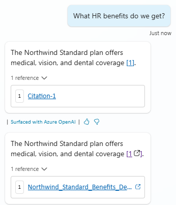

# Citations (Topic)

This snippet demonstrates how you can generate better looking citations in Copilot Studio for [uploaded documents](https://learn.microsoft.com/microsoft-copilot-studio/nlu-documents).

This allows to both display a **title** for the document, but also to point to a **URL** when the citation link is clicked, for example to download or open the document.

> [!IMPORTANT]
> **This assumes that you're responsibe for storing the files in a location where they are accessible to your users, when clicked.**

The sample works both for uploaded files and other knowledge sources (e.g. public website, SharePoint / OneDrive).

With this sample, you have two options, that can be used indepently from each other:
1. Set a URL pointing to a folder where files are expected to be available to your users, when no URLs are available. For this, set the URL for your base folder in `Topic.UploadedFilesRootUrl`.
1. Set a mapping between each document and a URL location for the file. For this, udpdated the `Topic.FilesSources` table. Make sure that each file name is encoded in the same way as returned as citation when an answer is generated (e.g. use %20 instead of spaces, etc.)

The bottom message in the image above is an example of how the citations would look after using this snippet.

## Authors

Snippet|Author(s)
--------|---------
Citations (Topic) | [Henry Jammes](https://github.com/HenryJammes) ([@HenryJammes](https://www.twitter.com/HenryJammes))

## Minimal path to awesome

1. Open a copilot in **Copilot Studio**
1. Select **Topics**
1. Select **System**
1. Select **Conversational boosting**
1. Select the **... More** in the upper right corner and select **Open code editor**
1. Click inside the code editor and **CTL + A for Windows** or **Command-A** for Mac to select all rows.
1. Paste the contents of the **[YAML-file](./source/citations.yaml)** inside the code editor.
1. Select **Close code editor**
1. If you're using a folder to store all of your documents, set the URL for your base folder in the `Topic.UploadedFilesRootUrl` string variable.
1. If you're using a different locations for each file, update the `Topic.FilesSources` table variable accordingly.
1. **Save**

## Disclaimer

**THIS CODE IS PROVIDED *AS IS* WITHOUT WARRANTY OF ANY KIND, EITHER EXPRESS OR IMPLIED, INCLUDING ANY IMPLIED WARRANTIES OF FITNESS FOR A PARTICULAR PURPOSE, MERCHANTABILITY, OR NON-INFRINGEMENT.**

