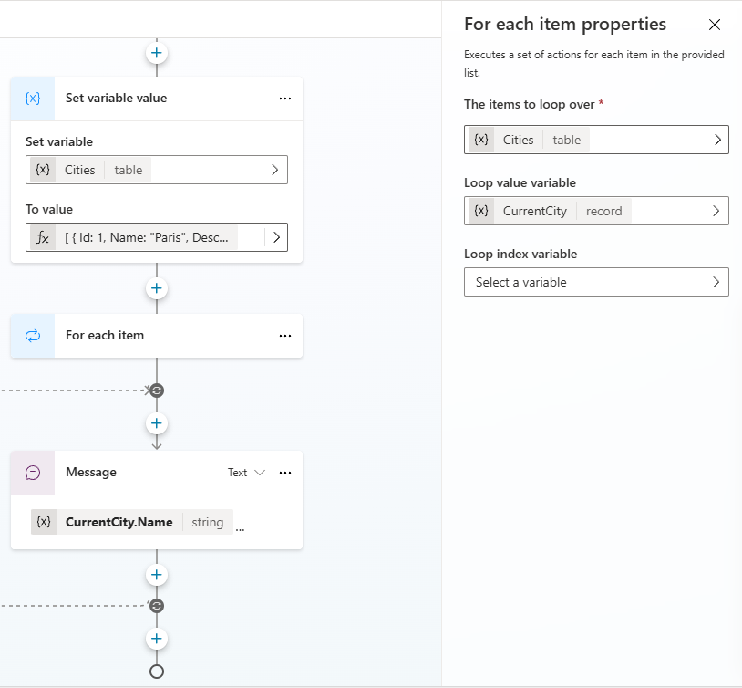

# Foreach Snippet (Topic)

This is a snippet that demonstrates how to do a foreach loop in Copilot Studio.

## Minimal path to awesome

1. Open a copilot in **Copilot Studio**
1. Select **Topics**
1. Select **+ Create**
1. Select **Topic**
1. Select **Create from blank**
1. Select the **...** in the upper right corner and select **Open code editor**
1. Click inside the code editor and **CTL + A for Windows** or **Command-A** for Mac to select all rows.
1. Paste the contents of the **[YAML-file](./source/foreach.yaml)** inside the code editor.
1. Enter a **Name** for your Topic.
1. Select **Save**

    

