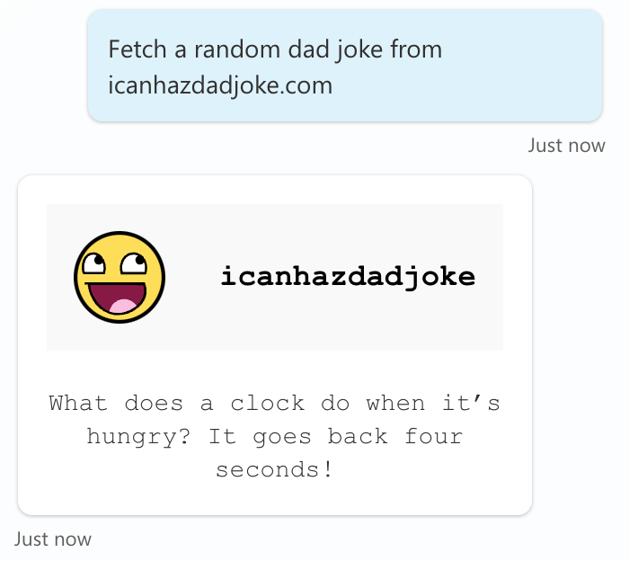

# icanhazdadjoke - Fetch a random dad joke (Action with Adaptive Card)

This is a snippet that demonstrates how to use the icanhazdadjoke - fetch a random dad joke action in an action. It uses an adaptive card as an output.

## Authors

Snippet|Author(s)
--------|---------
icanhazdadjoke - Fetch a random dad joke (Action with Adaptive Card) | [Daniel Laskewitz](https://github.com/laskewitz) ([@laskewitz](https://www.twitter.com/laskewitz))

## Minimal path to awesome

1. Open a copilot in **Copilot Studio**
1. Select **Actions**
1. Select **+ Add an action**
1. Search for **Fetch a random dad joke** and select the **Search** button
1. Select the **Fetch a random dad joke** action from the **icanhazdadjoke (Independent Publisher)** connector
1. Scroll down a little and select **Copilot author authentication** under **End user authentication**
1. Select **Next**
1. Select **Finish**
1. Select the **icanhazdadjoke (Independent Publisher) - Fetch a random dad joke** action in the list (select the name)
1. Select **... More**  in the upper right corner and select **Open code editor**
1. Make sure to copy the **name** of the **connection reference** and keep it somewhere safe (you need it later)

    

1. Replace the code in the code editor with the contents of the **[YAML-file](./source/dadjoke-ac.yaml)**
1. Replace **{ REPLACE-WITH-CONNECTION-REFERENCE-NAME }** with the **connection reference name** you copied earlier
1. Save the **action**
1. Select **Generative AI**
1. Scroll down to **Dynamic Chaining with generative actions (preview)** and enable it by flipping the toggle on
1. Test out the **action** by using the **Test copilot** pane

    

## Disclaimer

**THIS CODE IS PROVIDED *AS IS* WITHOUT WARRANTY OF ANY KIND, EITHER EXPRESS OR IMPLIED, INCLUDING ANY IMPLIED WARRANTIES OF FITNESS FOR A PARTICULAR PURPOSE, MERCHANTABILITY, OR NON-INFRINGEMENT.**

