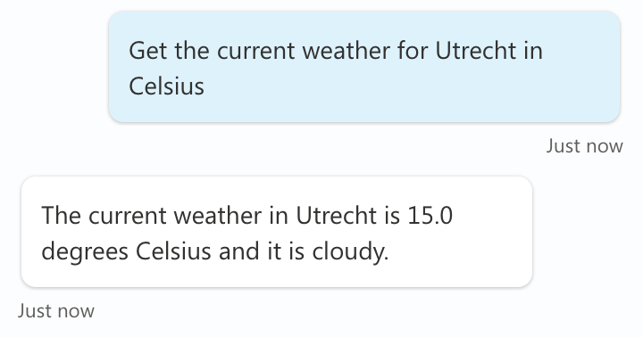
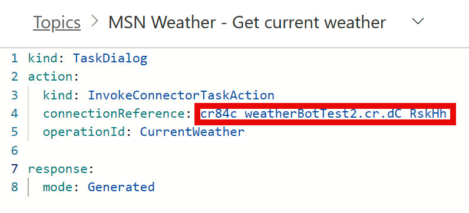

# MSN Weather - Current Weather (Action with AI Generated Message)

This is a snippet that demonstrates how to use the MSN Weather - Get current weather action in a plugin action. It uses the AI generated text as output.

## Authors

Snippet|Author(s)
--------|---------
MSN Weather - Current Weather (Action with AI Generated Message) | [Daniel Laskewitz](https://github.com/laskewitz) ([@laskewitz](https://www.twitter.com/laskewitz))

## Minimal path to awesome

1. Open a copilot in **Copilot Studio**
1. Select **Actions**
1. Select **+ Add an action**
1. Search for **Get Current Weather** and select the **Search** button
1. Select the **Get Current Weather** action from the **MSN Weather** connector
1. Select **Next**
1. Select **Finish**
1. Select the **MSN Weather - Get Current Weather** action in the list (select the name)
1. Select the **...** in the upper right corner and select **Open code editor**
1. Make sure to copy the **name** of the **connection reference**

    

1. Paste the contents of the **[YAML-file](./source/weather.yaml)** in the code editor
1. Replace **{ REPLACE-WITH-CONNECTION-REFERENCE-NAME }** with the **connection reference name** you copied two steps earlier
1. Save the **action**
1. Select **Generative AI**
1. Scroll down to **Dynamic Chaining with generative actions (preview)** and enable it by flipping the toggle on
1. Test out the **action** by using the **Test copilot** pane

## Disclaimer

**THIS CODE IS PROVIDED *AS IS* WITHOUT WARRANTY OF ANY KIND, EITHER EXPRESS OR IMPLIED, INCLUDING ANY IMPLIED WARRANTIES OF FITNESS FOR A PARTICULAR PURPOSE, MERCHANTABILITY, OR NON-INFRINGEMENT.**

