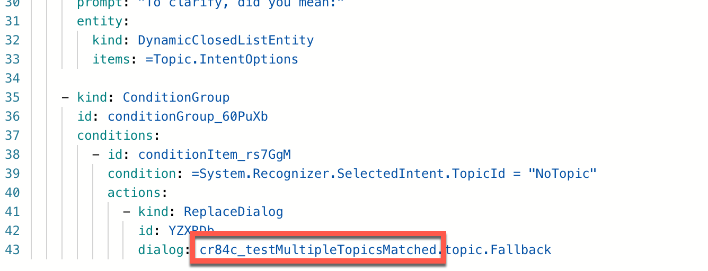
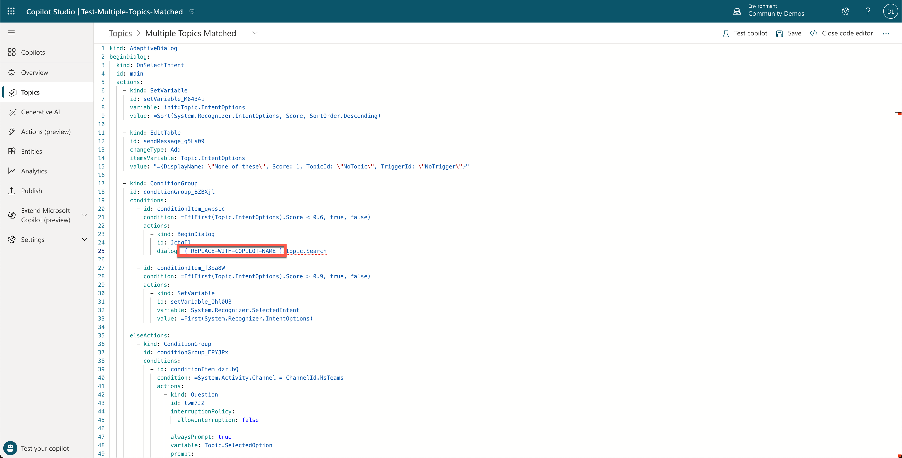
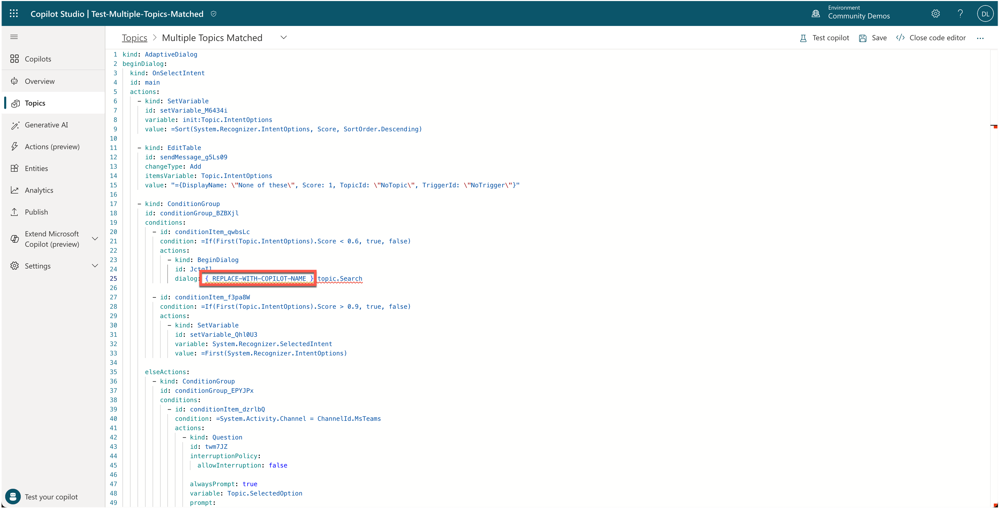

# Multiple Topics Matched

This is a snippet that demonstrates how you can provide the user of your copilot the option to select a topic when multiple topics are triggered. In this topic, an adaptive card will be sent to the user, so that the user can select the topic they want to trigger.

## Minimal path to awesome

1. Open a copilot in **Copilot Studio**.
1. Select **Generative AI**.
1. Scroll down to the **Use AI features in your copilot section** and select the toggle in the **Boost conversational coverage with generative answers** to turn that feature on.

    

1. Select **Save** at the top.
1. Select **Topics**.
1. Select **System**.
1. Select the **Multiple Topics Matched** topic by selecting the name.
1. Select the **...** in the upper right corner and select **Open code editor**.
1. At the bottom line of the code editor, you should see the internal name of the copilot. Copy the internal name of the copilot and save it temporarily in a place where you can easily copy it from later on (for instance in notepad). 

    NOTE: only copy the part before `.topic.Fallback`. 

    

1. Paste the contents of the **[YAML-file](./source/multiple-topics-matched.yaml)** inside the code editor.

    

1. Replace **{ REPLACE-WITH-COPILOT-NAME }** on line 26 with the internal name of your copilot we just copied to notepad.

    

1. Replace  **{ REPLACE-WITH-COPILOT-NAME }** on line 145 with the internal name of your copilot we just copied to notepad as well.
1. Select **Save** to save the **Multiple Topics Matched** topic.
