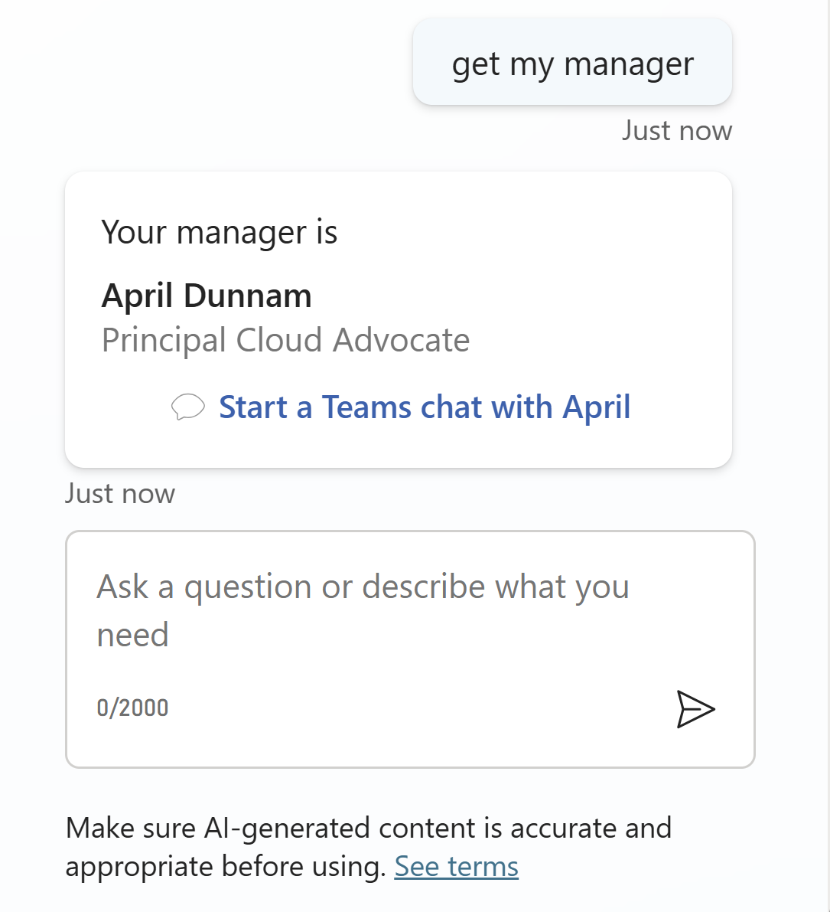
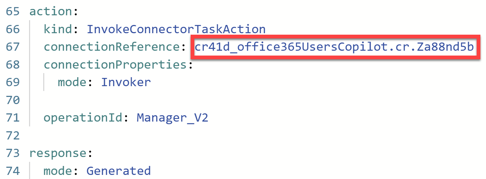

# Office 365 Users: Get Manager (Action with Adaptive Card)

This is a snippet that demonstrates how to get your manager details using the Office 365 Users action. It uses an adaptive card as an output to not only display your manager details but to also start a Teams chat with them.

You can also customize the adaptive card to include more information from your manager.

## Authors

Snippet|Author(s)
--------|---------
Office 365 Users: Get Manager (Action with Adaptive Card) | [Gomolemo Mohapi](https://github.com/gomomohapi) ([@GomoMohapi](https://www.twitter.com/GomoMohapi))

## Minimal path to awesome

1. Open a copilot in **Copilot Studio**
1. Select **Actions**
1. Select **+ Add an action**
1. Search for **Get manager** and press _Enter_
1. Select the **Get manager (V2)** action from the **Office 365 Users** connector
1. Select **Next**
1. Select **Next** again
1. Select **Finish**
1. Select the **Office 365 Users - Get manager (V2)** action in the list (select the name)
1. Select the **...** in the upper right corner and select **Open code editor**
1. Make sure to look for and copy the **name** of the **connection reference**

    

1. Replace all the code in the code editor with the contents of this **[YAML-file](./source/manager.yaml)**

1. Replace **{ REPLACE-WITH-CONNECTION-REFERENCE-NAME }** with the **connection reference name** you copied two steps earlier

1. **Save** the action.

1. Select **Settings** on the top right corner

1. Select **Generative AI**

1. Under **Using generative AI in conversations**, select **Generative**

1. Select **Save** and then exit **Settings** by selecting the **X** in the upper right corner

1. Open the **Test your copilot** panel

1. **Refresh** the **Test your copilot** panel to get the latest changes

1. Test out the action by asking `get my manager` or something similar:

    

## Disclaimer

**THIS CODE IS PROVIDED *AS IS* WITHOUT WARRANTY OF ANY KIND, EITHER EXPRESS OR IMPLIED, INCLUDING ANY IMPLIED WARRANTIES OF FITNESS FOR A PARTICULAR PURPOSE, MERCHANTABILITY, OR NON-INFRINGEMENT.**

    

    

