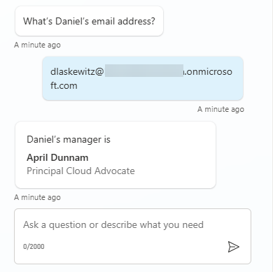
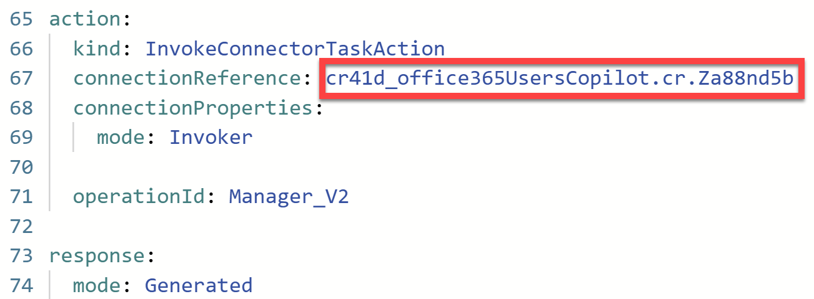
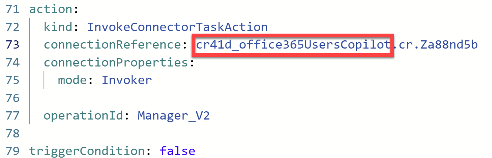
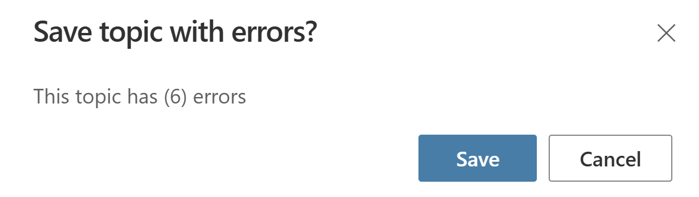
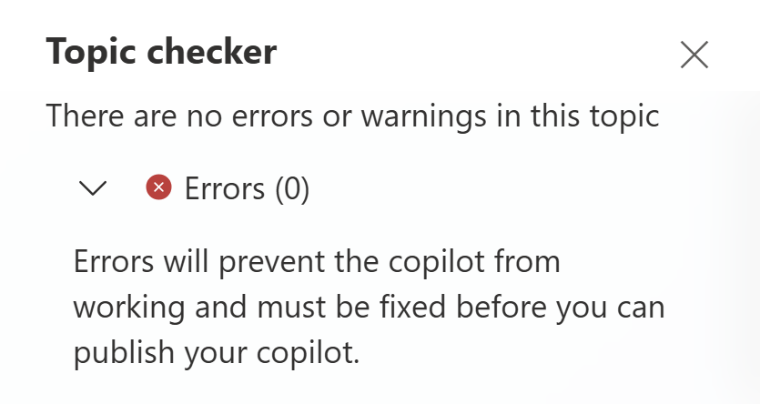
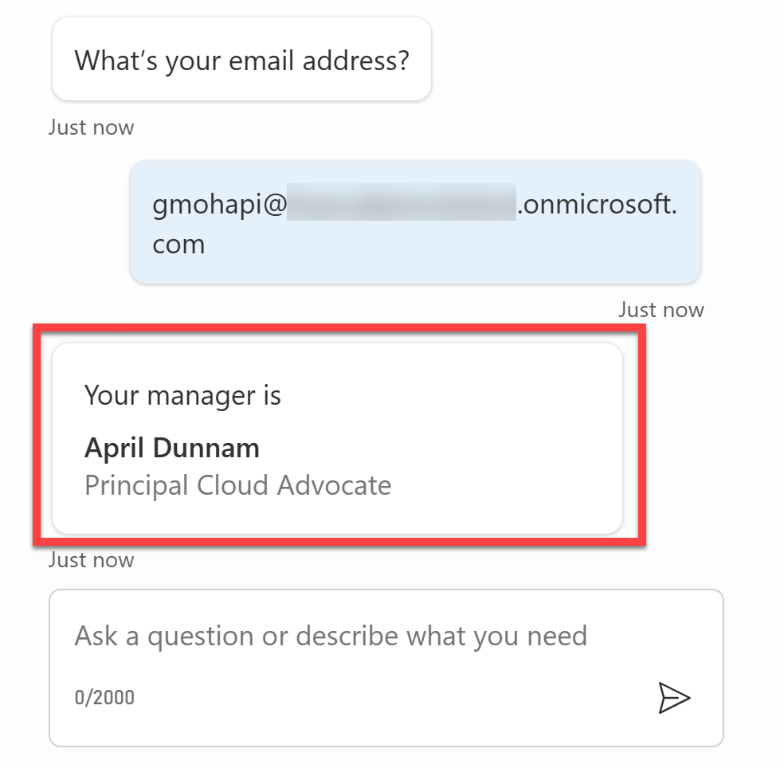

# Office 365 Users: Get Manager

This is a snippet that demonstrates how to get the manager of any user using the Office 365 Users connector inside of a Copilot Studio topic.

## Minimal path to awesome

### Add the action

1. Open a copilot in **Copilot Studio**
1. Select **Actions**
1. Select **+ Add an action**
1. Search for **Get manager** and press _Enter_
1. Select the **Get manager (V2)** action from the **Office 365 Users** connector
1. Select **Next**
1. Select **Next** again
1. Select **Finish**
1. Select the **Office 365 Users - Get manager (V2)** action in the list (select the name)
1. Select the **...** in the upper right corner and select **Open code editor**
1. Make sure to look for and copy the **name** of the **connection reference**

    

1. Paste the contents of the **[YAML-file](./source/manager.yaml)** into the code editor
1. Replace **{ REPLACE-WITH-CONNECTION-REFERENCE-NAME }** with the **connection reference name** you copied two steps earlier
1. Now copy the first part of the **connection reference name**, up to the first period (.)

    

    This is the **internal name of your copilot**. You'll need it later.

1. **Save** the action
1. Select **Settings**
1. Select **Generative AI**
1. Scroll down to **How should your copilot decide how to respond?** and enable the **Generative** option
1. Select **Save**
1. Exit **Settings** by selecting the **X** in the upper right corner

### Configure the topic

1. Select **Topics**
1. Select **+ Add a topic**
1. Select **From blank**
1. Name the topic **Get Manager Details**
1. Select the **...** in the upper right corner and select **Open code editor**
1. Paste the contents of the **[YAML-file](./source/topic.yaml)** into the code editor
1. Replace all references of **{ REPLACE-WITH-INTERNAL-COPILOT-NAME }** with the **internal name of the copilot** you copied earlier (There are 4 references)
1. Select **Save**

    You may see the following warning:

    

    Ignore this and select **Save**. There are no errors as long as you've replaced all references of the **internal name of the copilot** correctly

    To ensure that there are no errors, once the topic has been saved, select **Topic checker** and you should see the following:

    

1. Test out the copilot by asking **_"Who's my manager?"_** in the chat and follow the prompts.

    You should then get the following result (with your manager's name):

    