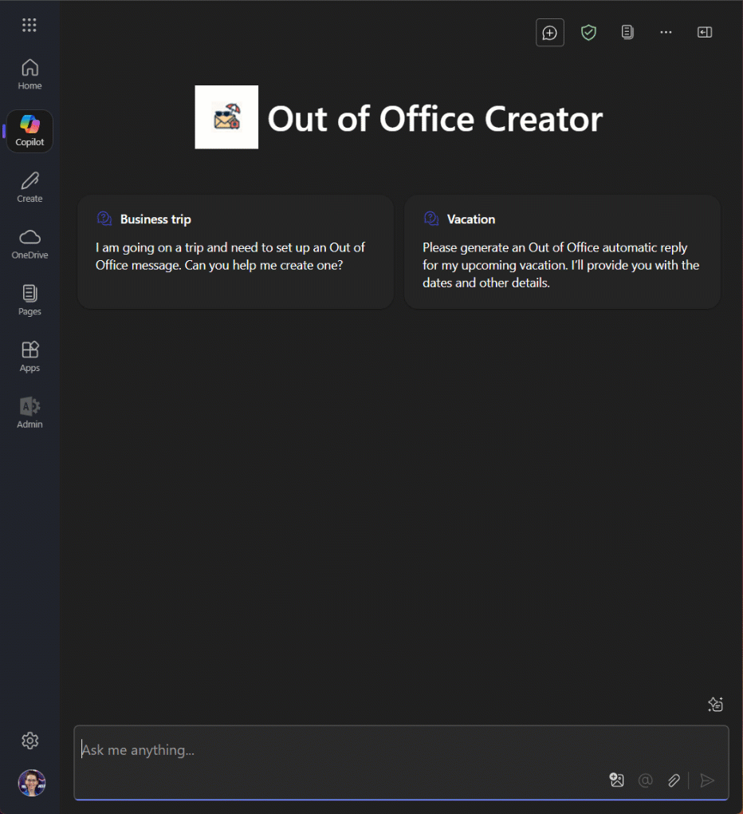
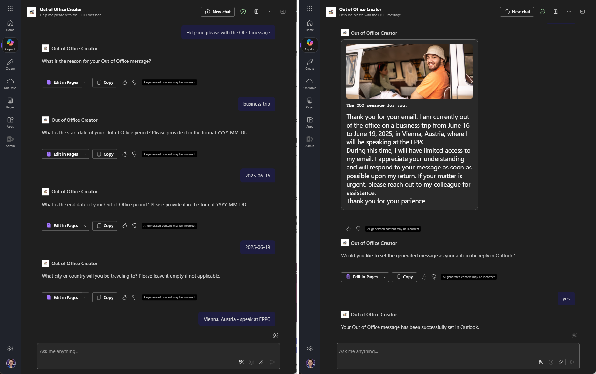
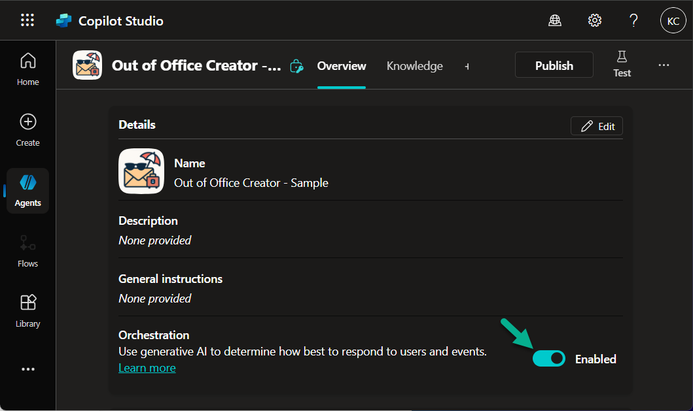
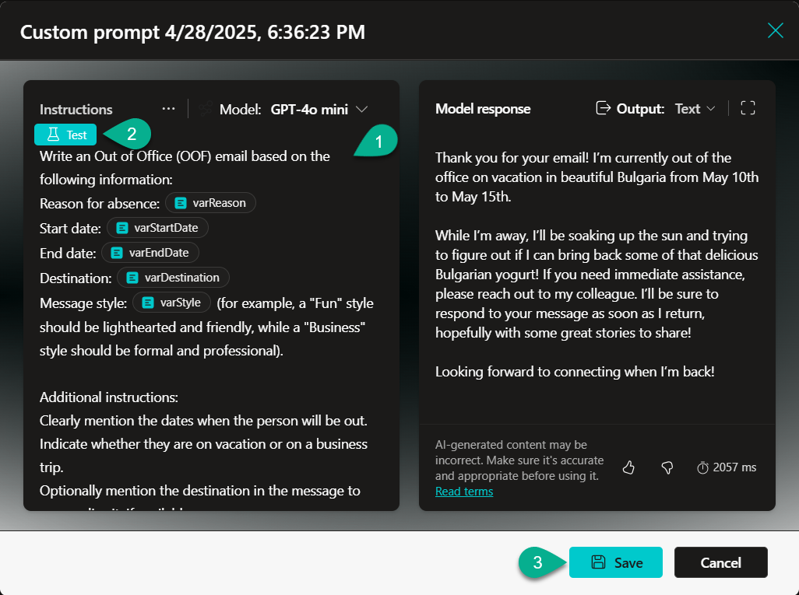
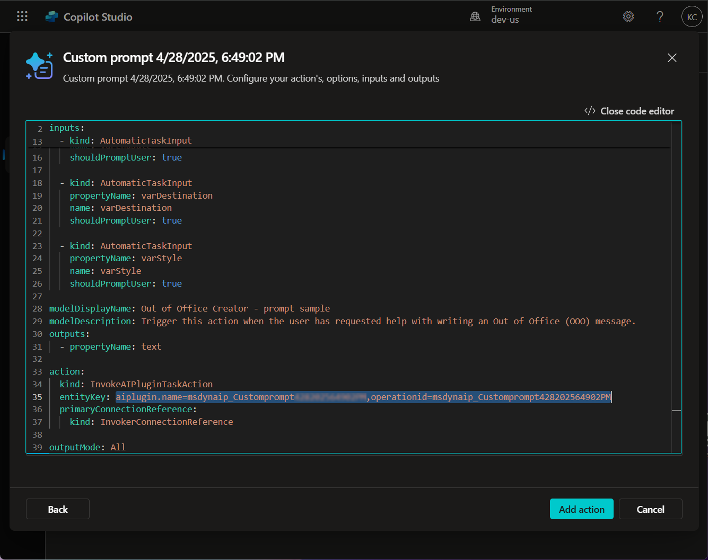
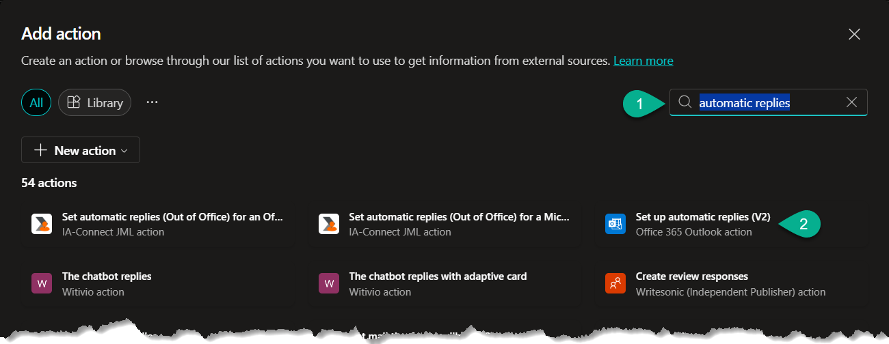
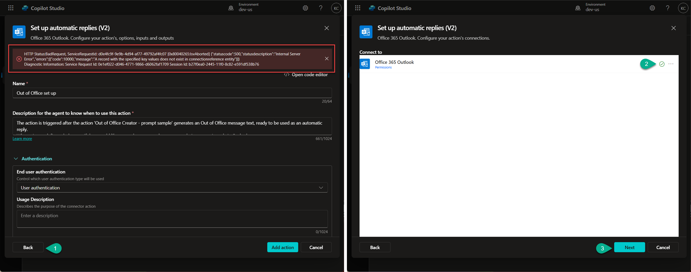
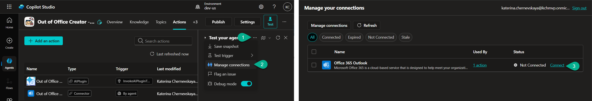
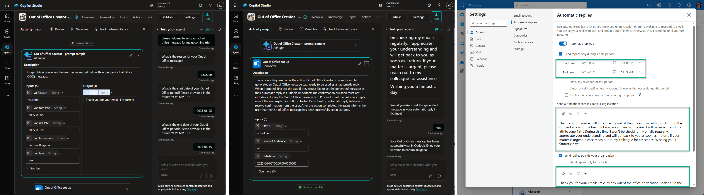

# Out of Office Creator

**Out of Office Creator** is an AI-powered agent for **Microsoft Teams** and/or **Microsoft 365 Copilot** that helps users easily create and set Out of Office automatic reply messages for Outlook.



The agent guides the user through a simple flow:

- It collects key information such as the reason for absence, travel destination, start and end dates, and preferred tone of the message.
- It uses AI to generate a complete, fluent Out of Office message based on the provided details.
- After generating the message, the agent asks the user if they would like to set it as their automatic reply in Outlook.
- Upon user confirmation, the agent automatically configure the Out of Office message.
- Finally, the agent notifies the user that the message has been successfully set.



## Authors

Author|Socials
--------|---------
Katerina Chernevskaya | [GitHub](https://github.com/Katerina-Chernevskaya/) - [LinkedIn](https://www.linkedin.com/in/katerinachernevskaya/)
Artem Chernevskiy | [GitHub](https://github.com/artemchern) - [LinkedIn](https://www.linkedin.com/in/artem-chernevskiy/)

## Prerequisites

1. Agent in Copilot Studio (follow [this article](https://learn.microsoft.com/en-us/microsoft-copilot-studio/fundamentals-get-started?tabs=web#create-an-agent) to create your agent)
2. Enable `Orchestration` in your agent



## Minimal path to awesome

### Create the first - Prompt action

1. Open your agent in **Copilot Studio**.
2. Select **Actions**.
3. Select **+ Add an action**.
4. Select **+ New action** and select **New prompt**.
5. Add the below prompt in the **Instruction** field:
```
Write an Out of Office (OOF) email based on the following information:
Reason for absence: [varReason] 
Start date: [varStartDate] 
End date: [varEndDate] 
Destination: [varDestination] 
Message style: [varStyle]  (for example, a "Fun" style should be lighthearted and friendly, while a "Business" style should be formal and professional).

Additional instructions:
Clearly mention the dates when the person will be out.
Indicate whether they are on vacation or on a business trip.
Optionally mention the destination in the message to personalize it, if available.
End the message politely, suggesting when the sender can expect a response or who they can contact in the sender's absence (use a placeholder if no contact info is provided).
Do not insert any placeholders (such as [insert contact person] or similar).
Do not create an email subject line.
Do not add a signature or name.
Generate the text in a natural, fluent, and polished English style.
The message should be ready to be used as an automatic reply.
```

6. Make sure to provide sample values for the variables. Once you are ready - **Test** the prompt and **Save** it.

    

7. Select **... More**  in the upper right corner and select **Open code editor**.
8. Make sure to copy the **value** of the **entityKey** and keep it somewhere safe (you need it later).

    

9. Replace the code in the code editor with the contents of the **[YAML-file](./source/prompt-action.yaml)**.
10. Replace **{ REPLACE-WITH-ENTITY-KEY-VALUE }** with the **entityKey value** you copied earlier.
11. Select **Add action**.

### Create the second - Office 365 Outlook action

1. Open your agent in **Copilot Studio**.
2. Select **Actions**.
3. Select **+ Add an action**.
4. Search for **automatic replies**.
5. Select the **Set up automatic replies (V2)** action.

    

6. Select **... More**  in the upper right corner and select **Open code editor**.
7. Make sure to copy the **name** of the **connection reference** and keep it somewhere safe (you need it later).

    

8. Replace the code in the code editor with the contents of the **[YAML-file](./source/automatic-reply.yaml)**.
9. Replace **{ REPLACE-WITH-CONNECTION-REFERENCE-NAME }** with the **connection reference name** you copied earlier.
10. Select **Add action**.
11. If you got the `HTTP Status:BadRequest` error - just select **Back** button and make sure that the connection configured. Once it is ready, click **Next** and select **Add action** again.

    

12. Open **Test** pane and select **... More**. Select **Manage connections**. In the opened window select **Connect**.

    

### Test the solution

1. In the **Test** pane ask the agent:

```
please help me to write an out of office message for my upcoming trip
```

2. Answer agent's questions.
3. Check the Out of Office message that agent generates.
4. Agree to set up the text as your automatic reply, and check your Outlook Automatic replies settings.

> Keep in mind that the action configured for UTC timezone. If you are in another timezone - you need to specify this in the **Out of Office set up** action.



### Next steps

Once you have successfully tested the agent in Copilot Studio:

1. Publish your agent to make it available for users.
2. Add the **Teams** and **Microsoft 365 Copilot** channels to your agent to enable access through Microsoft Teams and Microsoft 365 apps (follow [this article](https://learn.microsoft.com/en-us/microsoft-copilot-studio/publication-add-bot-to-microsoft-teams) to add these channels).
3. Test the experience in your preferred user interface, such as Microsoft Teams or within Microsoft 365 Copilot, to ensure the Out of Office creation flow works seamlessly.
4. Refine the agent if needed based on real-world usage and feedback.

## Disclaimer

**THIS CODE IS PROVIDED *AS IS* WITHOUT WARRANTY OF ANY KIND, EITHER EXPRESS OR IMPLIED, INCLUDING ANY IMPLIED WARRANTIES OF FITNESS FOR A PARTICULAR PURPOSE, MERCHANTABILITY, OR NON-INFRINGEMENT.**


