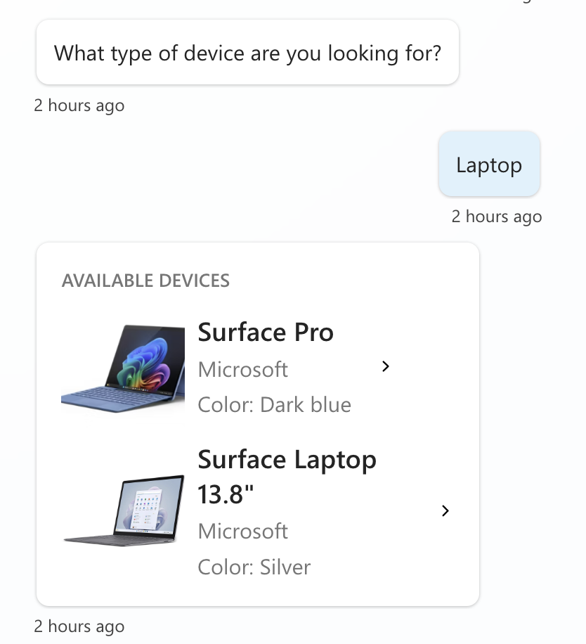
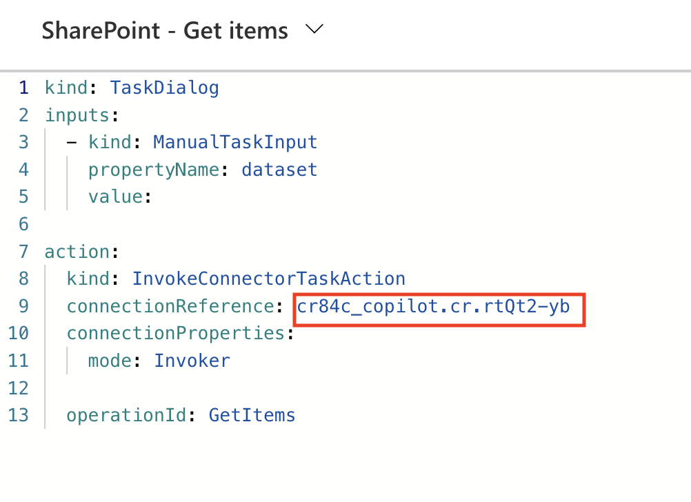
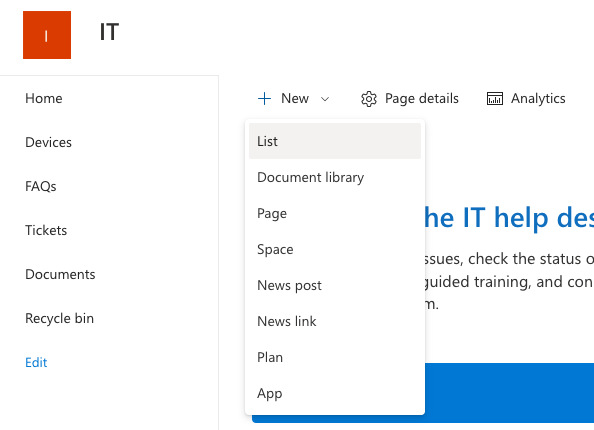
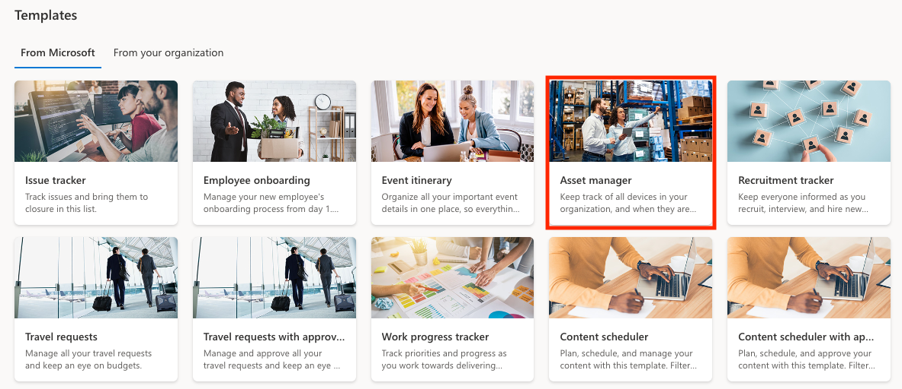
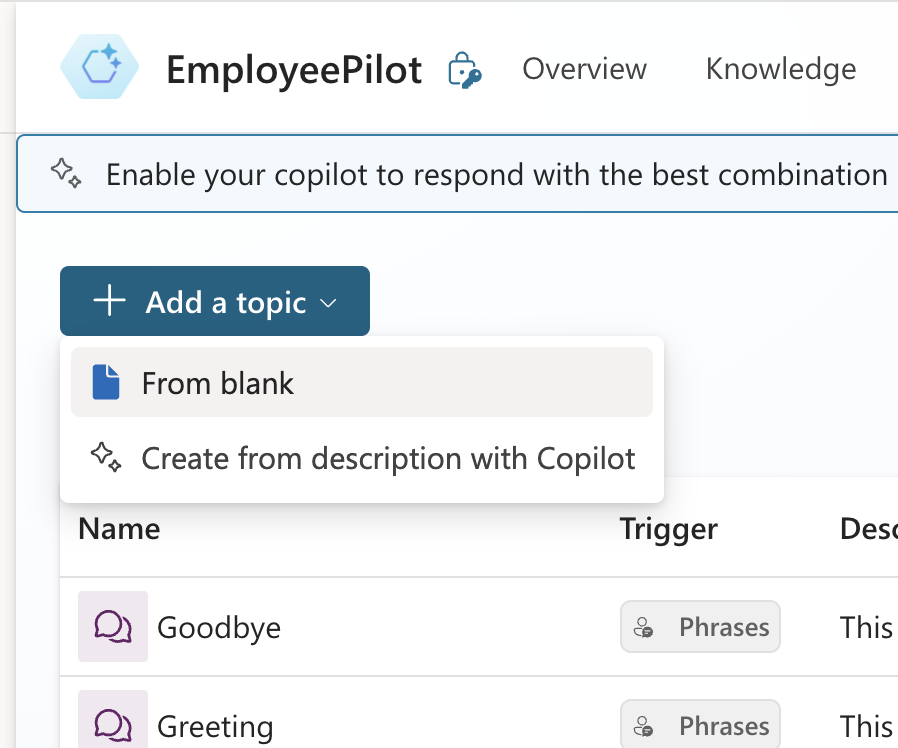
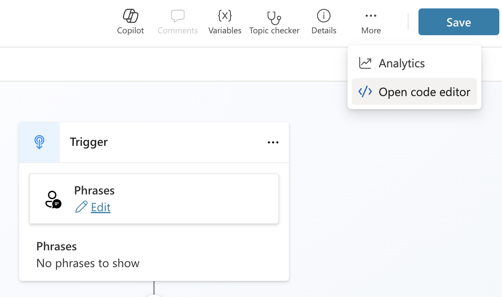
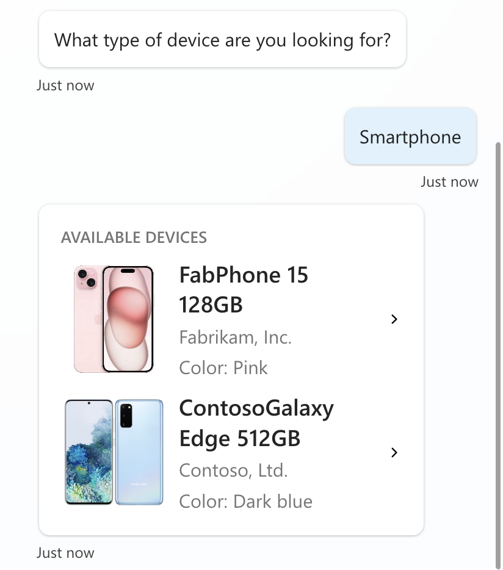

# SharePoint Get Items - Asset List (Topic with Adaptive Card)

This is a snippet that demonstrates how to use the SharePoint - Get items action as a connector action in a topic.  It uses a custom adaptive card as the output to show a table of items using the SharePoint Asset list template.

## Minimal path to awesome

### Enable dynamic chaining before proceeding

1. Open a copilot in **Copilot Studio**
1. Select **Generative AI**
1. Scroll down to **Dynamic Chaining with generative actions (preview)** and enable it by flipping the toggle on

### Setup the Action

1. Select **Actions**
1. Select **+ Add an action**
1. Search for **SharePoint Get Items** and select the **Search** button
1. Select the **Get Items** action from the **SharePoint** connector
1. Select **Next**
1. Select **Finish**
1. Select the **SharePoint - Get Items** action in the list (select the name)
1. Select the **...** in the upper right corner and select **Open code editor**
1. Make sure to copy the **name** of the **connection reference**

    

### Setup the SharePoint List
This snippet connects to a SharePoint list which will need to be configured before you setup the topic. Follow these steps to setup the list:
1. Go to your SharePoint site and select **New** and **List**
   
1. From the list of templates, select the **Asset Manager** template
   
1. In the pop-up, select **Use this template**
1. Give your list a name (keep track of this to use in later steps) and select **Create**
1. In the newly created list, scroll all the way to the right and select **Add column**
   
1. Choose **Hyperlink** as the column type and click **Next**
1. For the Name type **Image** and click **Save**

### Configure the Topic    
1. Select the **Topics** tab
1. Select **Add Topic** and **From Blank**
  
1. Rename your topic in the **upper left hand corner** to something relevant and remember this name.
1. Select the **more** button in the upper right hand corner and **Open in code editor**
  
1. Paste the contents of the **[YAML-file](./source/AvailableDevices.yaml)** in the code editor
1. Replace **{ REPLACE-WITH-CONNECTION-REFERENCE-NAME }** with the **connection reference name** you copied two steps earlier
1. Replace **{ REPLACE-WITH-COPILOT-NAME }** with the **copilot schema name**
1. Replace **{ REPLACE-WITH-TOPIC-NAME }** with the **topic name**
1. Replace **{ REPLACE-WITH-SHAREPOINT-SITE-URL }** with the **url of the SharePoint site name**
1. Replace **{ REPLACE-WITH-SHAREPOINT-LIST-GUID }** with the **GUID of the SharePoint list name**
1. Save the **topic**
1. Test out the **topic** by using the **Test copilot** section and send `What are the available devices?`
1. Select the device type from the multiple choice list
  

1. When you get a list of devices, you're **done**!

    

