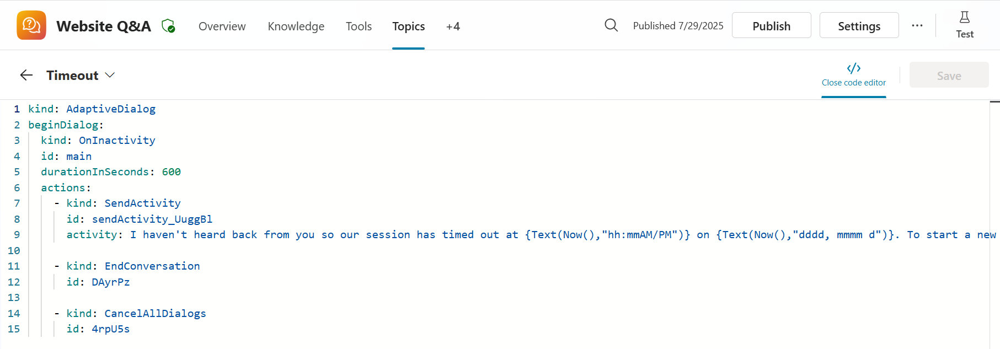
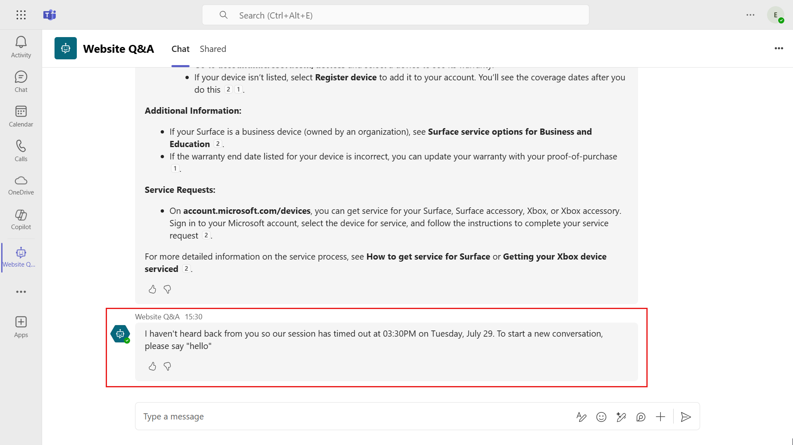
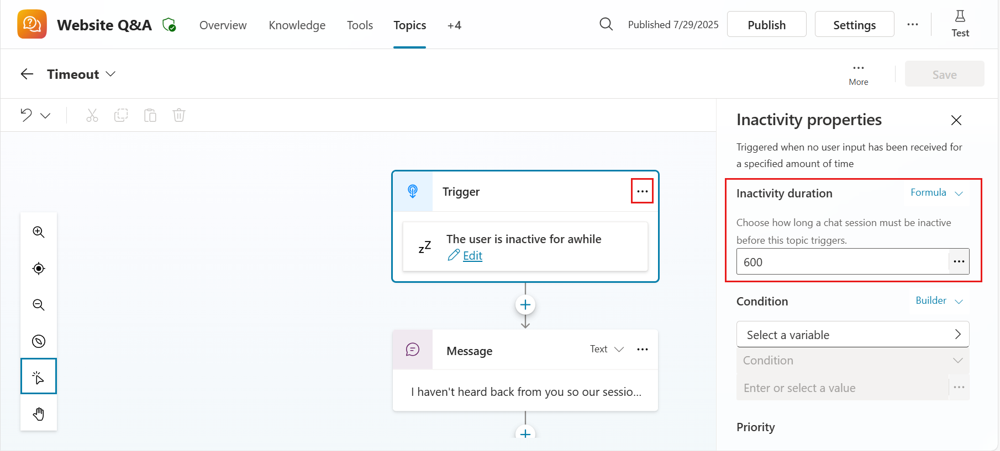

# Timeout Message (Topic)

This is a snippet that demonstrates a sample message for when a copilot session times out. It includes two Power Fx expressions for formatting of the time and date.

1. The current time, e.g 01:36PM
1. The current date, e.g Thursday, March 21

## Authors

Snippet|Author(s)
--------|---------
Timeout Message (Topic) | [Elaiza Benitez](https://github.com/elaizabenitez) ([@benitezhere](https://www.twitter.com/benitezhere))

## Minimal path to awesome

1. Open an agent in **Copilot Studio**
1. Select **Topics**
1. Select **+ Add a topic**
1. Select **Create from blank**
1. Select the **...** in the upper right corner and select **Open code editor**
1. Click inside the code editor and **CTL + A for Windows** or **Command-A** for Mac to select all rows.
1. Paste the contents of the **[YAML-file](./source/timeout-message.yaml)** inside the code editor.

    

1. Enter a **Name** for your Topic.
1. Select **Save**
1. Test out the **Timeout Message** by publishing your agent to **Microsoft Teams** and enter a trigger phase for one of your Topics.
1. After receiving a response from your agent, do not enter a message and leave idle for 10 minutes.
1. After 10 minutes, the trigger for inactivity will be executed and the timeout message will be displayed, you're **done**!

    

### Note

If you want to change the timeout duration, select the **ellipsis (. . .) icon** in the trigger. The **Inactivity properties** pane will load and the inactivity duration value can be updated. Convert desired minutes into seconds. For example 10 minutes is 600 seconds.

## Disclaimer

**THIS CODE IS PROVIDED *AS IS* WITHOUT WARRANTY OF ANY KIND, EITHER EXPRESS OR IMPLIED, INCLUDING ANY IMPLIED WARRANTIES OF FITNESS FOR A PARTICULAR PURPOSE, MERCHANTABILITY, OR NON-INFRINGEMENT.**

