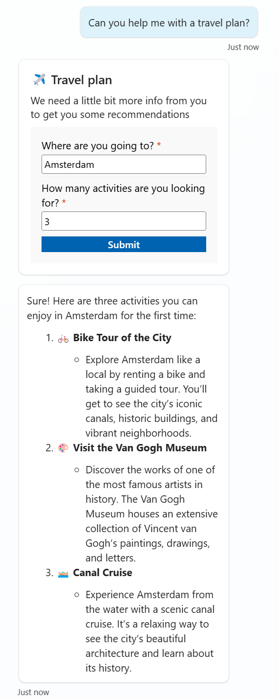

# Travel Plan (Topic)

This is a snippet that demonstrates how to use an AI prompt in a Copilot Studio Topic. It uses an Adaptive Card to gather inputs and an AI prompt to generate a travel plan for a trip.

  

## Authors

Snippet|Author(s)
--------|---------
Travel Plan (Topic) | [Daniel Laskewitz](https://github.com/laskewitz) ([@laskewitz](https://www.twitter.com/laskewitz))

## Minimal path to awesome

**Prerequisites**

- Create the Travel Plan AI Prompt in the same environment as where your copilot is. 
- Make sure to copy the ID of the AI model 
  - Go to [the Power Apps maker portal](https://make.powerapps.com) and go to **Solutions** > **Common Data Services Default Solution** > **AI Models** and select **Travel Plan** there - if that's the name you gave your AI Prompt. If you gave a different name, select that.
    
    This will open a URL with the following format: `https://make.powerapps.com/environment/{Environment ID}/aibuilder/solutions/00000001-0000-0000-0001-00000000009b/models/{Model ID}`
  - Copy the Model ID from the URL in the address bar and keep it somewhere safe so that you can easily copy and paste it later.

**Steps**

1. Open a copilot in **Copilot Studio**
1. Select **Topics**
1. Select **+ Add a topic**
1. Select **From blank**
1. Change the name from **Untitled** to **Travel Plan**
1. Select **More**
1. Select **Open code editor**
1. Paste the contents of the **[YAML-file](./source/travel-plan.yaml)** in the code editor
1. Replace **{ REPLACE-WITH-AI-MODEL-ID }** with the **AI Model ID** you kept somewhere safe in the prerequisites
1. Select **Close code editor**
1. **Save** the topic
1. Test out the **topic** by using the **Test copilot** section and send `Can you help me with a travel plan?`
1. Fill in the card by adding a **Location** and a number of **Activities**
1. When you get a response with a bunch of activities in the location you entered, you're **done**!

  

## Disclaimer

**THIS CODE IS PROVIDED *AS IS* WITHOUT WARRANTY OF ANY KIND, EITHER EXPRESS OR IMPLIED, INCLUDING ANY IMPLIED WARRANTIES OF FITNESS FOR A PARTICULAR PURPOSE, MERCHANTABILITY, OR NON-INFRINGEMENT.**

