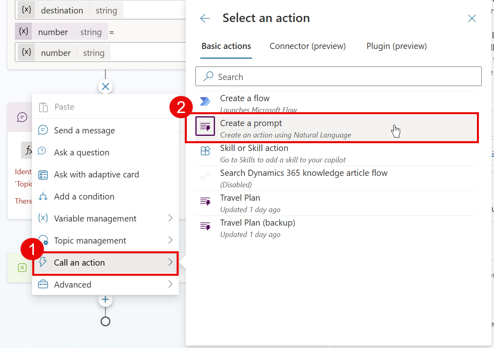
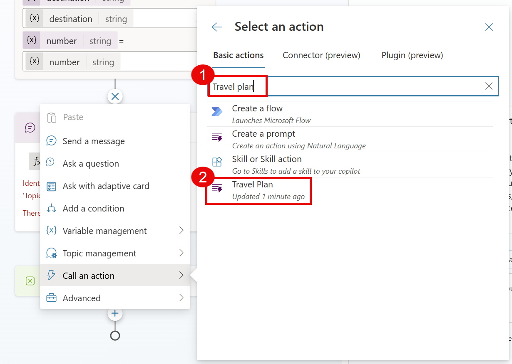
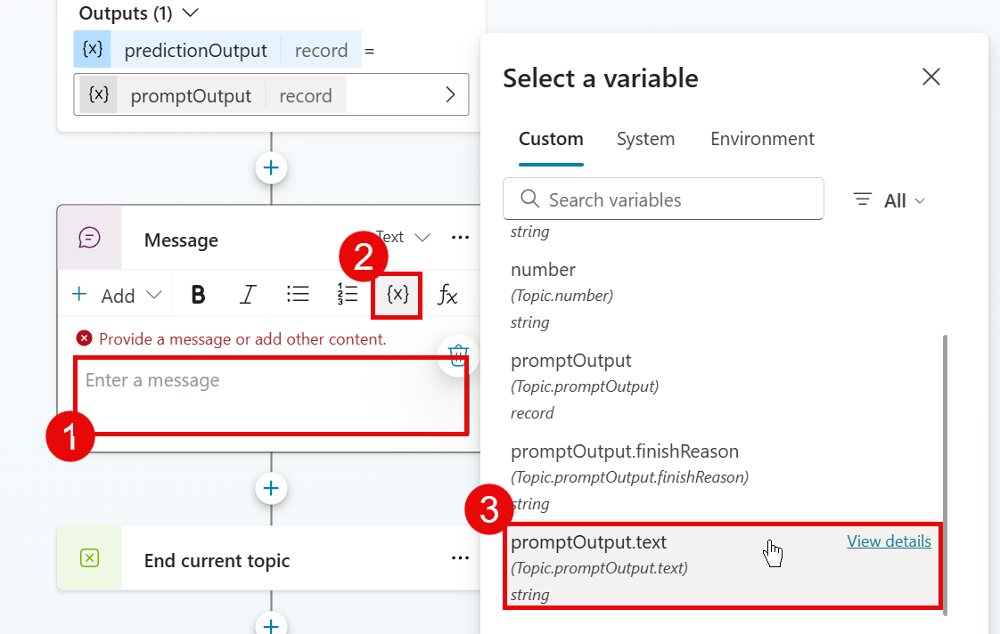

# Travel Plan (Topic)

This is a snippet that demonstrates how to use an AI prompt in a Copilot Studio Topic. It uses an Adaptive Card to gather inputs and an AI prompt to generate a travel plan for a trip.

  

## Authors

Snippet|Author(s)
--------|---------
Travel Plan (Topic) | [Daniel Laskewitz](https://github.com/laskewitz) ([@laskewitz](https://www.twitter.com/laskewitz))

## Minimal path to awesome

**Prerequisites**

- Create the Travel Plan AI Prompt in the same environment as where your copilot is. 
- Make sure to copy the ID of the AI model 
  - Go to [the Power Apps maker portal](https://make.powerapps.com) and go to **Solutions** > **Common Data Services Default Solution** > **AI Models** and select **Travel Plan** there - if that's the name you gave your AI Prompt. If you gave a different name, select that.
    
    This will open a URL with the following format: `https://make.powerapps.com/environment/{Environment ID}/aibuilder/solutions/00000001-0000-0000-0001-00000000009b/models/{Model ID}`
  - Copy the Model ID from the URL in the address bar and keep it somewhere safe so that you can easily copy and paste it later.

**Steps**

1. Open a copilot in **Copilot Studio**
1. Select **Topics**
1. Select **+ Add a topic**
1. Select **From blank**
1. Change the name from **Untitled** to **Travel Plan**
1. Select **More**
1. Select **Open code editor**
1. Paste the contents of the **[YAML-file](./source/travel-plan.yaml)** in the code editor
1. Select **Close code editor**

    Don't worry about the error you'll see in the message card, later on that will disappear.

1. Select the **+** after the adaptive card to add a node
1. Select **Call an action** in the popout
1. Select **Create a prompt** in the next area

    

    This will open the AI Builder prompt builder

1. Enter **Travel Plan** as the name for the prompt at the top
1. Enter the following prompt as the prompt:

    `Pease give me [Number] options for activities in [Destination] for people who are there for the first time. Please return a numbered list with emojis in the name of the activity and give it a brief description.`

1. Under Prompt settings, select **Input**
1. Select **+ Add input**
1. Enter **Number** as the name
1. Enter **3** as the sample data
1. Select **+ Add input** again
1. Enter **Destination** as the name
1. Enter **Amsterdam, The Netherlands** as the sample data
1. Select **[Number]** in the prompt and remove it from the prompt, leaving the cursor on that spot
1. Select the **+ Insert** button
1. Select **Number** in the popout - this will add the input to your prompt
1. Select **[Destination]** in the prompt and remove it from the prompt, leaving the cursor on that spot
1. Select the **+ Insert** button again
1. Select **Destination** in the popout to add destination to the prompt as well

    Now you have replaced the text with actual inputs, and this means you can now test the prompt

1. Select the **Test prompt** button under the prompt to test the prompt with the sample data

    This will show an example output of the prompt response in the Prompt response section

1. Select the **Save custom prompt** button
1. Back in Copilot Studio, you will not directly see the prompt. Make sure to search for **Travel Plan** and it will show for you
1. Select **Travel Plan**

    

1. Select **>** in the **Destination** input and select the **destination** variable (this is the output of the adaptive card)
1. Select **>** in the **Number** input and select the **number** variable
1. Select **>** in the **predictionOutput** output and select the **Create new** button to create a new variable

    This will automatically create a variable called *Var1*.

1. Select **Var1**

    This will open the *Variable properties* panel

1. Change the name from **Var1** to **promptOutput**
1. Close the **Variable properties** panel

    

1. Select **Prompt output** in the message node by clicking on it (1)
1. Remove the text **Prompt output**
1. Select the variable icon **{x}** (2)
1. Select **promptOutput.text** (3) - this is the generated text by the prompt.
1. **Save** the topic
1. Test out the **topic** by using the **Test copilot** section and send `Can you help me with a travel plan?`
1. Fill in the card by adding a **Location** and a number of **Activities**
1. When you get a response with a bunch of activities in the location you entered, you're **done**!

  

## Disclaimer

**THIS CODE IS PROVIDED *AS IS* WITHOUT WARRANTY OF ANY KIND, EITHER EXPRESS OR IMPLIED, INCLUDING ANY IMPLIED WARRANTIES OF FITNESS FOR A PARTICULAR PURPOSE, MERCHANTABILITY, OR NON-INFRINGEMENT.**

