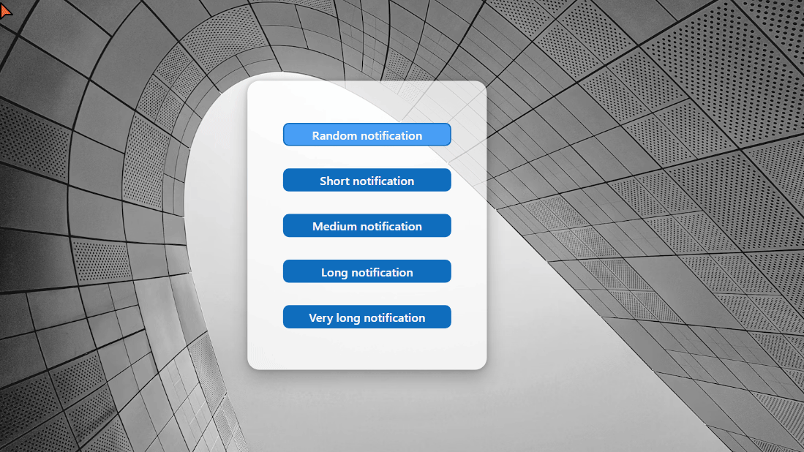
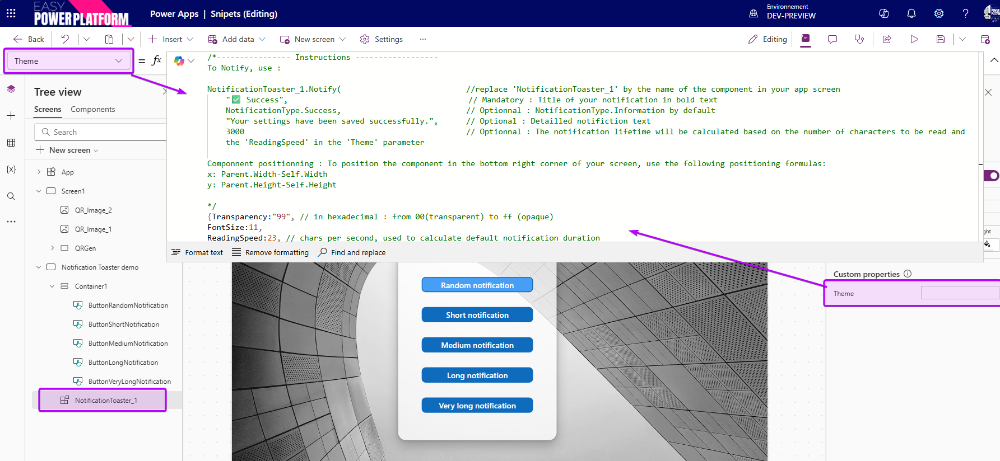

# Notification Toaster

An alternate inapp notification system, 



## Authors

Snippet|Author
--------|---------
David Zoonekyndt | [GitHub](https://github.com/DavidZoon) ([LinkedIn](https://www.linkedin.com/in/david-zoonekyndt/) )

## Minimal path to awesome

1. Open your canvas app in **Power Apps**
2. Copy the contents of the **[YAML-file](./source/notification-toaster.yaml)** 
3. Go to Tree view >> Components
4. Press Ctrl+V to paste YAML content
5. Back to Tree view >> Screens and insert NotificationToaster in you application from custom category

### ⚠️⚠️⚠️ Important:

Paste YAML snipet in components view !

To show a notification, use :
```
NotificationToaster_1.Notify(                           //replace 'NotificationToaster_1' by the name of the component in your app screen
    "✅ Success",                                       // Mandatory : Title of your notification in bold text
    NotificationType.Success,                           // Optionnal : NotificationType.Information by default
    "Your settings have been saved successfully.",      // Optional : Detailled notifiction text
    3000)                                               // Optionnal : The notification lifetime will be calculated based on the number of characters to be read and the 'ReadingSpeed' in the 'Theme' parameter
```

Componnent positionning : To position the component in the bottom right corner of your screen, use the following positioning formulas:

x: `Parent.Width-Self.Width`
y: `Parent.Height-Self.Height`

All settings and instruction are in the 'Theme' parameter :
   

## Code
 **[YAML-file](./source/notification-toaster.yaml)** 

 **[Demo screen (import component first ! ) YAML-file](./source/notification-toaster-demo-screen-import-compenent-first.yaml)** 

 ## Disclaimer

**THIS CODE IS PROVIDED *AS IS* WITHOUT WARRANTY OF ANY KIND, EITHER EXPRESS OR IMPLIED, INCLUDING ANY IMPLIED WARRANTIES OF FITNESS FOR A PARTICULAR PURPOSE, MERCHANTABILITY, OR NON-INFRINGEMENT.**


