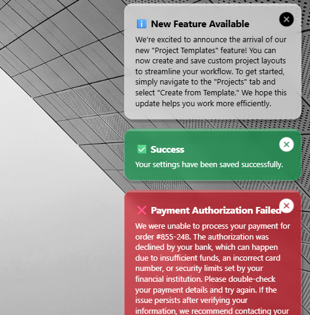

# Notification Toaster

An alternate inapp notification system, 



## Authors

Snippet|Author
--------|---------
David Zoonekyndt | [GitHub](https://github.com/DavidZoon) ([LinkedIn](https://www.linkedin.com/in/david-zoonekyndt/) )

## Minimal path to awesome

1. Open your canvas app in **Power Apps**
2. Copy the contents of the **[YAML-file](./source/notification-toaster.yaml)** 
3. Go to Tree view >> Components
4. Press Ctrl+V to paste YAML content
5. Back to Tree view >> Screens and insert NotificationToaster in you application from custom category

### ⚠️⚠️⚠️ Important:

Paste YAML snipet in components view !

To Notify, use :
```
Collect(colNotifications, {
    Title:      "✅ Success",                                      // set your notificaiton title here
    Text:       "Your settings have been saved successfully.",  // put you notification text here
    Type:       NotificationType.Success,                       // used for notification appearance
    Duration:   2000                                            // Notification duration in milliseconds
    }
```

Componnent positionning : To position the component in the bottom right corner of your screen, use the following positioning formulas:

x: `Parent.Width-Self.Width`
y: `Parent.Height-Self.Height`


## Code
 **[YAML-file](./source/notification-toaster.yaml)** 

 ## Disclaimer

**THIS CODE IS PROVIDED *AS IS* WITHOUT WARRANTY OF ANY KIND, EITHER EXPRESS OR IMPLIED, INCLUDING ANY IMPLIED WARRANTIES OF FITNESS FOR A PARTICULAR PURPOSE, MERCHANTABILITY, OR NON-INFRINGEMENT.**


