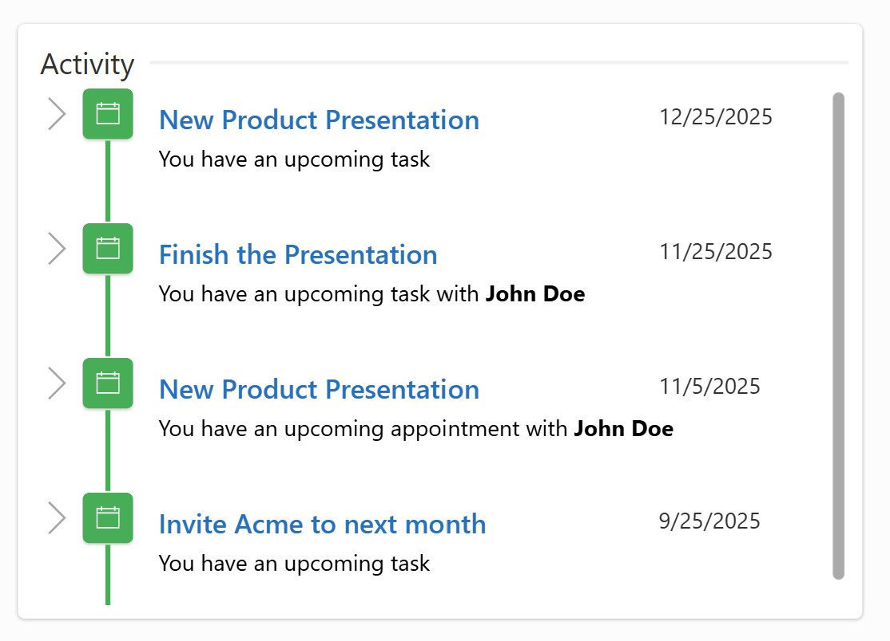

# Activity Feed

A Activity feed UI that displays a real-time style activity feed which is perfect for showing updates such as appointments, tasks, or status changes.  
Great for collaboration scenarios and keeping users informed.




## ✨ Features

- Clean, vertical timeline layout  
- Supports **HTML** in descriptions  
- Automatically sorts items by date (newest first)  
- Easy to import with a simple YAML snippet  
- Works with collections, Dataverse, or API data sources

## Authors


Author|Socials
--------|---------
Summit Bajracharya | [GitHub](https://github.com/summitbaj) ([@summitbajracharya](https://www.linkedin.com/in/summitbajracharya) )


## Minimal path to awesome


Follow these steps to start using the Activity Feed snippet:

1. Open your **Canvas App** in Power Apps.  
2. Copy the contents of the **[activityfeed.yaml](./source/activityfeed.yaml)** file.  
3. Select the screen where you want to insert the control, click the **three dots (…)**, and choose **Paste code**.  
4. Add sample data (see below) or connect your own source.  
5. Done!


## Preparation
To help you test the Activity Feed quickly, add this sample collection to **App OnStart** or any button’s **OnSelect**:

```
ClearCollect(
    colActivity,
    {
        Name: "New Product Presentation",
        Date: DateValue("12/25/2025"),
        Details: "You have an upcoming task"
    },{
        Name: "Finish the presentation",
        Date: DateValue("11/25/2025"),
        Details: "You have an upcoming task with <b>John Doe</b>"
    },{
        Name: "New Product Presentation",
        Date: DateValue("11/05/2025"),
        Details: "You have an upcoming appointment with <b>John Doe</b>"
    },{
        Name: "Invite Acme to the next month",
        Date: DateValue("9/25/2025"),
        Details: "You have an upcoming task"
    }
)
```
The gallery in the YAML snippet uses:
```
Items = Sort(colActivity, Date, SortOrder.Descending)
```
Replace **colActivity** with any source you prefer.

## YAML Snippet
Copy and paste the YAML code below into your canvas screen (right-click → Paste):
``` YAML

- conTimelineMain:
    Control: GroupContainer@1.3.0
    Variant: AutoLayout
    Properties:
      Fill: =RGBA(255, 255, 255, 1)
      Height: =353
      LayoutAlignItems: =LayoutAlignItems.Center
      LayoutDirection: =LayoutDirection.Vertical
      PaddingBottom: =8
      PaddingLeft: =8
      PaddingRight: =8
      PaddingTop: =8
      X: =60
      Y: =60
    Children:
      - conTimelineHeader:
          Control: GroupContainer@1.3.0
          Variant: AutoLayout
          Properties:
            DropShadow: =DropShadow.None
            FillPortions: =0
            Height: =30
            LayoutAlignItems: =LayoutAlignItems.Center
            LayoutDirection: =LayoutDirection.Horizontal
            LayoutMaxHeight: =0
            LayoutMaxWidth: =0
            LayoutMinHeight: =16
            LayoutMinWidth: =16
          Children:
            - Label2:
                Control: Label@2.5.1
                Properties:
                  AlignInContainer: =AlignInContainer.Start
                  BorderColor: =RGBA(0, 0, 0, 0)
                  BorderStyle: =BorderStyle.None
                  BorderThickness: =2
                  Color: =RGBA(50, 49, 48, 1)
                  DisabledBorderColor: =RGBA(0, 0, 0, 0)
                  DisabledColor: =RGBA(161, 159, 157, 1)
                  FocusedBorderThickness: =4
                  Font: =Font.'Segoe UI'
                  Height: =30
                  LayoutMaxHeight: =0
                  LayoutMaxWidth: =0
                  LayoutMinHeight: =16
                  LayoutMinWidth: =16
                  Text: ="Activity"
                  Width: =70
            - Rectangle2_1:
                Control: Rectangle@2.3.0
                Properties:
                  BorderColor: =RGBA(0, 0, 0, 0)
                  BorderStyle: =BorderStyle.None
                  BorderThickness: =2
                  DisabledFill: =RGBA(161, 159, 157, 1)
                  Fill: =RGBA(240, 240, 240, 1)
                  FillPortions: =1
                  FocusedBorderThickness: =4
                  Height: =2
                  HoverFill: =RGBA(0, 120, 212, 1)
                  LayoutMaxHeight: =0
                  LayoutMaxWidth: =0
                  LayoutMinHeight: =16
                  LayoutMinWidth: =5
                  PressedFill: =RGBA(0, 120, 212, 1)
                  Width: =5
      - galTimeline:
          Control: Gallery@2.15.0
          Variant: BrowseLayout_Vertical_ThreeTextVariant_ver5.0
          Properties:
            BorderColor: =RGBA(245, 245, 245, 1)
            Items: =Sort(colActivity,Date,SortOrder.Descending)
            TemplateSize: =80
            X: =40
            Y: =40
          Children:
            - conGalContainer:
                Control: GroupContainer@1.3.0
                Variant: AutoLayout
                Properties:
                  DropShadow: =DropShadow.None
                  Height: =80
                  LayoutAlignItems: =LayoutAlignItems.Center
                  LayoutDirection: =LayoutDirection.Horizontal
                  Width: =Parent.Width
                Children:
                  - conGalNextArrow:
                      Control: Classic/Icon@2.5.0
                      Properties:
                        AccessibleLabel: =Self.Tooltip
                        AlignInContainer: =AlignInContainer.Start
                        BorderColor: =RGBA(0, 0, 0, 0)
                        Color: =RGBA(166, 166, 166, 1)
                        DisabledBorderColor: =RGBA(245, 245, 245, 1)
                        DisabledColor: =RGBA(225, 223, 221, 1)
                        DisabledFill: =RGBA(0, 0, 0, 0)
                        FocusedBorderThickness: =4
                        Height: =30
                        HoverBorderColor: =RGBA(0, 0, 0, 0)
                        HoverColor: =RGBA(16, 110, 190, 1)
                        HoverFill: =RGBA(0, 0, 0, 0)
                        Icon: =Icon.ChevronRight
                        PaddingBottom: =5
                        PaddingLeft: =5
                        PaddingRight: =5
                        PaddingTop: =5
                        PressedBorderColor: =RGBA(0, 0, 0, 0)
                        PressedColor: =RGBA(16, 110, 190, 1)
                        PressedFill: =RGBA(0, 0, 0, 0)
                        Tooltip: ="View item details"
                        Width: =30
                        Y: =33
                  - conGalSeperator:
                      Control: GroupContainer@1.3.0
                      Variant: AutoLayout
                      Properties:
                        DropShadow: =DropShadow.None
                        FillPortions: =0
                        LayoutAlignItems: =LayoutAlignItems.Center
                        LayoutDirection: =LayoutDirection.Vertical
                        LayoutMaxHeight: =0
                        LayoutMaxWidth: =0
                        LayoutMinHeight: =16
                        LayoutMinWidth: =16
                        Width: =30
                      Children:
                        - conGalIcon:
                            Control: GroupContainer@1.3.0
                            Variant: AutoLayout
                            Properties:
                              AlignInContainer: =AlignInContainer.Start
                              Fill: =RGBA(54, 176, 75, 1)
                              FillPortions: =0
                              Height: =30
                              LayoutAlignItems: =LayoutAlignItems.Center
                              LayoutDirection: =LayoutDirection.Vertical
                              LayoutMaxHeight: =0
                              LayoutMaxWidth: =0
                              LayoutMinHeight: =16
                              LayoutMinWidth: =16
                              PaddingBottom: =8
                              PaddingLeft: =8
                              PaddingRight: =8
                              PaddingTop: =8
                              Width: =30
                            Children:
                              - Icon1:
                                  Control: Classic/Icon@2.5.0
                                  Properties:
                                    BorderColor: =RGBA(0, 0, 0, 0)
                                    Color: =RGBA(255, 255, 255, 1)
                                    DisabledBorderColor: =RGBA(245, 245, 245, 1)
                                    DisabledColor: =RGBA(225, 223, 221, 1)
                                    DisabledFill: =RGBA(0, 0, 0, 0)
                                    FocusedBorderThickness: =4
                                    Height: =14
                                    HoverBorderColor: =RGBA(0, 0, 0, 0)
                                    HoverColor: =RGBA(16, 110, 190, 1)
                                    HoverFill: =RGBA(0, 0, 0, 0)
                                    Icon: =Icon.CalendarBlank
                                    LayoutMaxHeight: =0
                                    LayoutMaxWidth: =0
                                    LayoutMinHeight: =16
                                    LayoutMinWidth: =16
                                    PressedBorderColor: =RGBA(0, 0, 0, 0)
                                    PressedColor: =RGBA(16, 110, 190, 1)
                                    PressedFill: =RGBA(0, 0, 0, 0)
                                    Width: =14
                        - conGalRect:
                            Control: Rectangle@2.3.0
                            Properties:
                              BorderColor: =RGBA(0, 0, 0, 0)
                              BorderStyle: =BorderStyle.None
                              BorderThickness: =2
                              DisabledFill: =RGBA(161, 159, 157, 1)
                              Fill: =RGBA(54, 176, 75, 1)
                              FillPortions: =1
                              FocusedBorderThickness: =4
                              Height: =10
                              HoverFill: =RGBA(0, 120, 212, 1)
                              LayoutMaxHeight: =0
                              LayoutMaxWidth: =0
                              LayoutMinHeight: =16
                              LayoutMinWidth: =16
                              PressedFill: =RGBA(0, 120, 212, 1)
                              Width: =5
                  - conGalContent:
                      Control: GroupContainer@1.3.0
                      Variant: AutoLayout
                      Properties:
                        DropShadow: =DropShadow.None
                        LayoutAlignItems: =LayoutAlignItems.Center
                        LayoutDirection: =LayoutDirection.Vertical
                        LayoutMaxHeight: =0
                        LayoutMaxWidth: =0
                        LayoutMinHeight: =16
                        LayoutMinWidth: =16
                        PaddingBottom: =8
                        PaddingLeft: =15
                        PaddingRight: =8
                        PaddingTop: =8
                      Children:
                        - conGalTimelineHeader:
                            Control: GroupContainer@1.3.0
                            Variant: AutoLayout
                            Properties:
                              DropShadow: =DropShadow.None
                              LayoutAlignItems: =LayoutAlignItems.Center
                              LayoutDirection: =LayoutDirection.Horizontal
                              LayoutMaxHeight: =0
                              LayoutMaxWidth: =0
                              LayoutMinHeight: =16
                              LayoutMinWidth: =16
                            Children:
                              - conGalTimelineTitle:
                                  Control: Label@2.5.1
                                  Properties:
                                    AlignInContainer: =AlignInContainer.Start
                                    BorderColor: =RGBA(0, 0, 0, 1)
                                    Color: =RGBA(39, 113, 194, 1)
                                    DisabledColor: =RGBA(161, 159, 157, 1)
                                    FillPortions: =1
                                    Font: =Font.'Segoe UI'
                                    FontWeight: =FontWeight.Semibold
                                    Height: =27
                                    PaddingBottom: =0
                                    PaddingLeft: =0
                                    PaddingRight: =0
                                    PaddingTop: =0
                                    Size: =12
                                    Text: =ThisItem.Name
                                    VerticalAlign: =VerticalAlign.Top
                                    Width: =295
                                    X: =50
                                    Y: =47
                              - conGalTimelineDate:
                                  Control: Label@2.5.1
                                  Properties:
                                    AlignInContainer: =AlignInContainer.Start
                                    BorderColor: =RGBA(0, 0, 0, 1)
                                    Color: =RGBA(50, 49, 48, 1)
                                    DisabledColor: =RGBA(161, 159, 157, 1)
                                    Font: =Font.'Segoe UI'
                                    Height: =26
                                    PaddingBottom: =0
                                    PaddingLeft: =12
                                    PaddingRight: =0
                                    PaddingTop: =0
                                    Size: =10
                                    Text: =ThisItem.Date
                                    VerticalAlign: =VerticalAlign.Top
                                    Width: =117
                                    X: =436
                                    Y: =24
                        - htmGalTimelineContent:
                            Control: HtmlViewer@2.1.0
                            Properties:
                              AlignInContainer: =AlignInContainer.Stretch
                              DisabledBorderColor: =RGBA(161, 159, 157, 1)
                              Font: =Font.'Segoe UI'
                              HtmlText: =ThisItem.Details
                              LayoutMaxHeight: =0
                              LayoutMaxWidth: =0
                              LayoutMinHeight: =16
                              LayoutMinWidth: =16
                              PaddingBottom: =0
                              PaddingLeft: =0
                              PaddingRight: =0
                              PaddingTop: =0
                              Size: =10


```
## Disclaimer


**THIS CODE IS PROVIDED *AS IS* WITHOUT WARRANTY OF ANY KIND, EITHER EXPRESS OR IMPLIED, INCLUDING ANY IMPLIED WARRANTIES OF FITNESS FOR A PARTICULAR PURPOSE, MERCHANTABILITY, OR NON-INFRINGEMENT.**


