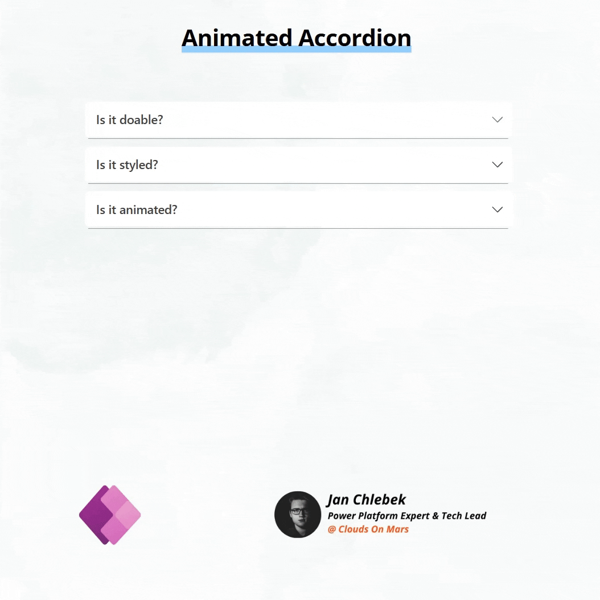

# Animated Accordion

Animated accordion component implemented using native components in Power Apps Canvas. Great for FAQ and any other foldable UI objects.

## Authors

Author|Socials
--------|---------
Jan Chlebek | [LinkedIn](https://www.linkedin.com/in/jan-chlebek/) - ([GitHub](https://github.com/jan-chlebek) )

## Minimal path to awesome

1. Open your Power App in edit mode
2. Copy the contents of the **[animated-accordion.pa.pa.yaml](./source/animated-accordion.pa.yaml)**
3. Right-click on the screen where you want to add the snippet and select `Paste`

## Disclaimer

**THIS CODE IS PROVIDED *AS IS* WITHOUT WARRANTY OF ANY KIND, EITHER EXPRESS OR IMPLIED, INCLUDING ANY IMPLIED WARRANTIES OF FITNESS FOR A PARTICULAR PURPOSE, MERCHANTABILITY, OR NON-INFRINGEMENT.**

