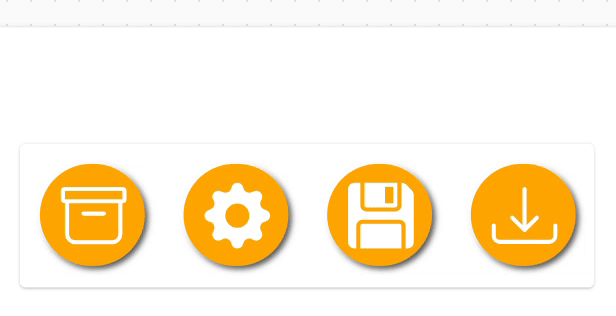

# Animated Canvas Buttons with CSS-style SVG Effects (YAML Snippet)

Bring your Canvas Power Apps to life with animated SVG buttons styled to mimic CSS hover and microinteraction effects. Use this reusable snippet to apply visual polish and responsiveness to buttons via declarative YAML.

## Authors

Snippet|Author(s)
--------|---------
Animated CSS SVG Button | [Felix Verduin](https://github.com/felixverduin) ([Hashnode](https://fsvtech.hashnode.dev/) / [LinkedIn](https://www.linkedin.com/in/felixverduin/))

## Minimal path to awesome

> **_NOTE:_** The recommended best practice is to utilize this YAML snippet inside of a canvas component for reusability.

1. Open your canvas app in **Power Apps**
1. Copy the contents of the **[YAML-file](./source/AnimatedSVGButton.yaml)**
1. Right click on the screen where you want to add the snippet and select **Paste**

## Disclaimer

**THIS CODE IS PROVIDED *AS IS* WITHOUT WARRANTY OF ANY KIND, EITHER EXPRESS OR IMPLIED, INCLUDING ANY IMPLIED WARRANTIES OF FITNESS FOR A PARTICULAR PURPOSE, MERCHANTABILITY, OR NON-INFRINGEMENT.**

