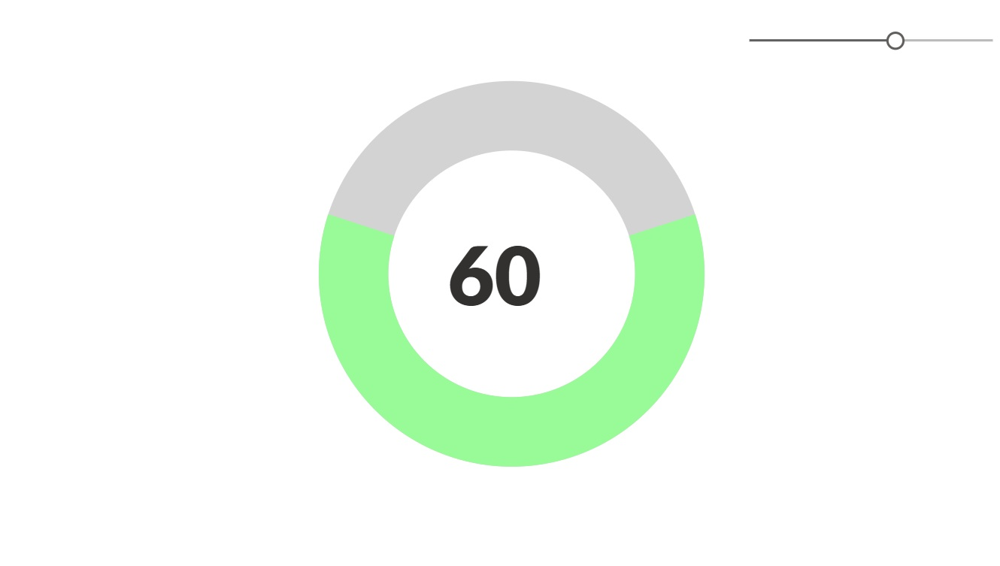

# Animated Progress Circle Chart 

This is an animated progress chart which functions off of a slider value 0 - 100. 

## Authors

Snippet|Author(s)
--------|---------
Animated Progress Circle Chart | [Melissa Hale](https://github.com/Mello245) ([LinkedIn](https://www.linkedin.com/in/melissa-stephanie-hale/) )

## Minimal path to awesome

1. Open your canvas app in **Power Apps**
1. Copy the contents of the **[YAML-file](./source/sample.yaml)** 
1. Right click on the screen where you want to add the snippet and select "Paste YAML"


## Code

``` YAML
- Chart:
          Control: Image@2.2.3
          Properties:
            BorderColor: =RGBA(0, 0, 0, 0)
            BorderStyle: =BorderStyle.None
            BorderThickness: =2
            DisabledBorderColor: =RGBA(0, 0, 0, 0)
            DisabledFill: =RGBA(0, 0, 0, 0)
            FocusedBorderThickness: =4
            Height: =653
            HoverBorderColor: =RGBA(0, 0, 0, 0)
            HoverFill: =RGBA(0, 0, 0, 0)
            Image: |+
              ="data:image/svg+xml;utf8," & EncodeUrl(
                  "<svg width='50' height='50' viewBox='0 0 50 50' xmlns='http://www.w3.org/2000/svg'>" & 
                      "<circle cx='25' cy='25' r='" & 100/(2*Pi()) & "' stroke='lightgray' stroke-width='7' fill='transparent'/>" & 
                      "<circle cx='25' cy='25' r='" & 100/(2*Pi()) & "' stroke='palegreen' stroke-width='7' fill='transparent' stroke-dasharray='" & Text(Slider1.Value/2) & "," & Text(100 - Slider1.Value) & "' transform='rotate(90,25,25)'>" & 
                          "<animate attributeName='stroke-dasharray' values='0,100;" & Text(Slider1.Value/2) & "," & Text(100 - Slider1.Value) & "' dur='1s' repeatCount='1'/>" & 
                          "<animate attributeName='stroke' values='rgba(255,0,0);" & 
                              If(Slider1.Value>50, "rgba(255,130,0);", "") & 
                              "rgba(" & If(Slider1.Value<50, 255, 255 - (Slider1.Value-50)/50 * 255) & "," & 
                              If(Slider1.Value<50, (Slider1.Value)/50 * 130) & ",0)" & 
                          "' dur='1s' repeatCount='1'/>" & 
                      "</circle>" & 
                  "</svg>"
              )

            PressedBorderColor: =RGBA(0, 0, 0, 0)
            PressedFill: =RGBA(0, 0, 0, 0)
            Width: =1016
            X: =175
            Y: =40
      - Slider1:
          Control: Classic/Slider@2.1.0
          Properties:
            BorderColor: =RGBA(0, 0, 0, 0)
            BorderStyle: =BorderStyle.None
            BorderThickness: =2
            DisabledBorderColor: =RGBA(0, 0, 0, 0)
            FocusedBorderThickness: =4
            HandleActiveFill: =RGBA(255, 255, 255, 1)
            HandleHoverFill: =RGBA(255, 255, 255, 1)
            HoverBorderColor: =RGBA(0, 0, 0, 0)
            OnChange: =Set(varReset,true);Set(verReset,false);
            PressedBorderColor: =RGBA(0, 0, 0, 0)
            RailFill: =RGBA(184, 187, 184, 1)
            RailHoverFill: =RGBA(222, 236, 249, 1)
            ValueFill: =RGBA(96, 94, 92, 1)
            ValueHoverFill: =RGBA(0, 120, 212, 1)
            X: =996
            Y: =40
      - Label1:
          Control: Label@2.5.1
          Properties:
            BorderColor: =RGBA(0, 0, 0, 0)
            BorderStyle: =BorderStyle.None
            BorderThickness: =2
            Color: =RGBA(50, 49, 48, 1)
            DisabledBorderColor: =RGBA(0, 0, 0, 0)
            DisabledColor: =RGBA(161, 159, 157, 1)
            FocusedBorderThickness: =4
            Font: =Font.'Lato Black'
            FontWeight: =FontWeight.Lighter
            Height: =177
            Size: =80
            Text: =Slider1.Value
            Width: =221
            X: =594
            Y: =278

```

## Disclaimer

**THIS CODE IS PROVIDED *AS IS* WITHOUT WARRANTY OF ANY KIND, EITHER EXPRESS OR IMPLIED, INCLUDING ANY IMPLIED WARRANTIES OF FITNESS FOR A PARTICULAR PURPOSE, MERCHANTABILITY, OR NON-INFRINGEMENT.**


