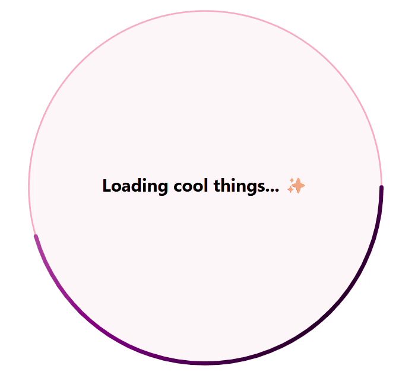

# Animated SVG Loading

This is a custom animated loading visual of a circle with gradient border color changing from purple to pink to purple over three seconds. The spinning graphic can be used to show application users that something is being processed in a more engaging way. 



## Author

Snippet | Author  
--------|----------
Animated SVG Loading | Cathrine Bruvold \| [GitHub](https://github.com/cathrinebruvold) \| [LinkedIn](https://www.linkedin.com/in/cathrine-bruvold-b91b92113/)

## Minimal path to awesome

1. Open your canvas app in **Power Apps**
1. Copy the contents of the **[YAML-file](./source/animated-svg-loading.pa.yaml)** 
1. Right click on the screen where you want to add the snippet and select "Paste"
    
1. Edit the code on the Image property of the SVG to change size, colors, duration etc. 

## 🎨 Customize the SVG Code

If you want to adapt the SVG to your needs, here are some options:

---

### 1. Repetition

Change how many times the animated circle should be drawn. Use a number or leave it infinite:

```xml
repeatCount="indefinite"
```

### 2. Center Text

Update the text message shown in the middle of the visual:

```xml
<text ...>Loading cool things... ✨</text>
```

### 3. Color Outline

Customize the outer stroke color of the circle:

```xml
<circle ... stroke="lightpink" />
```

### 4. Background Circle

Change the background color or its transparency (the last number controls opacity):

```xml
<circle cx="250" cy="250" r="220" fill="rgba(255, 182, 193, 0.1)" />
```

### 5. Gradient Colors

Add or update gradient stops to create a smooth color transition:

```xml
<stop offset="0%" stop-color="pink" />
<stop offset="60%" stop-color="purple" />
<stop offset="100%" stop-color="darkpurple" />
```

> 💡 You can add more `<stop>` tags to create richer color transitions.

### 6. Animation Speed

Control how fast the circle is drawn:

```xml
dur="3s"
```

Try `2s`, `5s`, etc. to make it faster or slower.

### 7. Visual Styling

**Stroke Appearance**  
Control the thickness and shape of the animated stroke:

```xml
stroke-width="5"
stroke-linecap="round"
```

You can try `"square"` or `"butt"` instead of `"round"` for different styles.

**Text Styling**  
Tweak the font, size, and color of the central message:

```xml
font-size="22"
font-family="Segoe UI"
font-weight="bold"
fill="black"
```

### 💡 Final Tip

Most importantly — **have fun** and make something **AMAZING** ✨  
This is your loading screen, so give it your personality!

## Disclaimer

**THIS CODE IS PROVIDED *AS IS* WITHOUT WARRANTY OF ANY KIND, EITHER EXPRESS OR IMPLIED, INCLUDING ANY IMPLIED WARRANTIES OF FITNESS FOR A PARTICULAR PURPOSE, MERCHANTABILITY, OR NON-INFRINGEMENT.**


