# Breadcrumbs

This snippet shows you how to build breadcrumbs for Canvas apps. In this example, we will use a component so that the functionalities are reusable on different screens within your Canvas app.

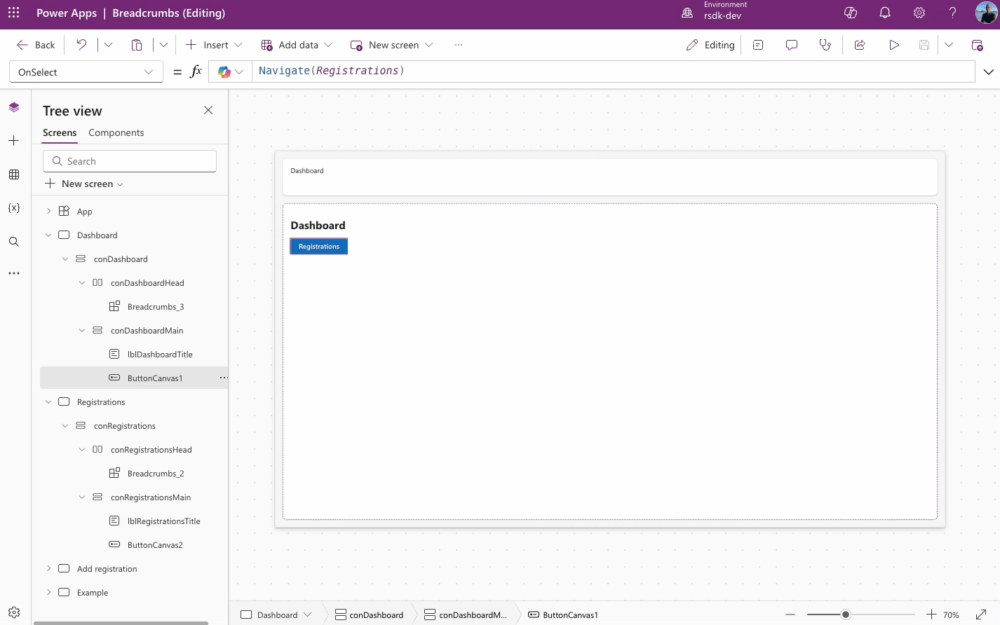

## Authors

Snippet|Author
--------|---------
Arjan Rijsdijk | [GitHub](https://github.com/arijsdijk) - [Bluesky](https://bsky.app/profile/arjanrijsdijk.com) - [LinkedIn](https://www.linkedin.com/in/arjanrijsdijk/)


## Preparation
To properly test and use the breadcrumbs functionality later, we’ll need a Canvas app (or custom pages in a model-driven app).

In this example, I’ve put together an app with 3 simple screens:

* Dashboard
* Registrations
* Add Registration

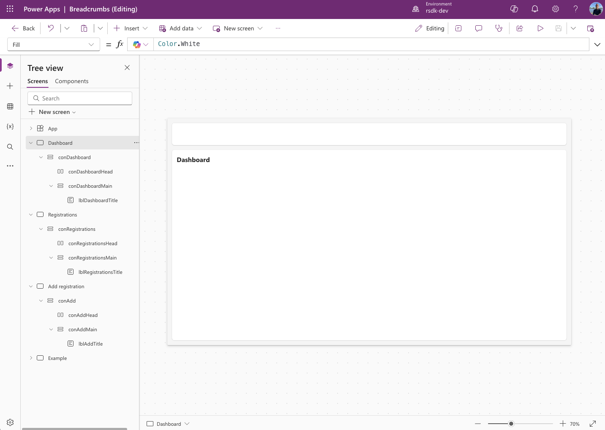


You can use the YAML code below to create the Dashboard page. Click + New screen and paste the code below (right-click > Paste).

```yaml

Screens:
  Dashboard:
    Children:
      - conDashboard:
          Control: GroupContainer@1.3.0
          Variant: AutoLayout
          Properties:
            Fill: =RGBA(245, 245, 245, 1)
            Height: =Parent.Height
            LayoutAlignItems: =LayoutAlignItems.Stretch
            LayoutDirection: =LayoutDirection.Vertical
            LayoutGap: =16
            PaddingBottom: =16
            PaddingLeft: =16
            PaddingRight: =16
            PaddingTop: =16
            Width: =Parent.Width
          Children:
            - conDashboardHead:
                Control: GroupContainer@1.3.0
                Variant: AutoLayout
                Properties:
                  Fill: =RGBA(255, 255, 255, 1)
                  FillPortions: =0
                  Height: =75
                  LayoutDirection: =LayoutDirection.Horizontal
                  RadiusBottomLeft: =8
                  RadiusBottomRight: =8
                  RadiusTopLeft: =8
                  RadiusTopRight: =8
            - conDashboardMain:
                Control: GroupContainer@1.3.0
                Variant: AutoLayout
                Properties:
                  Fill: =RGBA(255, 255, 255, 1)
                  LayoutDirection: =LayoutDirection.Vertical
                  PaddingBottom: =16
                  PaddingLeft: =16
                  PaddingRight: =16
                  PaddingTop: =16
                  RadiusBottomLeft: =8
                  RadiusBottomRight: =8
                  RadiusTopLeft: =8
                  RadiusTopRight: =8
                Children:
                  - lblDashboardTitle:
                      Control: Text@0.0.51
                      Properties:
                        AlignInContainer: =AlignInContainer.Stretch
                        Size: =22
                        Text: ="Dashboard"
                        VerticalAlign: =VerticalAlign.Middle
                        Weight: ='TextCanvas.Weight'.Bold 

```


### Create a Collection
We’ll start by creating a collection for the data we’ll need later in the breadcrumbs. See the example below.

```
ClearCollect( 
    colBreadcrumbs,
    { 
        DisplayOrder: 1,
        Name: "Dashboard ", 
        Screen: 'Dashboard',
        AccessibleLabel: "Go to dashboard",
        isVisible: true
    },
    { 
        DisplayOrder: 2,
        Name: "Time Registration", 
        Screen: 'Registrations',
        AccessibleLabel: "Go to time registrations",
        isVisible: true
    },
    { 
        DisplayOrder: 3,
        Name: "Add registration" 
    }
)
```
For now, we’ll put this collection in the App OnStart property — see the example below.

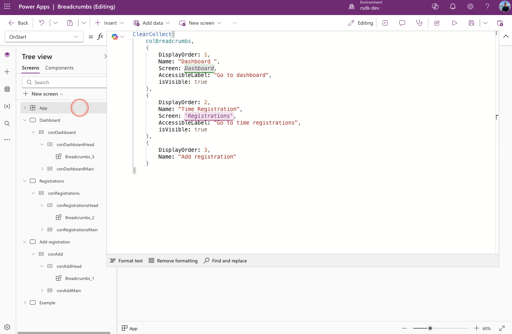


## Component
To avoid having to copy all the controls to different screens later, we’re going to create a component. We can then reuse this component on all our screens in the app.

### Create a new component

* In Power Apps Studio, go to Components
* Click + New component
* Give the component a name (in this example: Breadcrumbs)
* Turn on Access app scope (this allows the component to use data, collections, and variables from the app)
* Set the component height to 48


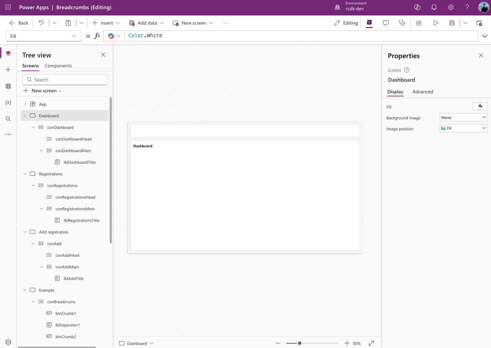

## Create the Crumbs
Before we start building the breadcrumbs, there are a few things worth explaining.

Breadcrumbs are basically a horizontal display of elements. Normally, you might go for a Horizontal gallery, but the big drawback is that it doesn’t support flexible width. That’s why we’re choosing a Horizontal container instead — it lets us neatly display all the controls in a row.

In this example, we’re creating a component with 3 breadcrumbs by default. Using the Visible property, we’ll decide which breadcrumbs should actually be shown — so it’ll still work even in situations with just two levels.

Simply put, we’ll place a horizontal container with the following controls inside:

**Button ➡️ Divider ➡️ Button ➡️ Divider ➡️ Text**

The result should look something like this:

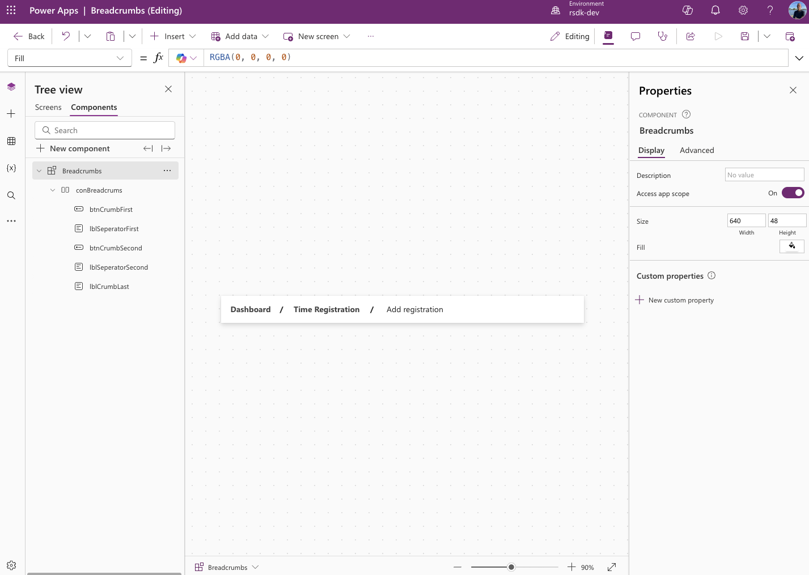

To get the same result, copy the YAML code below into the component you created earlier.

```yaml
- conBreadcrums:
    Control: GroupContainer@1.3.0
    Variant: AutoLayout
    Properties:
      DropShadow: =DropShadow.None
      Fill: =RGBA(255, 255, 255, 1)
      Height: =48
      LayoutDirection: =LayoutDirection.Horizontal
      PaddingLeft: =16
      PaddingRight: =16
      RadiusBottomLeft: =0
      RadiusBottomRight: =0
      RadiusTopLeft: =0
      RadiusTopRight: =0
      Width: =Parent.Width
    Children:
      - btnCrumbFirst:
          Control: Button@0.0.45
          Properties:
            AccessibleLabel: =LookUp(colBreadcrumbs,DisplayOrder = 1).AccessibleLabel
            Align: =Align.Left
            AlignInContainer: =AlignInContainer.Center
            Appearance: ='ButtonCanvas.Appearance'.Transparent
            Font: =Font.'Segoe UI'
            FontSize: =14
            FontWeight: =FontWeight.Bold
            Icon: ="ChevronRight"
            Layout: ='ButtonCanvas.Layout'.TextOnly
            OnSelect: =Navigate(LookUp(colBreadcrumbs,DisplayOrder = 1).Screen)
            PaddingBottom: =0
            PaddingLeft: =0
            PaddingRight: =0
            PaddingTop: =0
            Text: =LookUp(colBreadcrumbs,DisplayOrder = 1).Name
            Visible: =LookUp(colBreadcrumbs,DisplayOrder = 1).isVisible
            Width: |
              =Len(LookUp(colBreadcrumbs,DisplayOrder = 1).Name) * 7.5
            X: =136
            Y: =40
      - lblSeperatorFirst:
          Control: Text@0.0.51
          Properties:
            Align: ='TextCanvas.Align'.Center
            AlignInContainer: =AlignInContainer.Center
            Text: ="/"
            VerticalAlign: =VerticalAlign.Middle
            Visible: =LookUp(colBreadcrumbs,DisplayOrder = 1).isVisible
            Weight: ='TextCanvas.Weight'.Bold
            Width: =32
      - btnCrumbSecond:
          Control: Button@0.0.45
          Properties:
            AccessibleLabel: =LookUp(colBreadcrumbs,DisplayOrder = 2).AccessibleLabel
            Align: =Align.Center
            AlignInContainer: =AlignInContainer.Center
            Appearance: ='ButtonCanvas.Appearance'.Transparent
            Font: =Font.'Segoe UI'
            FontSize: =14
            FontWeight: =FontWeight.Bold
            Icon: ="ChevronRight"
            Layout: ='ButtonCanvas.Layout'.TextOnly
            OnSelect: =Navigate(LookUp(colBreadcrumbs,DisplayOrder = 2).Screen)
            PaddingBottom: =0
            PaddingLeft: =0
            PaddingRight: =0
            PaddingTop: =0
            Text: =LookUp(colBreadcrumbs,DisplayOrder = 2).Name
            Visible: =LookUp(colBreadcrumbs,DisplayOrder = 2).isVisible
            Width: =Len(LookUp(colBreadcrumbs,DisplayOrder = 2).Name) * 7.5
            X: =136
            Y: =40
      - lblSeperatorSecond:
          Control: Text@0.0.51
          Properties:
            Align: ='TextCanvas.Align'.Center
            AlignInContainer: =AlignInContainer.Center
            Text: ="/"
            VerticalAlign: =VerticalAlign.Middle
            Visible: =LookUp(colBreadcrumbs,DisplayOrder = 2).isVisible
            Weight: ='TextCanvas.Weight'.Bold
            Width: =32
      - lblCrumbLast:
          Control: Text@0.0.51
          Properties:
            Align: ='TextCanvas.Align'.Center
            AlignInContainer: =AlignInContainer.Center
            Font: =Font.'Segoe UI'
            Text: =LookUp(colBreadcrumbs,DisplayOrder = 3).Name
            VerticalAlign: =VerticalAlign.Middle
            Width: =Len(LookUp(colBreadcrumbs,DisplayOrder = 3).Name) * 7.5 
            
```

## The Controls
We’ve now got a nice component set up, but it’s worth taking a closer look at some of the controls and Power Fx functions we’ve used — so you understand how and why we’re using them this way.

### Button

For the first two breadcrumb levels, we’re using a modern button. This makes it easy to use the OnSelect property to navigate to the corresponding screen. 

For some properties, we’re using a Lookup to pull data from the collection we created earlier (colBreadcrumbs).

#### Text property

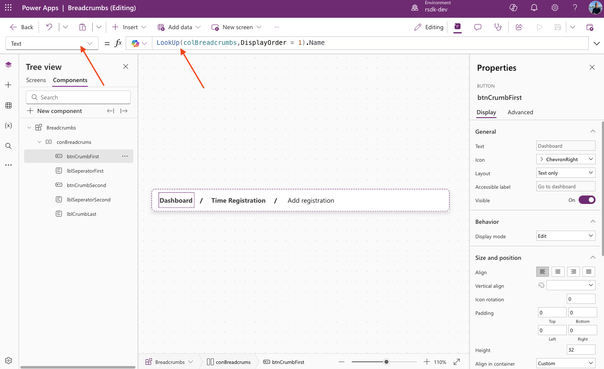

#### OnSelect property

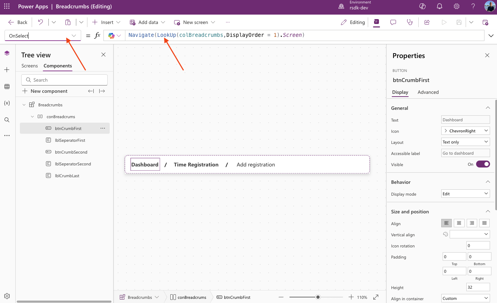

#### Width

While building these breadcrumbs, I ran into a fun challenge. There’s no auto-width property for a button or text label that automatically adjusts the control’s width based on its content (text).

To get the right width anyway, I use the Len function to get the number of characters, then multiply that number by 7.5. That way, I calculate the needed width for the control.

```
Len(LookUp(colBreadcrumbs,DisplayOrder = 1).Name) * 7.5
```

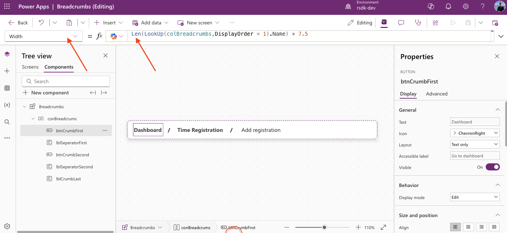

Even though the result isn’t always 100% exact, it works well enough for this solution. Just a heads-up: this calculation is based on the Segoe UI font at size 14. If you use a different font or size, you’ll need to adjust the formula accordingly.

#### AccessibleLabel

An important part (and one we often forget) is the accessibility of your app. In the end, the app should be usable for everyone and easy for screen readers to interpret. That’s why we included the accessible label for the buttons in the collection we created earlier.

In the AccessibleLabelPower apps breadcrumbs using icon as dividerPower apps breadcrumbs using icon as divider property of the buttons, we use the following lookup:

```
LookUp(colBreadcrumbs,DisplayOrder = 1).AccessibleLabel
```

This way, screen readers will also present this type of navigation correctly to the user(s).

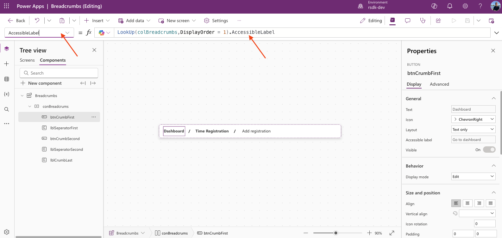


#### Dividers

After each breadcrumb option, we add a divider. In this example, we use a text label with a slash (/) to separate the crumbs.

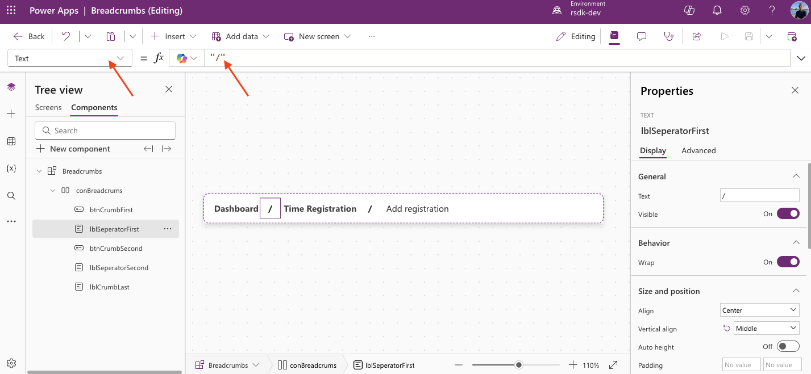

Of course, you can also use icons or images as dividers — some examples with YAML code are at the bottom of this article.

## Use the Component
Now that we’ve built the component, it’s time to add it to the different screens.

### Add Component to Screen
First, open the screen called Add registration. Then click the + in the header, go to Custom, and select Breadcrumbs.

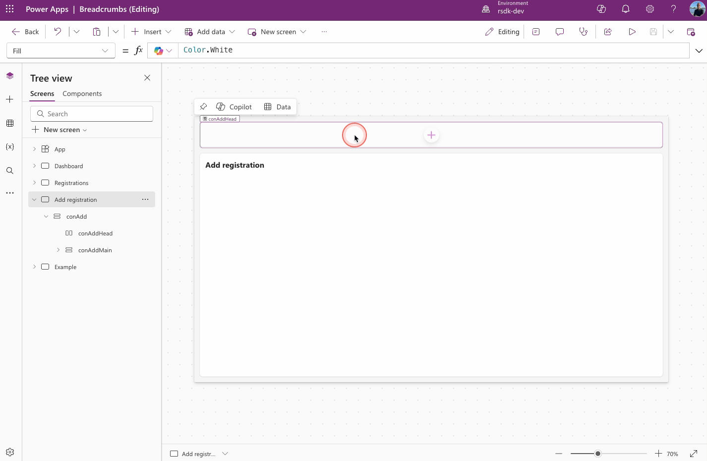

Repeat this step for all the other screens you created earlier, so each screen has the Breadcrumbs component in its header.

### OnVisible & colBreadcrumbs
Each screen now has the component in its header, but they all rely on the collection (colBreadcrumbs) we created earlier and placed in the App’s OnStart property.

So now we need to make sure each screen shows the right crumbs based on that collection.

There are two ways to do this: update the collection or just create a new collection for each screen. In this example, we go with the latter.

Open the Registrations screen.

Go to the screen’s OnVisible property and copy-paste the following YAML code.

```
ClearCollect( 
    colBreadcrumbs,
    { 
        DisplayOrder: 1,
        Name: "Dashboard ", 
        Screen: 'Dashboard',
        AccessibleLabel: "Go to dashboard",
        isVisible: true
    },
    { 
        DisplayOrder: 2,
        Name: "Time Registration", 
        Screen: 'Registrations',
        AccessibleLabel: "Go to time registrations",
        isVisible: false
    },
    { 
        DisplayOrder: 3,
        Name: "Time registration"
    }
)
```

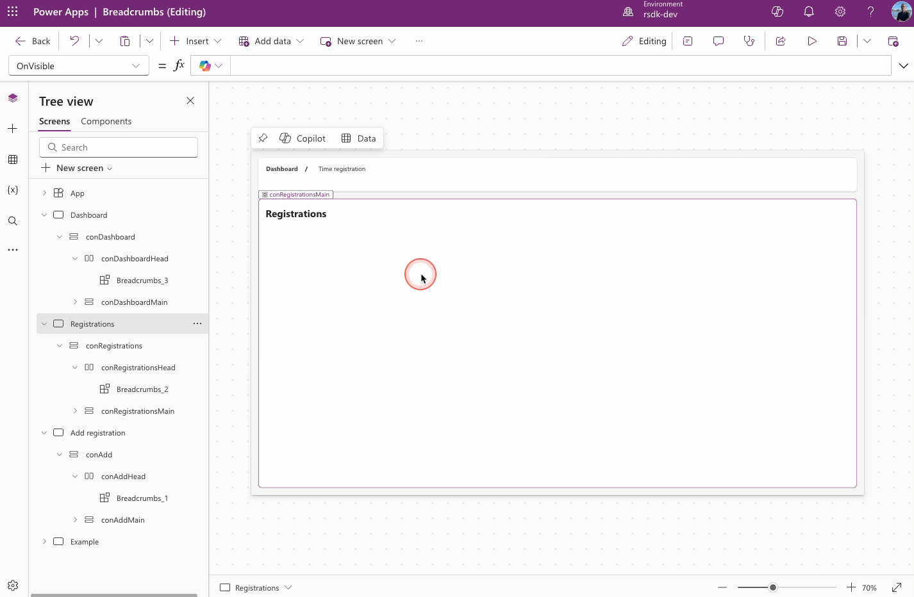

Since we only need 2 crumbs here and the last one should always be a non-clickable text label of the active screen, we set the visibility of the second crumb to False.

Now open the Dashboard screen.

Go to the screen’s OnVisible property and copy-paste the following YAML code.

```
ClearCollect( 
    colBreadcrumbs,
    { 
        DisplayOrder: 1,
        Name: "Dashboard ", 
        Screen: 'Dashboard',
        AccessibleLabel: "Go to dashboard",
        isVisible: true
    },
    { 
        DisplayOrder: 2,
        Name: "Time Registration", 
        Screen: 'Registrations',
        AccessibleLabel: "Go to time registrations",
        isVisible: false
    },
    { 
        DisplayOrder: 3,
        Name: "Time registration"
    }
)
```

Now open the Add registration screen.

Go to the screen’s OnVisible property and copy-paste the following YAML code.

```
ClearCollect( 
    colBreadcrumbs,
    { 
        DisplayOrder: 1,
        Name: "Dashboard ", 
        Screen: Dashboard,
        AccessibleLabel: "Go to dashboard",
        isVisible: true
    },
    { 
        DisplayOrder: 2,
        Name: "Time Registration", 
        Screen: 'Registrations',
        AccessibleLabel: "Go to time registrations",
        isVisible: true
    },
    { 
        DisplayOrder: 3,
        Name: "Add registration" 
    }
)
```

Now, when we navigate between the different screens, we can see the breadcrumbs in action.

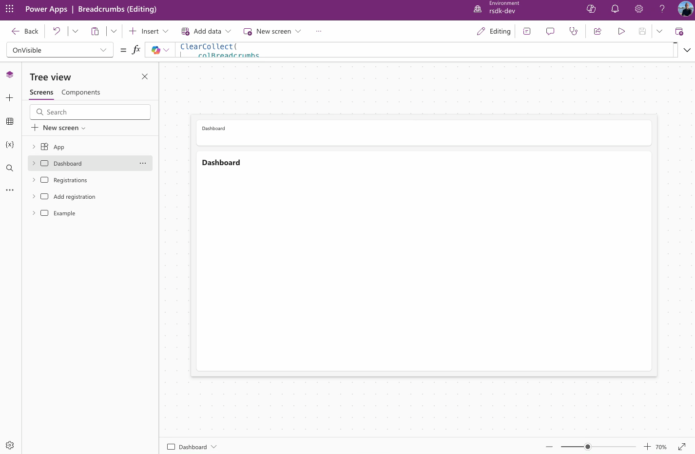

To check the result, I’m placing a button on the Dashboard screen that will navigate to Registrations, and on that screen, I’ll add another button to navigate to Add registration.

Let’s take a look at how it turns out!


## Examples
Based on the example above, I’ve put together a few other versions. 

Just a heads-up: before you can use the YAML code, you’ll need the colBreadcrumbs collection from the earlier example.

### Icons
In this example, we use an icon as the divider.

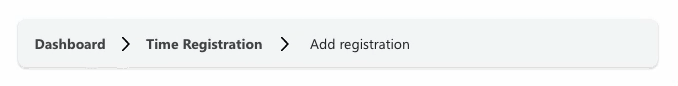


Copy and paste the YAML code below to give it a try.


```yaml
- conBreadcrumbsIcon:
    Control: GroupContainer@1.3.0
    Variant: AutoLayout
    Properties:
      Fill: =RGBA(214, 221, 224, 0.3)
      Height: =48
      LayoutDirection: =LayoutDirection.Horizontal
      PaddingLeft: =16
      PaddingRight: =16
      RadiusBottomLeft: =8
      RadiusBottomRight: =8
      RadiusTopLeft: =8
      RadiusTopRight: =8
      Width: =640
      X: =64
      Y: =64
    Children:
      - btnCrumbIcon1:
          Control: Button@0.0.45
          Properties:
            Align: =Align.Left
            AlignInContainer: =AlignInContainer.Center
            Appearance: ='ButtonCanvas.Appearance'.Transparent
            Font: =Font.'Segoe UI'
            FontSize: =14
            FontWeight: =FontWeight.Bold
            Icon: ="ChevronRight"
            Layout: ='ButtonCanvas.Layout'.TextOnly
            PaddingBottom: =0
            PaddingLeft: =0
            PaddingRight: =0
            PaddingTop: =0
            Text: =LookUp(colBreadcrumbs,DisplayOrder = 1).Name
            Width: |
              =Len(LookUp(colBreadcrumbs,DisplayOrder = 1).Name) * 7.5
            X: =136
            Y: =40
      - icoCrumbIcon1:
          Control: Icon@0.0.7
          Properties:
            AlignInContainer: =AlignInContainer.Center
            Height: =24
            Icon: ="ChevronRight"
            IconColor: =RGBA(0, 0, 0, 1)
            IconStyle: ='Icon.IconStyle'.Filled
      - btnCrumbIcon2:
          Control: Button@0.0.45
          Properties:
            Align: =Align.Center
            AlignInContainer: =AlignInContainer.Center
            Appearance: ='ButtonCanvas.Appearance'.Transparent
            Font: =Font.'Segoe UI'
            FontSize: =14
            FontWeight: =FontWeight.Bold
            Icon: ="ChevronRight"
            Layout: ='ButtonCanvas.Layout'.TextOnly
            PaddingBottom: =0
            PaddingLeft: =0
            PaddingRight: =0
            PaddingTop: =0
            Text: =LookUp(colBreadcrumbs,DisplayOrder = 2).Name
            Width: =Len(LookUp(colBreadcrumbs,DisplayOrder = 2).Name) * 7.5
            X: =136
            Y: =40
      - icoCrumbIcon2:
          Control: Icon@0.0.7
          Properties:
            AlignInContainer: =AlignInContainer.Center
            Height: =24
            Icon: ="ChevronRight"
            IconColor: =RGBA(0, 0, 0, 1)
            IconStyle: ='Icon.IconStyle'.Filled
      - lblCrumbIcon3:
          Control: Text@0.0.51
          Properties:
            Align: ='TextCanvas.Align'.Center
            AlignInContainer: =AlignInContainer.Center
            Font: =Font.'Segoe UI'
            Text: =LookUp(colBreadcrumbs,DisplayOrder = 3).Name
            VerticalAlign: =VerticalAlign.Middle
            Weight: ='TextCanvas.Weight'.Medium
            Width: =Len(LookUp(colBreadcrumbs,DisplayOrder = 3).Name) * 7.5 
```

### Image (SVG)
In this example, we use an SVG image as the divider.

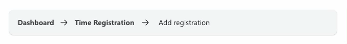

```yaml
- conBreadcrumbsSvg:
    Control: GroupContainer@1.3.0
    Variant: AutoLayout
    Properties:
      Fill: |
        =RGBA(214, 221, 224, 0.3)
      Height: =48
      LayoutDirection: =LayoutDirection.Horizontal
      PaddingLeft: =16
      PaddingRight: =16
      RadiusBottomLeft: =8
      RadiusBottomRight: =8
      RadiusTopLeft: =8
      RadiusTopRight: =8
      Width: =640
      X: =64
      Y: =64
    Children:
      - btnCrumbSvg1:
          Control: Button@0.0.45
          Properties:
            Align: =Align.Left
            AlignInContainer: =AlignInContainer.Center
            Appearance: ='ButtonCanvas.Appearance'.Transparent
            FontWeight: =FontWeight.Bold
            Icon: ="ChevronRight"
            Layout: ='ButtonCanvas.Layout'.TextOnly
            PaddingBottom: =0
            PaddingLeft: =0
            PaddingRight: =0
            PaddingTop: =0
            Text: =LookUp(colBreadcrumbs,DisplayOrder = 1).Name
            Width: |
              =Len(LookUp(colBreadcrumbs,DisplayOrder = 1).Name) * 7.5
            X: =136
            Y: =40
      - imgCrumbSvg1:
          Control: Image@2.2.3
          Properties:
            AlignInContainer: =AlignInContainer.Center
            Height: =24
            Image: |-
              ="data:image/svg+xml;utf8, "&EncodeUrl("<svg xmlns='http://www.w3.org/2000/svg' fill='none' viewBox='0 0 24 24' stroke-width='1.5' stroke='currentColor' class='size-6'>
                <path stroke-linecap='round' stroke-linejoin='round' d='M13.5 4.5 21 12m0 0-7.5 7.5M21 12H3' />
              </svg>
              ")
            PaddingLeft: =8
            PaddingRight: |+
              =8

            Width: =32
            X: =650
            Y: =350
      - btnCrumbSvg2:
          Control: Button@0.0.45
          Properties:
            Align: =Align.Center
            AlignInContainer: =AlignInContainer.Center
            Appearance: ='ButtonCanvas.Appearance'.Transparent
            FontWeight: =FontWeight.Bold
            Icon: ="ChevronRight"
            Layout: ='ButtonCanvas.Layout'.TextOnly
            PaddingBottom: =0
            PaddingLeft: =0
            PaddingRight: =0
            PaddingTop: =0
            Text: =LookUp(colBreadcrumbs,DisplayOrder = 2).Name
            Width: =Len(LookUp(colBreadcrumbs,DisplayOrder = 2).Name) * 7.5
            X: =136
            Y: =40
      - imgCrumbSvg2:
          Control: Image@2.2.3
          Properties:
            AlignInContainer: =AlignInContainer.Center
            Height: =24
            Image: |-
              ="data:image/svg+xml;utf8, "&EncodeUrl("<svg xmlns='http://www.w3.org/2000/svg' fill='none' viewBox='0 0 24 24' stroke-width='1.5' stroke='currentColor' class='size-6'>
                <path stroke-linecap='round' stroke-linejoin='round' d='M13.5 4.5 21 12m0 0-7.5 7.5M21 12H3' />
              </svg>
              ")
            PaddingLeft: =8
            PaddingRight: |+
              =8

            Width: =32
            X: =650
            Y: =350
      - lblCrumbSvg3:
          Control: Text@0.0.51
          Properties:
            Align: ='TextCanvas.Align'.Center
            AlignInContainer: =AlignInContainer.Center
            Text: =LookUp(colBreadcrumbs,DisplayOrder = 3).Name
            VerticalAlign: =VerticalAlign.Middle
            Width: =Len(LookUp(colBreadcrumbs,DisplayOrder = 3).Name) * 7.5 
```

### Colors
Here’s an example using a different color (green).


Copy and paste the YAML code below to give it a try.

```yaml 
- conBreadcrumbsGreen:
    Control: GroupContainer@1.3.0
    Variant: AutoLayout
    Properties:
      BorderColor: =RGBA(162, 206, 187, 1)
      BorderThickness: =1
      DropShadow: =DropShadow.None
      Fill: =RGBA(209, 231, 222, 1)
      Height: =48
      LayoutDirection: =LayoutDirection.Horizontal
      PaddingLeft: =16
      PaddingRight: =16
      RadiusBottomLeft: =8
      RadiusBottomRight: =8
      RadiusTopLeft: =8
      RadiusTopRight: =8
      Width: =640
      X: =64
      Y: =64
    Children:
      - btnCrumbGreen1:
          Control: Button@0.0.45
          Properties:
            AccessibleLabel: =LookUp(colBreadcrumbs,DisplayOrder = 1).AccessibleLabel
            Align: =Align.Left
            AlignInContainer: =AlignInContainer.Center
            Appearance: ='ButtonCanvas.Appearance'.Transparent
            Font: =Font.'Segoe UI'
            FontColor: =RGBA(25, 136, 84, 1)
            FontWeight: =FontWeight.Bold
            Icon: ="ChevronRight"
            Layout: ='ButtonCanvas.Layout'.TextOnly
            OnSelect: =Navigate(LookUp(colBreadcrumbs,DisplayOrder = 1).Screen)
            PaddingBottom: =0
            PaddingLeft: =0
            PaddingRight: =0
            PaddingTop: =0
            Text: =LookUp(colBreadcrumbs,DisplayOrder = 1).Name
            Width: |
              =Len(LookUp(colBreadcrumbs,DisplayOrder = 1).Name) * 7.5
            X: =136
            Y: =40
      - lblSeperatorGreen1:
          Control: Text@0.0.51
          Properties:
            Align: ='TextCanvas.Align'.Center
            AlignInContainer: =AlignInContainer.Center
            FontColor: =RGBA(25, 136, 84, 1)
            Text: ="/"
            VerticalAlign: =VerticalAlign.Middle
            Weight: ='TextCanvas.Weight'.Bold
            Width: =32
      - btnCrumbGreen2:
          Control: Button@0.0.45
          Properties:
            AccessibleLabel: =LookUp(colBreadcrumbs,DisplayOrder = 2).AccessibleLabel
            Align: =Align.Center
            AlignInContainer: =AlignInContainer.Center
            Appearance: ='ButtonCanvas.Appearance'.Transparent
            Font: =Font.'Segoe UI'
            FontColor: =RGBA(25, 136, 84, 1)
            FontWeight: =FontWeight.Bold
            Icon: ="ChevronRight"
            Layout: ='ButtonCanvas.Layout'.TextOnly
            OnSelect: =Navigate(LookUp(colBreadcrumbs,DisplayOrder = 2).Screen)
            PaddingBottom: =0
            PaddingLeft: =0
            PaddingRight: =0
            PaddingTop: =0
            Text: =LookUp(colBreadcrumbs,DisplayOrder = 2).Name
            Width: =Len(LookUp(colBreadcrumbs,DisplayOrder = 2).Name) * 7.5
            X: =136
            Y: =40
      - lblSeperatorGreen2:
          Control: Text@0.0.51
          Properties:
            Align: ='TextCanvas.Align'.Center
            AlignInContainer: =AlignInContainer.Center
            FontColor: =RGBA(25, 136, 84, 1)
            Text: ="/"
            VerticalAlign: =VerticalAlign.Middle
            Weight: ='TextCanvas.Weight'.Bold
            Width: =32
      - lblCrumbGreen3:
          Control: Text@0.0.51
          Properties:
            Align: ='TextCanvas.Align'.Center
            AlignInContainer: =AlignInContainer.Center
            Font: =Font.'Segoe UI'
            FontColor: =RGBA(25, 136, 84, 1)
            Text: =LookUp(colBreadcrumbs,DisplayOrder = 3).Name
            VerticalAlign: =VerticalAlign.Middle
            Width: =Len(LookUp(colBreadcrumbs,DisplayOrder = 3).Name) * 7.5
```

### Darkmode
An example designed for use in a dark mode interface.

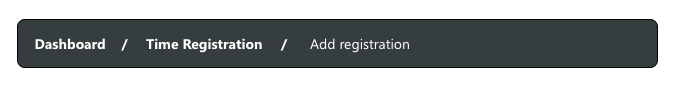

Copy and paste the YAML code below to give it a try.

```yaml
- conBreadcrumbsDark:
    Control: GroupContainer@1.3.0
    Variant: AutoLayout
    Properties:
      BorderThickness: =1
      DropShadow: =DropShadow.None
      Fill: =RGBA(53, 61, 63, 1)
      Height: =48
      LayoutDirection: =LayoutDirection.Horizontal
      PaddingLeft: =16
      PaddingRight: =16
      RadiusBottomLeft: =8
      RadiusBottomRight: =8
      RadiusTopLeft: =8
      RadiusTopRight: =8
      Width: =640
      X: =64
      Y: =64
    Children:
      - btnCrumbDark1:
          Control: Button@0.0.45
          Properties:
            AccessibleLabel: =LookUp(colBreadcrumbs,DisplayOrder = 1).AccessibleLabel
            Align: =Align.Left
            AlignInContainer: =AlignInContainer.Center
            Appearance: ='ButtonCanvas.Appearance'.Transparent
            Font: =Font.'Segoe UI'
            FontColor: =RGBA(255, 255, 255, 1)
            FontWeight: =FontWeight.Bold
            Icon: ="ChevronRight"
            Layout: ='ButtonCanvas.Layout'.TextOnly
            OnSelect: =Navigate(LookUp(colBreadcrumbs,DisplayOrder = 1).Screen)
            PaddingBottom: =0
            PaddingLeft: =0
            PaddingRight: =0
            PaddingTop: =0
            Text: =LookUp(colBreadcrumbs,DisplayOrder = 1).Name
            Width: |
              =Len(LookUp(colBreadcrumbs,DisplayOrder = 1).Name) * 7.5
            X: =136
            Y: =40
      - lblSeperatorDark1:
          Control: Text@0.0.51
          Properties:
            Align: ='TextCanvas.Align'.Center
            AlignInContainer: =AlignInContainer.Center
            FontColor: =RGBA(255, 255, 255, 1)
            Text: ="/"
            VerticalAlign: =VerticalAlign.Middle
            Weight: ='TextCanvas.Weight'.Bold
            Width: =32
      - btnCrumbDark2:
          Control: Button@0.0.45
          Properties:
            AccessibleLabel: =LookUp(colBreadcrumbs,DisplayOrder = 2).AccessibleLabel
            Align: =Align.Center
            AlignInContainer: =AlignInContainer.Center
            Appearance: ='ButtonCanvas.Appearance'.Transparent
            Font: =Font.'Segoe UI'
            FontColor: =RGBA(255, 255, 255, 1)
            FontWeight: =FontWeight.Bold
            Icon: ="ChevronRight"
            Layout: ='ButtonCanvas.Layout'.TextOnly
            OnSelect: =Navigate(LookUp(colBreadcrumbs,DisplayOrder = 2).Screen)
            PaddingBottom: =0
            PaddingLeft: =0
            PaddingRight: =0
            PaddingTop: =0
            Text: =LookUp(colBreadcrumbs,DisplayOrder = 2).Name
            Width: =Len(LookUp(colBreadcrumbs,DisplayOrder = 2).Name) * 7.5
            X: =136
            Y: =40
      - lblSeperatorDark2:
          Control: Text@0.0.51
          Properties:
            Align: ='TextCanvas.Align'.Center
            AlignInContainer: =AlignInContainer.Center
            FontColor: =RGBA(255, 255, 255, 1)
            Text: ="/"
            VerticalAlign: =VerticalAlign.Middle
            Weight: ='TextCanvas.Weight'.Bold
            Width: =32
      - lblCrumbDark3:
          Control: Text@0.0.51
          Properties:
            Align: ='TextCanvas.Align'.Center
            AlignInContainer: =AlignInContainer.Center
            Font: =Font.'Segoe UI'
            FontColor: =RGBA(255, 255, 255, 1)
            Text: =LookUp(colBreadcrumbs,DisplayOrder = 3).Name
            VerticalAlign: =VerticalAlign.Middle
            Width: =Len(LookUp(colBreadcrumbs,DisplayOrder = 3).Name) * 7.5
```


## Related

For a complete guide check out the toast notifications article on [LinkedIn](https://www.linkedin.com/pulse/create-breadcrumbs-your-power-app-arjan-rijsdijk-53iee/)

## Disclaimer

**THIS CODE IS PROVIDED *AS IS* WITHOUT WARRANTY OF ANY KIND, EITHER EXPRESS OR IMPLIED, INCLUDING ANY IMPLIED WARRANTIES OF FITNESS FOR A PARTICULAR PURPOSE, MERCHANTABILITY, OR NON-INFRINGEMENT.**

<!---

--->