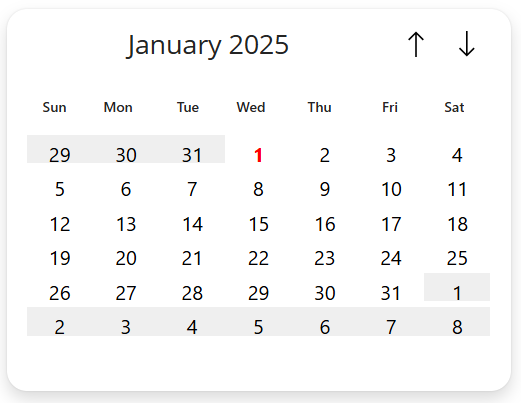

# Calendar

This is a snippet that can help you get started with creating a calendar in canvas app. It uses containers and galleries, to create a functional calendar.

## Authors

Snippet|Author(s)
--------|---------
Marcel Ferreira | [GitHub](https://github.com/marcelbf)

## Code

**[YAML-file](./source/calendar.pa.yaml)**

## Minimal path to awesome

1. Open your canvas app in **Power Apps**
1. Copy the contents of the **[YAML-file](./source/calendar.pa.yaml)** or copy the code from above.
1. Right click on the screen where you want to add the snippet and select "Paste Code"
1. Customize the values to your need. Use the variable **_selectedDate** to get or set the selected date.

## Disclaimer

**THIS CODE IS PROVIDED *AS IS* WITHOUT WARRANTY OF ANY KIND, EITHER EXPRESS OR IMPLIED, INCLUDING ANY IMPLIED WARRANTIES OF FITNESS FOR A PARTICULAR PURPOSE, MERCHANTABILITY, OR NON-INFRINGEMENT.**

