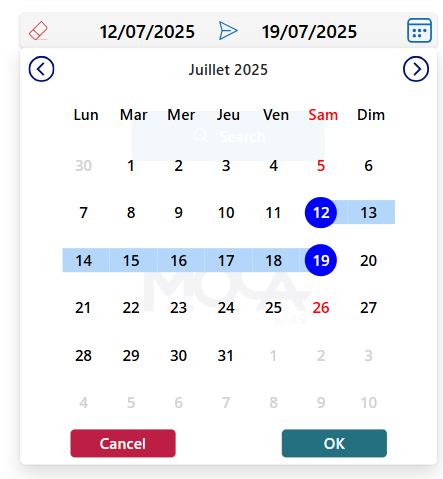

# Date Range Picker

This snippet implements a date range picker, enabling users to select a start and end date, thus improving the overall UX.

## Authors

Snippet|Author
--------|---------
Steve Bourdin | [GitHub](https://github.com/SteveBourdin) ([LinkedIn](https://www.linkedin.com/in/steve-bourdin-ab998762/) )

## Minimal path to awesome

1. Open your canvas app in **Power Apps**
2. Copy the contents of the **[YAML-file](./source/date-range-picker.yaml)** 
3. Click on the three dots of the screen where you want to add the snippet and select "Paste code"

## Code
 **[YAML-file](./source/date-range-picker.yaml)** 

## Disclaimer

**THIS CODE IS PROVIDED *AS IS* WITHOUT WARRANTY OF ANY KIND, EITHER EXPRESS OR IMPLIED, INCLUDING ANY IMPLIED WARRANTIES OF FITNESS FOR A PARTICULAR PURPOSE, MERCHANTABILITY, OR NON-INFRINGEMENT.**

