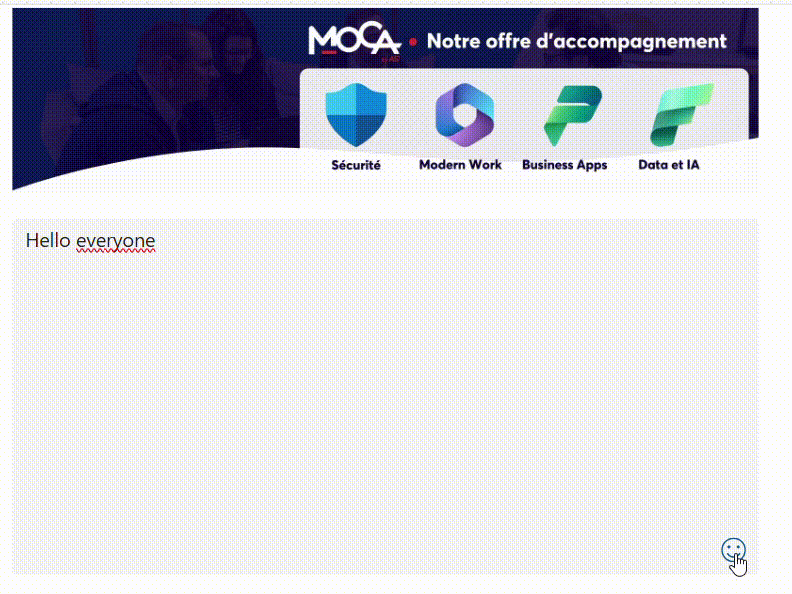

# Emoji Input

Emoji Input is a smart emoji search tool built in PowerApps. It lets users quickly find emojis by typing keywords, with instant filtering and organized results by category. Perfect for adding personality to forms, chats, or custom apps.

## Authors

Snippet|Author
--------|---------
Steve Bourdin | [GitHub](https://github.com/SteveBourdin) ([LinkedIn](https://www.linkedin.com/in/steve-bourdin-ab998762/) )

## Minimal path to awesome

1. Open your canvas app in **Power Apps**
1. Copy the contents of the **[YAML-file](./source/emoji-input.yaml)** 
1. Click on the three dots of the screen where you want to add the snippet and select "Paste code"

## Code
 **[YAML-file](./source/emoji-input.yaml)** 

## Disclaimer

**THIS CODE IS PROVIDED *AS IS* WITHOUT WARRANTY OF ANY KIND, EITHER EXPRESS OR IMPLIED, INCLUDING ANY IMPLIED WARRANTIES OF FITNESS FOR A PARTICULAR PURPOSE, MERCHANTABILITY, OR NON-INFRINGEMENT.**

