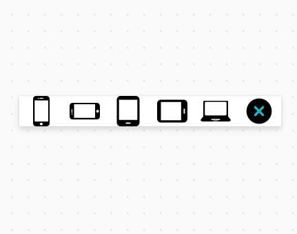
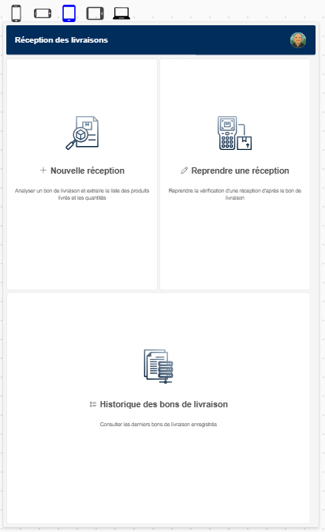

Form factor selection in editor

Allow you to change the form factor in edit mode, helping you to design responsive applications

⚠️⚠️⚠️ Important:

        Set Gallery.Y to : -Self.Height 

        
        You need to replace for<b> every screen</b> properties, otherwise screen will not be affected by your formfactor selection :
        
        Width :
                Max(App.Width, App.MinScreenWidth)

                by :
                Coalesce(vFormFactor.Width,Max(App.Width, App.MinScreenWidth))
        Height :
                Max(App.Height, App.MinScreenHeight)

                by :
                Coalesce(vFormFactor.Height,Max(App.Height, App.MinScreenHeight))

