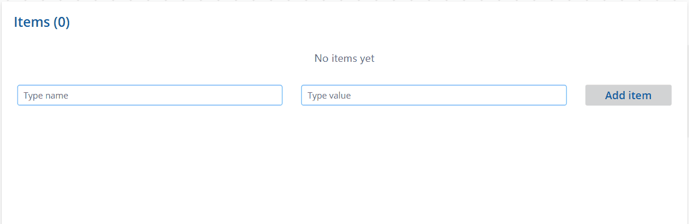

# Gallery with Dynamic Items

A canvas app snippet that lets users dynamically add and remove items from a gallery using two text fields. The gallery updates in real time, shows an item counter in the title, alternates row colors for readability, and displays an empty state message when no items are present.

## Features

- Add items with a **Name** and **Value** field
- Remove individual items with a trash icon
- **Item counter** in the title (e.g. "Items (3)")
- **Disabled Add button** when either field is blank
- Colors adapt to your app theme via `App.Theme.Colors`

## Authors

Snippet|Author
--------|---------
Gallery with Dynamic Items | [Ateina](https://github.com/Ateina)

## Minimal path to awesome

1. Open your canvas app in **Power Apps**
2. Copy the contents of the **[YAML-file](./source/gallery-dynamic-items.yaml)**
3. Click on the three dots of the screen where you want to add the snippet and select **Paste code**
4. Start the app and use the form to add items

> **Adapt to your project:** The `Name` and `Value` fields are generic placeholders. Rename them to match your use case and update the corresponding references in the YAML source — the text inputs, gallery labels, and `Collect` / `Patch` calls.

## Code

**[YAML-file](./source/gallery-dynamic-items.yaml)**

## Disclaimer

**THIS CODE IS PROVIDED *AS IS* WITHOUT WARRANTY OF ANY KIND, EITHER EXPRESS OR IMPLIED, INCLUDING ANY IMPLIED WARRANTIES OF FITNESS FOR A PARTICULAR PURPOSE, MERCHANTABILITY, OR NON-INFRINGEMENT.**

