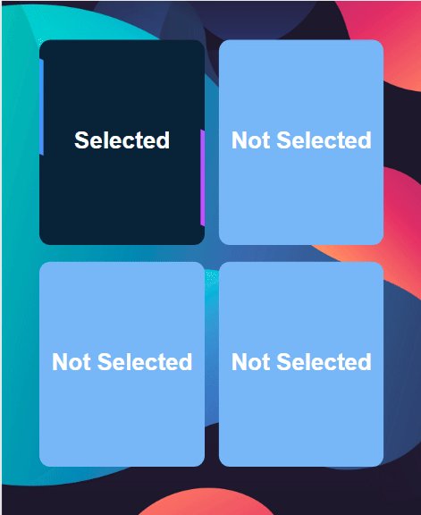
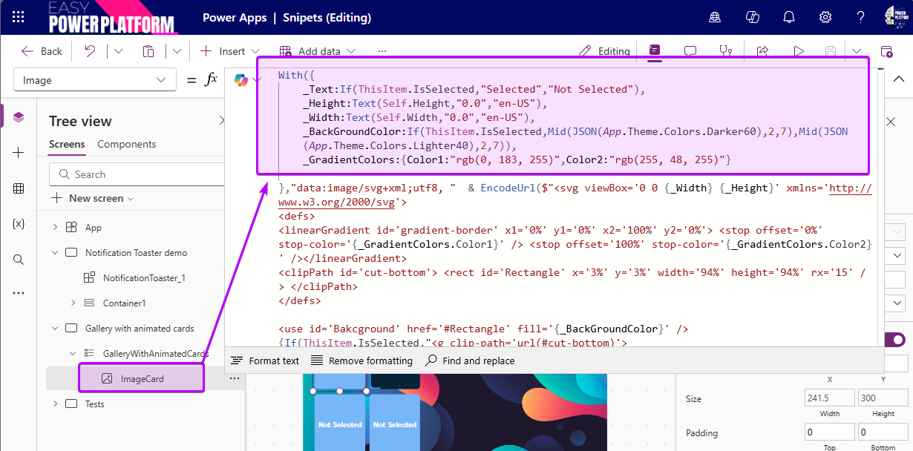
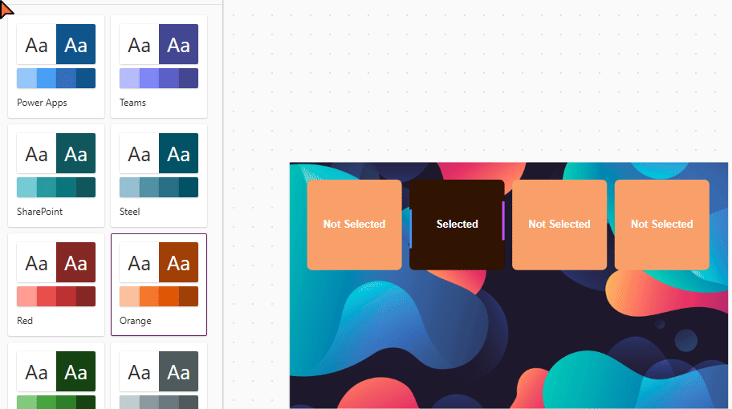

# Gallery with animated cards

A fairly simple use of a dynamic SVG image in a gallery to highlight the selected item with an animation.

## Authors

Snippet|Author
--------|---------
David Zoonekyndt | [GitHub](https://github.com/DavidZoon) ([LinkedIn](https://www.linkedin.com/in/david-zoonekyndt/) )

## Minimal path to awesome

1. Open your canvas app in **Power Apps**
1. Copy the contents of the **[YAML-file](./source/gallery-with-animated-cards.yaml)**
1. Click on the three dots of the screen where you want to add the snippet and select "Paste"
1. Customize the appearance and behavior of the map by changing the parameters in the With() of the Image object:
   

### ⚠️⚠️⚠️ Important

 Be careful, however, the visuals are less attractive on a gallery template that is too stretched in height or width.
 The card is responsive; it will adapt to the gallery template format. The colors also change with the modern theme of your application.

  

## Code

 **[YAML-file](./source/gallery-with-animated-ards.yaml)**

## Disclaimer

**THIS CODE IS PROVIDED *AS IS* WITHOUT WARRANTY OF ANY KIND, EITHER EXPRESS OR IMPLIED, INCLUDING ANY IMPLIED WARRANTIES OF FITNESS FOR A PARTICULAR PURPOSE, MERCHANTABILITY, OR NON-INFRINGEMENT.**

