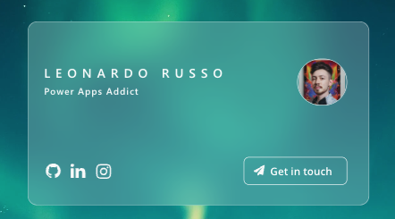
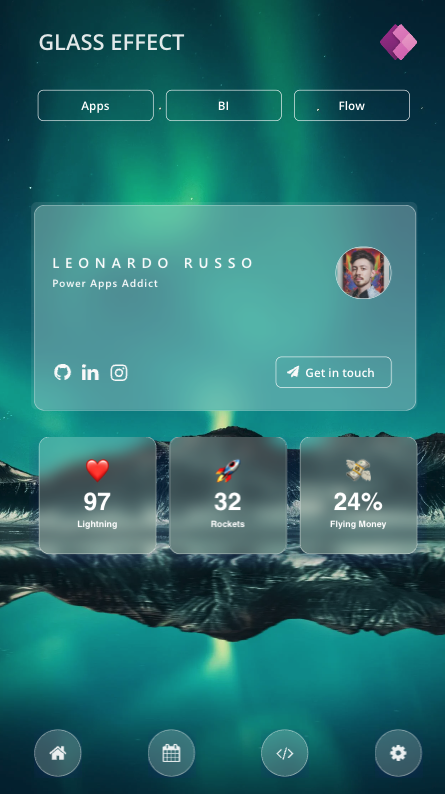

# Glass Effect Template

This screen showcases a glass-effect design using the HTML component in Power Apps. It features a prominent main card in the center displaying a profile. 


The KPI section uses emoji icons creatively to represent key metrics, adding a visual and intuitive touch. Each KPI is displayed within a card, featuring the metric value alongside its corresponding emoji.  


This snippet helps create a visually engaging layout using simple Power Apps elements.

## Authors

Snippet|Author(s)
--------|---------
Leonardo Russo | [GitHub](https://github.com/leorrusso) 

## Code

```yaml
- conMain:
    Control: GroupContainer
    Variant: manualLayoutContainer
    Properties:
      Height: =1366
      Width: =768
    Children:
    - imgBackground:
        Control: Image
        Properties:
          Image: ="https://images.pexels.com/photos/3617500/pexels-photo-3617500.jpeg?auto=compress&cs=tinysrgb&w=1260&h=750&dpr=3"
          Height: =Parent.Height
          ImagePosition: =ImagePosition.Fill
          Width: =Parent.Width
    - Gallery1:
        Control: Gallery
        Variant: galleryHorizontal
        Properties:
          Items: =["home","calendar","code","cog"]
          Height: =144
          ShowScrollbar: =false
          TemplateSize: =188
          Transition: =Transition.Pop
          Width: =768
          Y: =1222
        Children:
        - HtmlText1_2:
            Control: HtmlViewer
            Properties:
              HtmlText: "=\"\n\n<div style='\ndisplay:flex;\nalign-items:center;\njustify-content:center;\nwidth:80px; \nheight:80px; \nborder-radius:80px;\nborder: 1px solid rgba( 255, 255, 255, 0.53 ); \nbackdrop-filter: blur( 4px );\n-webkit-backdrop-filter: blur( 4px ); \nbackground: rgba( 255, 255, 255, 0.2 );\nbox-shadow: 0 8px 32px 0 rgba( 31, 38, 135, 0.37 )\n'>\n    \n    </img>\n    \n    \n</div>\""
              AutoHeight: =true
              DisabledBorderColor: =RGBA(56, 56, 56, 1)
              Fill: =RGBA(0, 0, 0, 0)
              Font: =Font.'Segoe UI'
              Height: =95
              Width: =97
              X: =54
              Y: =15
    - Label2:
        Control: Label
        Properties:
          Text: ="GLASS EFFECT"
          Color: =RGBA(255, 255, 255, 0.88)
          FontWeight: =FontWeight.Semibold
          Height: =117
          PaddingLeft: =40
          Size: =28
          Width: =734
          X: =33
          Y: =23
    - htmKPI1:
        Control: HtmlViewer
        Properties:
          HtmlText: "=\"<div style='\nborder: 4px solid #fefefe; height:200px; width:200px; text-align:center; margin:auto; \nbox-shadow: 2px 2px 12px rgba(0,163,148,0.2); \nborder-radius:8px; font-family: Roboto, Helvetica, sans-serif; color:#323232; \nborder-radius:18px;\nborder: 1px solid rgba( 255, 255, 255, 0.53 ); \nbackground: rgba( 255, 255, 255, 0.2 );\nbox-shadow: 0 8px 32px 0 rgba( 31, 38, 135, 0.37);\nbackdrop-filter: blur(12px);\n-webkit-backdrop-filter: blur(12px);  '>\n    <div style='\n    margin: 0;\n    padding-bottom:10px;\n    position: relative;\n    top: 50%;\n    left: 50%;\n    transform: translate(-50%, -50%);\n    color:#fff;\n    font-size: 42px;'>❤️<br><b>97\n\n        <div style='\n            margin-top:5px;\n            font-size: 15px;'\n            >\n            Lightning\n        </div>\n  \n  </div>\n  \n\n\n</div>\""
          DisabledBorderColor: =RGBA(56, 56, 56, 1)
          Height: =233
          Width: =241
          X: =53
          Y: =747
    - cardGroup:
        Control: Group
        Children:
        - Button1_1:
            Control: Classic/Button
            Properties:
              Text: =""
              BorderColor: =Color.White
              BorderStyle: =BorderStyle.None
              BorderThickness: =1
              Fill: =RGBA(0, 0, 0, 0)
              Height: =353
              HoverFill: =RGBA(250,250,250,0.1)
              PressedFill: =
              Width: =657
              X: =61
              Y: =353
        - userImage:
            Control: Image
            Properties:
              Image: ="https://avatars.githubusercontent.com/u/62526027?v=4"
              BorderColor: =RGBA(255, 255, 255, 1)
              BorderThickness: =1
              Height: =88
              RadiusBottomLeft: =180
              RadiusBottomRight: =180
              RadiusTopLeft: =180
              RadiusTopRight: =180
              Transparency: =0.1
              Width: =94
              X: =579
              Y: =429
        - Button1:
            Control: Classic/Button
            Properties:
              Text: ="Get in touch"
              BorderColor: =Color.White
              BorderThickness: =1
              Fill: =RGBA(0, 0, 0, 0)
              Height: =52
              HoverFill: =RGBA(250,250,250,0.1)
              PaddingLeft: =28
              Width: =196
              X: =477
              Y: =616
        - HtmlText1:
            Control: HtmlViewer
            Properties:
              HtmlText: "=\"\n\n<div style='\nwidth:650px; \nheight:350px; \nborder-radius:18px;\nborder: 1px solid rgba( 255, 255, 255, 0.53 ); \nbackground: rgba( 255, 255, 255, 0.2 );\nbox-shadow: 0 8px 32px 0 rgba( 31, 38, 135, 0.37 )\nmargin:auto;\nbackdrop-filter: blur(32px);\n-webkit-backdrop-filter: blur(16px);  \nposition:relative;\n\n'>\n  \n    \n    <div style='color: white; border: 0px solid white; position:absolute; top:50px; Width:100%; padding:30px; font-weight: 600; font-size:24px;  letter-spacing: 10px;'>LEONARDO RUSSO</div>    \n    <div style='color: white; border: 0px solid white; position:absolute; top:90px; Width:100%; padding:30px; font-weight: 600; font-size:18px; letter-spacing: 1.5px; display:block;'>Power Apps Addict</div>\n    \n    \n</div>\""
              DisabledBorderColor: =RGBA(56, 56, 56, 1)
              Fill: =RGBA(0, 0, 0, 0)
              Font: =Font.'Segoe UI'
              Height: =394
              Width: =686
              X: =61
              Y: =353
    - htmKPI2:
        Control: HtmlViewer
        Properties:
          HtmlText: "=\"<div style='\nborder: 4px solid #fefefe; height:200px; width:200px; text-align:center; margin:auto; \nbox-shadow: 2px 2px 12px rgba(0,163,148,0.2); \nborder-radius:8px; font-family: Roboto, Helvetica, sans-serif; color:#323232; \nborder-radius:18px;\nborder: 1px solid rgba( 255, 255, 255, 0.53 ); \nbackground: rgba( 255, 255, 255, 0.2 );\nbox-shadow: 0 8px 32px 0 rgba( 31, 38, 135, 0.37);\nbackdrop-filter: blur(12px);\n-webkit-backdrop-filter: blur(12px); \n'>\n    <div style='\n    margin: 0;\n    padding-bottom:10px;\n    position: relative;\n    top: 50%;\n    left: 50%;\n    transform: translate(-50%, -50%);\n    color:#fff;\n    font-size: 42px;'>\U0001F680<br><b>32\n\n        <div style='\n            margin-top:5px;\n            font-size: 15px;'\n            >\n            Rockets\n        </div>\n  \n  </div>\n  \n\n\n</div>\""
          DisabledBorderColor: =RGBA(56, 56, 56, 1)
          Height: =233
          Width: =241
          X: =275
          Y: =747
    - htmKPI3:
        Control: HtmlViewer
        Properties:
          HtmlText: "=\"<div style='\nborder: 4px solid #fefefe; height:200px; width:200px; text-align:center; margin:auto; \nbox-shadow: 2px 2px 12px rgba(0,163,148,0.2); \nborder-radius:8px; font-family: Roboto, Helvetica, sans-serif; color:#323232; \nborder-radius:18px;\nborder: 1px solid rgba( 255, 255, 255, 0.53 ); \nbackground: rgba( 255, 255, 255, 0.2 );\nbox-shadow: 0 8px 32px 0 rgba( 31, 38, 135, 0.37);\nbackdrop-filter: blur(12px);\n-webkit-backdrop-filter: blur(12px); \n'>\n    <div style='\n    margin: 0;\n    padding-bottom:10px;\n    position: relative;\n    top: 50%;\n    left: 50%;\n    transform: translate(-50%, -50%);\n    color:#fff;\n    font-size: 42px;'>\U0001F4B8<br><b>24%\n\n        <div style='\n            margin-top:5px;\n            font-size: 15px;'\n            >\n            Flying Money\n        </div>\n  \n  </div>\n  \n\n\n</div>\""
          DisabledBorderColor: =RGBA(56, 56, 56, 1)
          Height: =233
          Width: =241
          X: =497
          Y: =747
    - galTopButtons:
        Control: Gallery
        Variant: galleryHorizontal
        Properties:
          Items: =["Apps", "BI", "Flow"]
          Height: =116
          ShowScrollbar: =false
          TemplatePadding: =20
          TemplateSize: =198
          Transition: =Transition.Pop
          Width: =673
          X: =53
          Y: =119
        Children:
        - btnTop:
            Control: Classic/Button
            Properties:
              Text: =ThisItem.Value
              BorderColor: =Color.White
              BorderThickness: =1
              Fill: =RGBA(0, 0, 0, 0)
              Height: =52
              HoverFill: =RGBA(250,250,250,0.1)
              Width: =196
              Y: =24
    - imgPowerAppsa:
        Control: Image
        Properties:
          Image: |-
            ="data:image/svg+xml;utf8, "&
            EncodeUrl("<svg width='96' height='96' viewBox='0 0 96 96' fill='none' xmlns='http://www.w3.org/2000/svg'>
            <defs>
            <filter id='filter0_f'>
            <feFlood flood-opacity='0' result='BackgroundImageFix'/>
            <feBlend mode='normal' in='SourceGraphic' in2='BackgroundImageFix' result='shape'/>
            <feGaussianBlur stdDeviation='4' result='effect1_foregroundBlur'/>
            </filter>
            <filter id='filter1_f'>
            <feFlood flood-opacity='0' result='BackgroundImageFix'/>
            <feBlend mode='normal' in='SourceGraphic' in2='BackgroundImageFix' result='shape'/>
            <feGaussianBlur stdDeviation='0.38' result='effect1_foregroundBlur'/>
            </filter>
            <linearGradient id='paint0_linear' x1='71' y1='96.0002' x2='15' y2='-40.9998' gradientUnits='userSpaceOnUse'>
            <stop stop-color='#742774'/>
            <stop offset='1' stop-color='#BB35A4'/>
            </linearGradient>
            <linearGradient id='paint1_linear' x1='32' y1='0.0002436' x2='78' y2='96.0002' gradientUnits='userSpaceOnUse'>
            <stop stop-color='#E48CC7'/>
            <stop offset='1' stop-color='#D467B9'/>
            </linearGradient>
            <linearGradient id='paint2_linear' x1='62' y1='29.0002' x2='76' y2='72' gradientUnits='userSpaceOnUse'>
            <stop stop-color='#E9A1CB'/>
            <stop offset='1' stop-color='#E48CC7'/>
            </linearGradient>
            <clipPath id='clip0'>
            <rect width='96' height='96' fill='white'/>
            </clipPath>
            <clipPath id='clip1'>
            <rect width='96' height='96' fill='white'/>
            </clipPath>
            <clipPath id='clip2'>
            <rect width='96' height='96' fill='white' transform='translate(0 0.00012207)'/>
            </clipPath>
            </defs>
            <g clip-path='url(#clip0)'>
            <g clip-path='url(#clip1)'>
            <g clip-path='url(#clip2)'>
            <mask id='mask0' mask-type='alpha' maskUnits='userSpaceOnUse' x='-1' y='1' width='97' height='94'>
            <path d='M1.45715 44.049C-0.522237 46.3111 -0.522238 49.6889 1.45715 51.951L36.9897 92.5596C38.5833 94.381 41.4167 94.381 43.0103 92.5596L46.8367 88.1866L51.0504 92.7833C52.6358 94.5128 55.3623 94.5128 56.9476 92.7833L94.2825 52.0543C96.3853 49.7604 96.3853 46.2396 94.2825 43.9457L56.9476 3.21667C55.3623 1.4872 52.6358 1.4872 51.0504 3.21667L46.8367 7.81341L43.0103 3.44035C41.4167 1.61904 38.5833 1.61904 36.9897 3.44035L1.45715 44.049Z' fill='white'/>
            </mask>
            <g mask='url(#mask0)'>
            <path d='M40 96L-2 48L40 0L82 48L40 96Z' fill='url(#paint0_linear)'/>
            <g filter='url(#filter0_f)'>
            <path d='M53.999 2L97.999 50L53.999 98L34.4767 76.7029C33.0748 75.1736 33.0748 72.8264 34.4767 71.2971L51.5214 52.7029C52.9232 51.1736 52.9232 48.8264 51.5214 47.2971L34.4767 28.7029C33.0748 27.1736 33.0748 24.8264 34.4767 23.2971L53.999 2Z' fill='black' fill-opacity='0.32'/>
            </g>
            <g filter='url(#filter1_f)'>
            <path d='M53.999 0.380127L97.999 48.3801L53.999 96.3801L34.4767 75.083C33.0748 73.5537 33.0748 71.2065 34.4767 69.6772L51.5214 51.083C52.9232 49.5537 52.9232 47.2065 51.5214 45.6772L34.4767 27.083C33.0748 25.5537 33.0748 23.2065 34.4767 21.6772L53.999 0.380127Z' fill='black' fill-opacity='0.24'/>
            </g>
            <path d='M53.999 0L97.999 48L53.999 96L34.4767 74.7029C33.0748 73.1736 33.0748 70.8264 34.4767 69.2971L51.5214 50.7029C52.9232 49.1736 52.9232 46.8264 51.5214 45.2971L34.4767 26.7029C33.0748 25.1736 33.0748 22.8264 34.4767 21.2971L53.999 0Z' fill='url(#paint1_linear)'/>
            <path d='M73.0514 27.2167C74.6367 25.4872 77.3633 25.4872 78.9486 27.2167L98 48L78.9486 68.7833C77.3633 70.5128 74.6367 70.5128 73.0514 68.7833L57.7165 52.0543C55.6137 49.7604 55.6137 46.2396 57.7165 43.9457L73.0514 27.2167Z' fill='url(#paint2_linear)'/>
            </g>
            </g>
            </g>
            </g>
            </svg>
            ")
          Height: =64
          Width: =64
          X: =654
          Y: =49
    - icoGitHub:
        Control: Image
        Properties:
          OnSelect: =Launch("https://github.com/leorrusso")
          Image: ="https://icongr.am/fontawesome/github.svg?size=128&color=fafafa"
          Height: =57
          PaddingBottom: =8
          PaddingLeft: =8
          PaddingRight: =8
          PaddingTop: =8
          Width: =49
          X: =90
          Y: =614
    - icoLinkedin:
        Control: Image
        Properties:
          OnSelect: ="https://www.linkedin.com/in/leonardorrusso/"
          Image: ="https://icongr.am/fontawesome/linkedin.svg?size=128&color=fafafa"
          Height: =57
          PaddingBottom: =8
          PaddingLeft: =8
          PaddingRight: =8
          PaddingTop: =8
          Width: =49
          X: =137
          Y: =614
    - icoInstagrama:
        Control: Image
        Properties:
          OnSelect: ="https://www.instagram.com/powerappsleo/"
          Image: ="https://icongr.am/fontawesome/instagram.svg?size=128&color=fafafa"
          Height: =57
          PaddingBottom: =8
          PaddingLeft: =8
          PaddingRight: =8
          PaddingTop: =8
          Width: =49
          X: =186
          Y: =615
    - icoPaperPlane:
        Control: Image
        Properties:
          OnSelect: =Launch("mailto:leonardo.russo@ltechsp.onmicrosoft.com")
          Image: ="https://icongr.am/fontawesome/paper-plane.svg?size=128&color=fafafa"
          Height: =45
          PaddingBottom: =8
          PaddingLeft: =8
          PaddingRight: =8
          PaddingTop: =9
          Width: =37
          X: =488
          Y: =618

```

## Minimal path to awesome

1. Open your canvas app in **Power Apps**
1. Copy the contents of the **[YAML-file](./source/glass.pa.yaml)** or copy it from the code above.
1. Right click on the screen where you want to add the snippet and select "Paste YAML"


This will add the containers to your screen and you can delete the containers you don't want to use.



## Disclaimer

**THIS CODE IS PROVIDED *AS IS* WITHOUT WARRANTY OF ANY KIND, EITHER EXPRESS OR IMPLIED, INCLUDING ANY IMPLIED WARRANTIES OF FITNESS FOR A PARTICULAR PURPOSE, MERCHANTABILITY, OR NON-INFRINGEMENT.**


