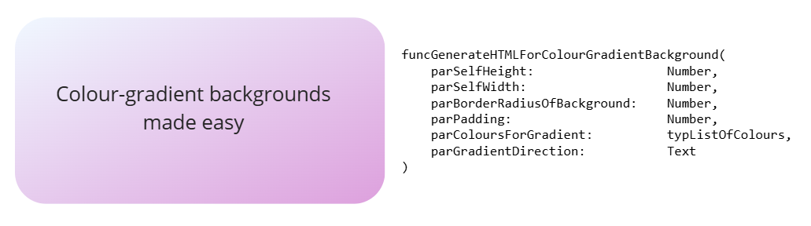
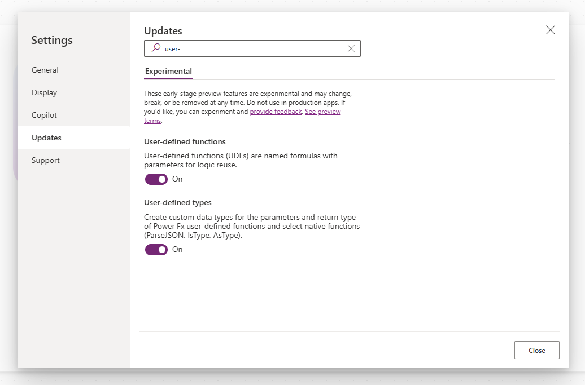
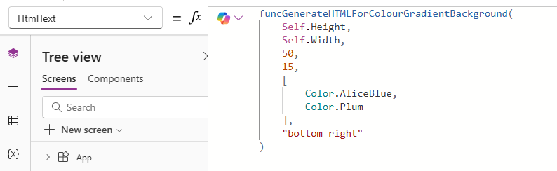
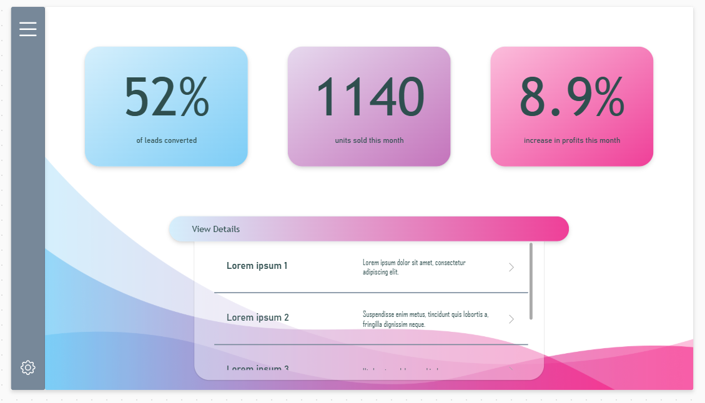

# Gradient Background

This function, funcGenerateHTMLForColourGradientBackground, generates the HTML Text required to create a linear colour-gradient background, with any number of colours.



The snippet also includes a function used to convert RGBA colours to Hex strings, which is called by funcGenerateHTMLForColourGradientBackground. This function can also be used independently.


## Authors

Snippet|Author(s)
--------|---------
Clarissa Gillingham | [Github](https://github.com/ClarissaGillinghamPDS) ([LinkedIn](https://www.linkedin.com/in/clarissa-gillingham-288287182/) )


## Code
```fx
funcConvertRGBAColourToHexString(
    parRGBAColour:      Color
) : Text = (Mid(JSON(parRGBAColour), 2, 7));


typListOfColours:= Type(
    [Color]
);

funcGenerateHTMLForColourGradientBackground(
    parSelfHeight:                  Number,             //the height of the HTML control this text is being embedded in, i.e. Self.Height.
    parSelfWidth:                   Number,             //the width of the HTML control this text is being embedded in, i.e. Self.Width.
    parBorderRadiusOfBackground:    Number,             //this will give a radius to the coloured background. Value should be given in pixels.
    parPadding:                     Number,             //this will give some padding around the coloured background. Value should be given in pixels.
    parColoursForGradient:          typListOfColours,   //table of colours in RGBA format
    parGradientDirection:           Text                //possible values: "top", "left", "right", "bottom", and any combination of the above, e.g. "top right" or "bottom left"
) : Text = With(
    //Convert Power Apps Colours into Hex Strings
    {
        wthBackgroundColours:           ForAll(
            Sequence(CountRows(parColoursForGradient)),
            funcConvertRGBAColourToHexString(Index(parColoursForGradient, Value).Value)
        )
    },

    With(
        //Concat all colours into one string for the linear-gradient function
        {
            wthBackgroundColoursString:     Concat(wthBackgroundColours, Value, ",")
        },

        $"<div style='
            box-sizing: border-box;
            display: flex;
            justify-content: center;
            align-items: center;
            height: {parSelfHeight - 1}px;
            width: {parSelfWidth}px;
        '>
            <div style='
                box-sizing: border-box;
                height: {parSelfHeight - parPadding - 1}px;
                width: {parSelfWidth - parPadding}px;
                border-radius: {parBorderRadiusOfBackground}px;
                background-color: {(First(wthBackgroundColours).Value)}; /*fallback*/
                background-image: linear-gradient(
                    to {parGradientDirection},
                    {wthBackgroundColoursString}
                );
            '>
                
            </div>
        </div>"
    )
);
```


## Minimal path to awesome

1. Open your canvas app in **Power Apps**
1. Ensure the 'User-defined functions' and 'User-defined types' settings are turned on (these are located in the **Updates** section of the Settings menu)

1. Select the **App** element in the Tree View, and navigate to its **Formulas** property
1. Paste the contents of _gradientfunction.fx_ into the Formulas property
1. Add a **HTML Text** Control to your desired screen
1. In your HTML Text Control's **HTMLtext** property, type funcGenerateHTMLForColourGradientBackground() and enter the desired parameters
    1. _parSelfHeight_: this should be filled with the height of your HTML Text control, i.e. Self.Height
    2. _parSelfWidth_: this should be filled with the width of your HTML Text control, i.e. Self.Width
    3. _parBorderRadiusOfBackground_: this should be filled with a number indicating how many pixels of border radius you wish to apply to your background, e.g. 20
    4. _parPadding_: this should be filled with a number indicating how many pixels of padding you wish to apply to the background, e.g. 10. This padding is applied in all directions.
    5. _parColoursforGradient_: this should be filled with an array of colours, supplied in RGBA (Power Apps 'Color' type) format, e.g. [Color.White, Color.Blue]. Any number of colours can be entered. This indicates the colours you wish your background to blend between.
    6. _parGradientDirection_: this should be filled with a string. Possible values are: "top", "bottom", "left", "right" or any combination of the above e.g. "top left", "bottom right". This indicates the direction the gradient should flow in.



See below for an example of how you can use these colour-gradients in your apps to elevate your UI:



## Disclaimer

**THIS CODE IS PROVIDED *AS IS* WITHOUT WARRANTY OF ANY KIND, EITHER EXPRESS OR IMPLIED, INCLUDING ANY IMPLIED WARRANTIES OF FITNESS FOR A PARTICULAR PURPOSE, MERCHANTABILITY, OR NON-INFRINGEMENT.**


