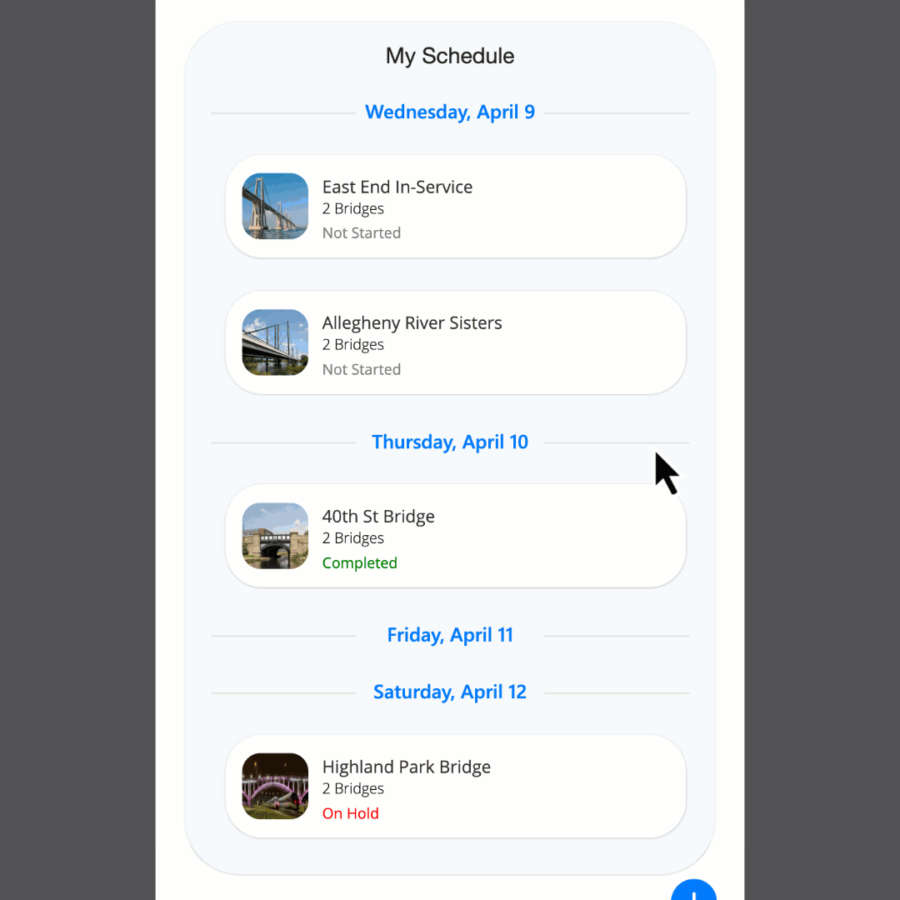

# Grouped Vertical Feed

This snippet demonstrates a nested gallery layout in Power Apps that visually groups records by date. The outer gallery generates the next 14 days using Sequence, while the inner gallery displays items (like appointments or tasks) that fall on each respective day.


Each date group uses a custom SVG header with a centered label and divider lines for a clean, modern look. Appointments are shown in card-style containers with optional images, titles, subtitles, and status indicators.

🔧 Key Features:
- Auto-generated 14-day range using Sequence
- Date-based grouping with nested galleries
- Dynamic SVG date headers
- Responsive layout with calculated inner gallery heights
- Ready to connect to real data sources by replacing the sample data

🧩 Ideal Use Cases:
- Appointment scheduling apps
- Event or task timelines
- Daily activity feeds
- Content calendars




## Authors

Snippet|Author(s)
--------|---------
April Dunnam | [GitHub](https://github.com/aprildunnam)


## Code

``` YAML
- ctnAppointments:
    Control: GroupContainer@1.3.0
    Variant: AutoLayout
    Properties:
      AlignInContainer: =AlignInContainer.Center
      DropShadow: =DropShadow.Semibold
      Fill: =RGBA(215, 218, 219, 0.14)
      LayoutDirection: =LayoutDirection.Vertical
      PaddingBottom: =20
      PaddingTop: =20
      RadiusBottomLeft: =60
      RadiusBottomRight: =60
      RadiusTopLeft: =60
      RadiusTopRight: =60
      Width: =Parent.Width * 0.9
    Children:
      - txtHeading:
          Control: Text@0.0.50
          Properties:
            Align: ='TextCanvas.Align'.Center
            AlignInContainer: =AlignInContainer.Start
            Font: ="Helvetica Neue"
            Height: =50
            Size: =24
            Text: ="My Schedule"
            Weight: ='TextCanvas.Weight'.Semibold
            Width: =Parent.Width
      - galDates:
          Control: Gallery@2.15.0
          Variant: BrowseLayout_Flexible_SocialFeed_ver5.0
          Properties:
            AlignInContainer: =AlignInContainer.Center
            BorderColor: =RGBA(0, 18, 107, 1)
            Items: |
              =ForAll(
                  Sequence(14),
                  {
                      date: Today() + ThisRecord.Value - 1,
                      name: Text(Today() + ThisRecord.Value - 1, "dddd, mmmm d")
                  }
              )
            ShowScrollbar: =false
            Width: =Parent.Width
          Children:
            - imgDateHeading:
                Control: Image@2.2.3
                Properties:
                  BorderColor: =RGBA(0, 18, 107, 1)
                  Height: =58
                  Image: |
                    ="data:image/svg+xml;utf8," & EncodeUrl(
                    "<svg xmlns='http://www.w3.org/2000/svg' width='375' height='24'>" & 
                    "<line x1='16' y1='12' x2='120' y2='12' stroke='#E0E0E0' stroke-width='1' />" & 
                    "<text x='187.5' y='16' font-family='Segoe UI, sans-serif' font-size='14' font-weight='bold' fill='#007AFF' text-anchor='middle'>" & 
                    ThisItem.name & 
                    "</text>" & 
                    "<line x1='255' y1='12' x2='359' y2='12' stroke='#E0E0E0' stroke-width='1' />" & 
                    "</svg>")
                  OnSelect: =Select(Parent)
                  Width: =Parent.Width
            - galAppointments:
                Control: Gallery@2.15.0
                Variant: BrowseLayout_Vertical_TwoTextOneImageVariant_ver5.0
                Properties:
                  BorderColor: =RGBA(0, 18, 107, 1)
                  Height: |
                    =CountRows(galAppointments.AllItems) * 148
                  Items: |-
                    =//Replace with your data
                    Filter(Table(
                        {
                            date: DateValue("04-08-25"),
                            title: "Western Corridor",
                            subtitle: "2 Bridges",
                            image: "https://upload.wikimedia.org/wikipedia/commons/thumb/7/7a/New_York_City_%28New_York%2C_USA%29%2C_Brooklyn_Bridge_--_2012_--_6630.jpg/640px-New_York_City_%28New_York%2C_USA%29%2C_Brooklyn_Bridge_--_2012_--_6630.jpg",
                            status: "In Progress",
                            statusColor: Color.YellowGreen
                        },
                        {
                            date: DateValue("04-09-25"),
                            title: "East End In-Service Trip",
                            subtitle: "2 Bridges",
                            image: "https://upload.wikimedia.org/wikipedia/commons/thumb/c/ce/General_Rafael_Urdaneta_Bridge_view_from_the_lake_to_Cabimas_side.jpg/640px-General_Rafael_Urdaneta_Bridge_view_from_the_lake_to_Cabimas_side.jpg",
                            status: "Not Started",
                            statusColor: Color.Gray
                        },
                        {
                            date: DateValue("04-09-25"),
                            title: "Allegheny River Sisters Bridge",
                            subtitle: "2 Bridges",
                            image: "https://upload.wikimedia.org/wikipedia/commons/thumb/8/8d/A5_Aarebruecke.jpg/640px-A5_Aarebruecke.jpg",
                            status: "Not Started",
                            statusColor: Color.Gray
                        },
                        {
                            date: DateValue("04-10-25"),
                            title: "40th St Bridge",
                            subtitle: "2 Bridges",
                            image: "https://upload.wikimedia.org/wikipedia/commons/thumb/9/93/South_side_of_Boundary_Bridge_1.jpg/640px-South_side_of_Boundary_Bridge_1.jpg",
                            status: "Completed",
                            statusColor: Color.Green
                        },
                        {
                            date: DateValue("04-12-25"),
                            title: "Highland Park Bridge",
                            subtitle: "2 Bridges",
                            image: "https://upload.wikimedia.org/wikipedia/commons/thumb/6/68/Lysets_t%C3%B8ven.jpg/640px-Lysets_t%C3%B8ven.jpg",
                            status: "On Hold",
                            statusColor: Color.Red
                        }
                    ),date = ThisItem.date)
                  TemplateSize: =148
                  Width: =Parent.Width
                  Y: =58
                Children:
                  - ctnItem:
                      Control: GroupContainer@1.3.0
                      Variant: ManualLayout
                      Properties:
                        Fill: =RGBA(255, 255, 255, 1)
                        Height: =112
                        RadiusBottomLeft: =40
                        RadiusBottomRight: =40
                        RadiusTopLeft: =40
                        RadiusTopRight: =40
                        X: =(Parent.Width - Self.Width) / 2
                        Y: =16
                      Children:
                        - Image3:
                            Control: Image@2.2.3
                            Properties:
                              BorderColor: =RGBA(0, 18, 107, 1)
                              Height: =72
                              Image: =ThisItem.image
                              ImagePosition: =ImagePosition.Stretch
                              OnSelect: =
                              RadiusBottomLeft: =20
                              RadiusBottomRight: =20
                              RadiusTopLeft: =20
                              RadiusTopRight: =20
                              Width: =72
                              X: =18
                              Y: =(Parent.Height / 2) - (Self.Height / 2)
                        - Title2:
                            Control: Label@2.5.1
                            Properties:
                              BorderColor: =RGBA(0, 0, 0, 1)
                              Color: =RGBA(50, 49, 48, 1)
                              Font: =Font.'Open Sans'
                              Height: =Self.Size * 1.8
                              OnSelect: =
                              PaddingBottom: =0
                              PaddingLeft: =0
                              PaddingRight: =0
                              PaddingTop: =0
                              Size: =14
                              Text: =ThisItem.title
                              VerticalAlign: =VerticalAlign.Top
                              Width: =200
                              X: =105
                              Y: =(Parent.Height - (Self.Size * 2.5 + Subtitle1.Size * 2.5)) / 2
                        - Subtitle1:
                            Control: Label@2.5.1
                            Properties:
                              BorderColor: =RGBA(0, 0, 0, 1)
                              Font: =Font.'Open Sans'
                              FontWeight: =FontWeight.Lighter
                              Height: =Self.Size * 1.8
                              OnSelect: =
                              PaddingBottom: =0
                              PaddingLeft: =0
                              PaddingRight: =0
                              PaddingTop: =0
                              Size: =12
                              Text: =ThisItem.subtitle
                              VerticalAlign: =VerticalAlign.Top
                              Width: =Title2.Width
                              X: =Title2.X
                              Y: =Title2.Y + Title2.Height
                        - Subtitle1_1:
                            Control: Label@2.5.1
                            Properties:
                              BorderColor: =RGBA(0, 0, 0, 1)
                              Color: =ThisItem.statusColor
                              Font: =Font.'Open Sans'
                              Height: =Self.Size * 1.8
                              OnSelect: =
                              PaddingBottom: =0
                              PaddingLeft: =0
                              PaddingRight: =0
                              PaddingTop: =0
                              Size: =12
                              Text: =ThisItem.status
                              VerticalAlign: =VerticalAlign.Top
                              Width: =Title2.Width
                              X: =105
                              Y: =Subtitle1_1.Height + Title2.Height + Title2.Y + 5

```
## Minimal path to awesome

1. Open your canvas app in **Power Apps**
1. Copy the contents of the **[YAML-file](./source/feed.pa.yaml)** or copy the code from above.
1. Right click on the screen where you want to add the snippet and select "Paste Code"


## Disclaimer

**THIS CODE IS PROVIDED *AS IS* WITHOUT WARRANTY OF ANY KIND, EITHER EXPRESS OR IMPLIED, INCLUDING ANY IMPLIED WARRANTIES OF FITNESS FOR A PARTICULAR PURPOSE, MERCHANTABILITY, OR NON-INFRINGEMENT.**


