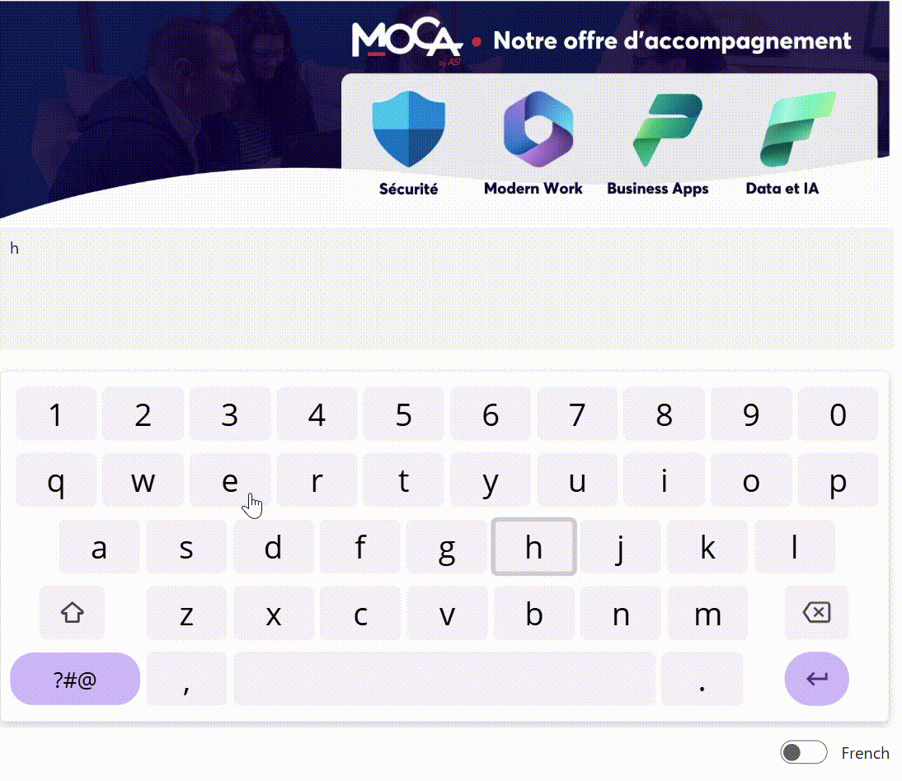

# Keyboard

This custom PowerApps component provides a fully functional virtual keyboard supporting letters, numbers, and special characters. It offers seamless language switching between French and English, making it ideal for multilingual applications and touch-based interfaces. Designed for flexibility and ease of integration, it enhances user input across a wide range of scenarios.

This component is designed to complement the default keyboard, especially on large tablets or touchscreen kiosks 🖥️. It lets you position the keyboard wherever you want 📍, adjust its size 📐, and even customize the keys and colors 🎨 to fit your needs. 
Flexibility and user experience first! 🚀

## Authors

Snippet|Author
--------|---------
Steve Bourdin | [GitHub](https://github.com/SteveBourdin) ([LinkedIn](https://www.linkedin.com/in/steve-bourdin-ab998762/) )

## Minimal path to awesome

Copy the provided **[YAML-file](./source/keyboard.yaml)**  code into the Component section of your PowerApps project.
Use the Default property of the component to set an initial text value.
The current value typed using the keyboard is accessible via the component’s Value property.

Once the component is placed on a canvas screen, to test it:
- Add a text input control.
- Set the Value property of the input to keyboard.Value.
- Set the Default property of the keyboard component to the value of the input control (e.g., TextInput1.Text).

## Code
 **[YAML-file](./source/keyboard.yaml)** 

## Disclaimer

**THIS CODE IS PROVIDED *AS IS* WITHOUT WARRANTY OF ANY KIND, EITHER EXPRESS OR IMPLIED, INCLUDING ANY IMPLIED WARRANTIES OF FITNESS FOR A PARTICULAR PURPOSE, MERCHANTABILITY, OR NON-INFRINGEMENT.**

