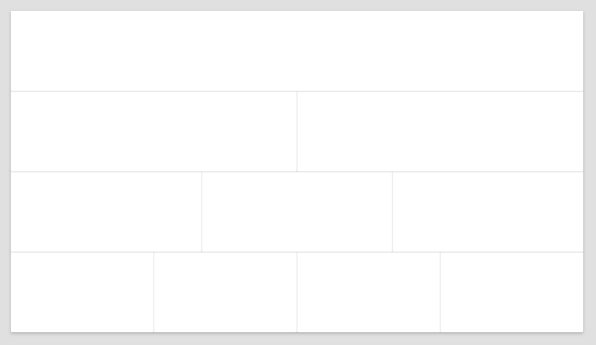

# Layout Pyramid

This is a simple snippet that can help you get started with creating a screen in canvas app. It is a set of containers with various number of columns. The first container has 1 column, the second container has 2 columns, the third container has 3 columns, and the fourth container has 4 columns.

## Authors

Snippet|Author(s)
--------|---------
Daniel Laskewitz | [GitHub](https://github.com/laskewitz) ([@Laskewitz](https://www.twitter.com/laskewitz) )

## Minimal path to awesome

1. Open your canvas app in **Power Apps**
1. Copy the contents of the **[YAML-file](./source/pyramid.pa.yaml)** 
1. Right click on the screen where you want to add the snippet and select "Paste YAML"

This will add the containers to your screen and you can delete the containers you don't want to use.

## Disclaimer

**THIS CODE IS PROVIDED *AS IS* WITHOUT WARRANTY OF ANY KIND, EITHER EXPRESS OR IMPLIED, INCLUDING ANY IMPLIED WARRANTIES OF FITNESS FOR A PARTICULAR PURPOSE, MERCHANTABILITY, OR NON-INFRINGEMENT.**

