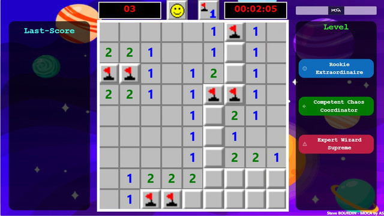

# Minesweeper

This snippet re-creates the vintage Microsoft Windows game, Minesweeper in your canvas app!



## Authors

Snippet|Author
--------|---------
Steve Bourdin | [GitHub](https://github.com/SteveBourdin) ([@steve-bourdin-ab998762](https://www.linkedin.com/in/steve-bourdin-ab998762/) )

## Minimal path to awesome

1. Open your canvas app in **Power Apps**
1. Copy the contents of the **[YAML-file](./source/minesweeper.yaml)** 
1. Click on the three dots of the screen where you want to add the snippet and select "Paste code"

## Code

``` YAML
- minesweeper:
    Control: GroupContainer@1.3.0
    Variant: ManualLayout
    Properties:
      Height: =768
      Width: =1366
    Children:
      - img_background:
          Control: Image@2.2.3
          Group: grp_Minesweeper
          Properties:
            Height: =Parent.Height
            Image: ="https://img.freepik.com/vecteurs-libre/fond-galaxie-dessin-anime-fusee_23-2148964618.jpg"
            ImagePosition: =ImagePosition.Stretch
            Width: =Parent.Width
      - cont_game:
          Control: GroupContainer@1.3.0
          Variant: AutoLayout
          Group: grp_Minesweeper
          Properties:
            Height: =App.Height
            LayoutAlignItems: =LayoutAlignItems.Center
            LayoutDirection: =LayoutDirection.Vertical
            LayoutJustifyContent: =LayoutJustifyContent.Center
            Visible: =varLoading<>true
            Width: =1366
          Children:
            - cont_headerMenu:
                Control: GroupContainer@1.3.0
                Variant: AutoLayout
                Properties:
                  AlignInContainer: =AlignInContainer.SetByContainer
                  FillPortions: =0
                  Height: =Parent.Height/10
                  LayoutAlignItems: =LayoutAlignItems.Center
                  LayoutDirection: =LayoutDirection.Horizontal
                  LayoutJustifyContent: =LayoutJustifyContent.Center
                  Visible: =varLoading<>true
                  Width: =gal_gameRows.Width
                Children:
                  - lbl_remainingMines:
                      Control: Text@0.0.50
                      Properties:
                        Align: ='TextCanvas.Align'.Center
                        BorderColor: =RGBA(255, 255, 255, 1)
                        BorderStyle: =BorderStyle.Solid
                        Fill: =Color.Black
                        Font: =Font.Verdana
                        FontColor: =RGBA(255, 0, 0, 1)
                        Height: =Parent.Height*0.8
                        Size: =30
                        Text: =Text(varNumberOfRemainingMines,"0##")
                        Weight: ='TextCanvas.Weight'.Bold
                        Width: =Parent.Width/3
                  - img_Smiley:
                      Control: Image@2.2.3
                      Properties:
                        Height: =Parent.Height
                        Image: |-
                          =If(
                              varGameOver = true,
                              //Show a Smiley with black glasses.... victory congrats !!
                              "data:image/png;base64,iVBORw0KGgoAAAANSUhEUgAAABoAAAAaBAMAAABbZFH9AAAAD1BMVEW9vb17e3v//wD///8AAABXk1meAAAAaUlEQVQY043PwQnAMAgFUAMZIJINxAECXSCI+89UE2wVmkM/Xh6R4AdMadCvSMkaCH3Ak3JUVQ1VIdJXQpbpqrTCLmEmm+kiWxVXtYc9rp1/YlVX/OniteeKW753Rofod+xeMAINs0rWDW08IHwPjv9jAAAAAElFTkSuQmCC",
                              If(
                                  varWinGame = true,
                                  //Show the smiley, game in progress
                                  "data:image/png;base64,iVBORw0KGgoAAAANSUhEUgAAABoAAAAaBAMAAABbZFH9AAAAElBMVEW9vb17e3v//wD///8AAAB7ewCe3E/QAAAAcElEQVQY023PQQqAMAxE0RR6AIs3GOJe8AIljPe/ktVGU7CfbN4uI2VokfWI0qi9yLrLW5oqk6FsAD8ZWtWVcacuw1N1KVuuDNLaaZfqLXXZRugJdqGnE4nB0K6+UhKu+OX/Z2yIfdPtqUSylFFp1AX4OyKQvMXNiwAAAABJRU5ErkJggg==",
                                  "data:image/png;base64,iVBORw0KGgoAAAANSUhEUgAAABoAAAAaBAMAAABbZFH9AAAAD1BMVEW9vb17e3v//wD///8AAABXk1meAAAAaElEQVQY043PwQnAIAyF4QgOUHGDRwYQuoCE7D9Tq41NoB76n/xO5lEJHVRPL0W1QrXRKm2VVV1ZAH0luOumjBGbBLO+pGAxZTxi0+yXeLxNJBBA/AdWhclv+d7pG3zfdnsqHh0lKkVdkaQgtF9LrKkAAAAASUVORK5CYII="
                              )
                          )
                        OnSelect: =UpdateContext({varLoading:true}) ;Select(btn_initialization)
                        Width: =Parent.Width/6
                  - img_clickMode:
                      Control: Image@2.2.3
                      Properties:
                        Height: =Parent.Height
                        Image: |-
                          =If(
                              varFlagMode = false,
                              //This mode put a flag on the square when the user click
                              "data:image/png;base64,iVBORw0KGgoAAAANSUhEUgAAABoAAAAaBAMAAABbZFH9AAAAElBMVEW9vb17e3v///8AAP8AAAD/AAA6aIEIAAAAW0lEQVQY05XOsQnAMAxE0RPGveUJTFbwAik8QBrvv0oETtAJksK/ewjEQamCenjCaora8CZLnZWCOisFIW2JvxjzRcrzEWBNFt0Wg3D+awzSsL7ly0Q9FGUJ6wYS/BUsDQYkbgAAAABJRU5ErkJggg==",
                              //This mode discovery the square when user click
                              "data:image/png;base64,iVBORw0KGgoAAAANSUhEUgAAABoAAAAaBAMAAABbZFH9AAAAElBMVEW9vb17e3v///8AAP8AAAD/AAA6aIEIAAAAWklEQVQY05XOsQnAMAxE0RPGveUJTFbQAik0QBrvv0pATtBBkiK/ewjBQamGvmXCGoo+cCehepDqZE0S355/wP4td5J70FjlEiJjldTiby2YvSuXiWZoyhLWCV/DFSzxfYVyAAAAAElFTkSuQmCC"
                          )
                        OnSelect: =UpdateContext({varFlagMode:Not varFlagMode}) ;
                        Width: =Parent.Width/6
                  - lbl_timing:
                      Control: Text@0.0.50
                      Properties:
                        Align: ='TextCanvas.Align'.Center
                        BorderColor: =RGBA(255, 255, 255, 1)
                        BorderStyle: =BorderStyle.Solid
                        Fill: =Color.Black
                        Font: =Font.Verdana
                        FontColor: =RGBA(255, 0, 0, 1)
                        Height: =Parent.Height*0.8
                        Size: =30
                        Text: |-
                          =//Display the elapsed time. When the game is lost or win, we show the timing save

                          If(
                              varGameOver = true || varEndGame = true || varWinGame = true,
                              varTimeEndOfGame,
                              Text(
                                  Time(
                                      0,
                                      0,
                                      tim_timingGame.Value / 1000
                                  ),
                                  "hh:mm:ss"
                              )
                          )
                        Weight: ='TextCanvas.Weight'.Bold
                        Width: =Parent.Width/3
                  - tim_initializationMinesweeper:
                      Control: Timer@2.1.0
                      Properties:
                        AutoStart: |-
                          =//This timer starts at the beginning of the game to initialize all variables.
                          IsBlank(varInitialization)
                        Duration: |-
                          =//Not important in this case
                          60000
                        OnTimerStart: |-
                          =//Collection for the last score
                          ClearCollect(
                              colHiScore,
                              Blank()
                          );
                          //The game start with the Rookie level
                          UpdateContext(
                              {
                                  varInitialization: true,
                                  varLevel: "Rookie"
                              }
                          );
                          //Execute the new partie :
                          Select(btn_initialization)
                        Start: =Self.AutoStart
                        Visible: =false
            - gal_gameRows:
                Control: Gallery@2.15.0
                Variant: Horizontal
                Properties:
                  AlignInContainer: =AlignInContainer.SetByContainer
                  BorderColor: =Color.White
                  BorderThickness: =10
                  Height: =571
                  Items: |-
                    =//One gallery with only value of X columns
                    Sequence(varNumberOfColumns)
                  TemplatePadding: =0
                  TemplateSize: =Self.Width/If(Self.AllItemsCount<>0,Self.AllItemsCount,1)
                  Visible: =varLoading=false
                  Width: =Self.Height
                  X: =348
                  Y: =165
                Children:
                  - gal_gameLines:
                      Control: Gallery@2.15.0
                      Variant: Vertical
                      Properties:
                        Fill: =RGBA(189, 189, 189, 1)
                        Height: =Parent.Height
                        Items: |-
                          =//A sub gallery with the different line
                          Filter(colSquareData,colonne=ThisItem.Value)
                        TemplatePadding: =0
                        TemplateSize: =Self.Height/If(Self.AllItemsCount<>0,Self.AllItemsCount,1)
                        Visible: =varLoading=false
                        Width: =gal_gameRows.TemplateWidth
                      Children:
                        - lbl_numberOfMines:
                            Control: Text@0.0.50
                            Properties:
                              Align: ='TextCanvas.Align'.Center
                              BorderColor: =RGBA(123,123,123,1)
                              BorderStyle: =BorderStyle.Solid
                              BorderThickness: =3
                              FontColor: =Switch(Self.Text,"1", RGBA(0,0,255,1),"2",RGBA(0,123,0,1),"3",RGBA(251,11,11,1),RGBA(0,0,123,1))
                              Height: =Parent.TemplateHeight
                              Size: =Self.Height*0.6
                              Text: |-
                                =//Number of mines present in the squares adjacent to the current square 
                                If(
                                    ThisItem.bombe = true || ThisItem.nbBombeACote = 0,
                                    "",
                                    ThisItem.nbBombeACote
                                )
                              Visible: =ThisItem.decouvert=true
                              Weight: ='TextCanvas.Weight'.Bold
                              Width: =Parent.Width
                        - img_mine:
                            Control: Image@2.2.3
                            Properties:
                              Height: =Parent.TemplateHeight
                              Image: |-
                                =//Oh my God, pray that this does not appear.
                                If(
                                    ThisItem.explosion = true,
                                    "data:image/png;base64,iVBORw0KGgoAAAANSUhEUgAAABAAAAAQAgMAAABinRfyAAAADFBMVEX/AAAAAAB7e3v///9Ql2ugAAAANElEQVQI12NYBQQMDQxA0MDgACNcQxwYGkRDgaz4UAcI0RoaGsLQEApkAQmwLEQdQhvYFAAmDxJuxV7pRgAAAABJRU5ErkJggg==",
                                    "data:image/png;base64,iVBORw0KGgoAAAANSUhEUgAAABAAAAAQAgMAAABinRfyAAAADFBMVEW9vb0AAAB7e3v///9j2HHCAAAANElEQVQI12NYBQQMDQxA0MDgACNcQxwYGkRDgaz4UAcI0RoaGsLQEApkAQmwLEQdQhvYFAAmDxJuxV7pRgAAAABJRU5ErkJggg=="
                                )
                              OnSelect: =Patch(colSquareData,ThisItem,{decouvert:true})
                              Visible: =ThisItem.decouvert=true&&ThisItem.bombe
                              Width: =Parent.TemplateWidth
                        - img_flagCase:
                            Control: Image@2.2.3
                            Properties:
                              Height: =Parent.TemplateHeight
                              Image: |-
                                =//Put a flag on the Square

                                If(
                                    ThisItem.drapeau = true,
                                    "data:image/png;base64,iVBORw0KGgoAAAANSUhEUgAAABAAAAAQBAMAAADt3eJSAAAAD1BMVEW9vb3///97e3sAAAD/AABQHuKJAAAAOklEQVQI12MQhAABGIOJQZABDJRADBYHCIPFBcpwcUGIIKsB6zJAZxgbQxjGQIDEQFghoAQBDExQBgCHngoRLPdU8QAAAABJRU5ErkJggg==",
                                    "data:image/png;base64,iVBORw0KGgoAAAANSUhEUgAAABAAAAAQAgMAAABinRfyAAAACVBMVEW9vb3///97e3uVBMaVAAAAHklEQVQI12MIDQ0NARFBDAEMDFzkEl6rVq1i0AISAIlSC03msuDYAAAAAElFTkSuQmCC"
                                )
                              OnSelect: |-
                                =UpdateContext(
                                    {
                                        varTimeEndOfGame: Text(
                                            Time(
                                                0,
                                                0,
                                                tim_timingGame.Value / 1000
                                            ),
                                            "hh:mm:ss"
                                        )
                                    }
                                );
                                If(
                                    varGameOver = false && varWinGame=false,
                                    If(
                                        varFlagMode <> true && ThisItem.drapeau = false,
                                        Patch(
                                            colSquareData,
                                            ThisItem,
                                            {
                                                decouvert: true,
                                                explosion: ThisItem.bombe
                                            };
                                        );
                                        If(
                                            ThisItem.bombe = true,
                                            UpdateIf(
                                                colSquareData,
                                                bombe = true,
                                                {decouvert: true}
                                            );
                                            UpdateContext({varGameOver: true});
                                            UpdateContext({varEndGame: true}),
                                            If(
                                                ThisItem.nbBombeACote = 0,
                                                ClearCollect(
                                                    colEmptySquare,
                                                    Blank()
                                                );
                                                Collect(
                                                    colEmptySquare,
                                                    ThisItem
                                                );
                                                UpdateContext({varReleaseEmptySquares: true})
                                            )
                                        );
                                        If(
                                            (CountRows(
                                                Filter(
                                                    colSquareData,
                                                    decouvert = false
                                                )
                                            ) = CountRows(
                                                Filter(
                                                    colSquareData,
                                                    decouvert = false && bombe = true
                                                )
                                            )) && CountRows(
                                                Filter(
                                                    colSquareData,
                                                    decouvert = false
                                                )
                                            ) > 0,
                                            UpdateContext({varWinGame: true});
                                            Collect(colHiScore,{niveau : varLevel,temps : varTimeEndOfGame})
                                        ),
                                        If(
                                            ThisItem.decouvert = false && varNumberOfRemainingMines > 0,
                                            If(
                                                ThisItem.drapeau <> true,
                                                UpdateContext({varNumberOfRemainingMines: varNumberOfRemainingMines - 1}),
                                                UpdateContext({varNumberOfRemainingMines: varNumberOfRemainingMines + 1})
                                            );
                                            Patch(
                                                colSquareData,
                                                ThisItem,
                                                {drapeau: Not ThisItem.drapeau}
                                            )
                                        )
                                    )
                                )
                              Visible: |-
                                =//visible if the square is not discover and have a flag
                                ThisItem.decouvert=false || ThisItem.drapeau=true
                              Width: =Parent.TemplateWidth
                        - lbl_forHover:
                            Control: Label@2.5.1
                            Properties:
                              Fill: =RGBA(180, 214, 250, 0)
                              Height: =img_flagCase.Height
                              HoverFill: |-
                                =//This code allows a transparence light blue color to be displayed when the mouse hovers over.
                                RGBA(180, 214, 250, 0.7)
                              OnSelect: =Select(img_flagCase)
                              Text: =""
                              Width: =img_flagCase.Width
            - tim_timingGame:
                Control: Timer@2.1.0
                Properties:
                  AutoPause: =varGameOver=true
                  AutoStart: =varEndGame=false
                  Duration: =600000000
                  Visible: =false
                  X: =958
                  Y: =295
            - tim_forEmptyCells:
                Control: Timer@2.1.0
                Properties:
                  AutoStart: |-
                    =//Start if we have blank square to analyze
                    varReleaseEmptySquares=true
                  OnTimerStart: |-
                    =//We always process the first square in the collection
                    UpdateContext({varEmptySquareCurrent: First(colEmptySquare)});
                    //The processed square is removed from the global collection.
                    Remove(
                        colEmptySquare,
                        varEmptySquareCurrent
                    );
                    If(
                        IsBlank(varEmptySquareCurrent) = false,
                        //We are on an empty square; we reveal each adjacent square.
                        ForAll(
                            Filter(
                                colSquareData,
                                decouvert = false && ligne >= varEmptySquareCurrent.ligne - 1 && ligne <= varEmptySquareCurrent.ligne + 1 && colonne >= varEmptySquareCurrent.colonne - 1 && colonne <= varEmptySquareCurrent.colonne + 1
                            ),
                            Patch(
                                colSquareData,
                                ThisRecord,
                                {decouvert: true}
                            );
                            //If we discover an empty square, we add it to the global collection to initiate processing for it.
                            If(
                                ThisRecord.nbBombeACote = 0,
           

```


