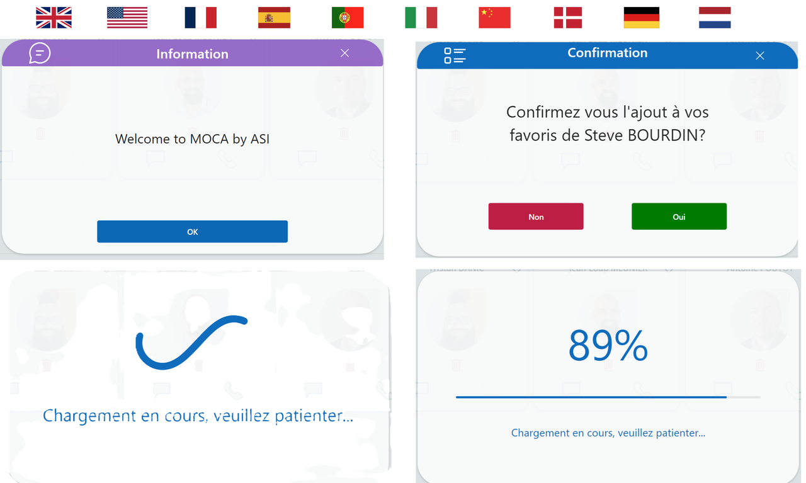

# Multiple Popins

This snippet is composed of 4 pop-ins for your applications. Reduce the number of components in your PowerApps apps by always using this snippet.

You can put this snippet in each of your screens.

You can also customize the language.



## Video Link

[Watch the video on YouTube](https://youtu.be/yTaPOKJ15Xc)


## Authors

Snippet|Author
--------|---------
Steve Bourdin | [GitHub](https://github.com/SteveBourdin) ([LinkedIn](https://www.linkedin.com/in/steve-bourdin-ab998762/) )

## Minimal path to awesome

1. Open your canvas app in **Power Apps**
2. Copy the contents of the **[YAML-file](./source/multiple-popin.yaml)** 
3. Click on the three dots of the screen where you want to add the snippet and select "Paste code"

## How to use?


1. Paste the Yaml code on your screen

2. Put the language in the OnVisible attribute of your screen : ```UpdateContext({var_popin_lang : "USA"})``` (disponibilities : GBR, USA, FRA, ESP, PRT, ITA, CHN, DNK, DEU, NLD)


# Use Pop-in message : 
----------------------------
You just have to put the desired message in the variable  "var_popinMessage" : ```UpdateContext({var_popinMessage:"Welcome to MOCA by ASI"})```

# Use Pop-in Waiting :
---------------------------
Setting the var_popinLoading variable to true will display the loading window : ```UpdateContext({var_popinLoading: true});;```

 Once the treatment is complete, reset the varirable to false.

# Use Pop-In Progress : 
----------------------------

To display the progress Pop-In you need to initialize 3 variables:

  - var_PopinProgressBar : Boolean => true

  - var_popinProgressBar_Total : Integer => Total number of actions

  - var_popinProgressBar_Current : Interger => Order of the current action

Example : 
```
UpdateContext(
    {

        var_popinProgressBar: true;

        var_popinProgressBar_Total: 9;

        var_popinProgressBar_Current: 0

    }

);;
```

As the actions progress, increment the variable var_popinProgressBar_Current 

Example :

```UpdateContext({var_popinProgressBar_Current: var_popinProgressBar_Current + 1});;```


When the var_popinProgressBar_Current variable reaches the total number of actions, the Pop-In will be removed.


# Use Pop-In Confirmation :
----------------------------------

To use the confirmation pop-in, you must enter at least two variables:

  - var_popinConfirmation_Message => Text => The question to display
   - var_popinConfirmation_Show => boolean => if true, show the popin


Example :

```
UpdateContext(

    {

        var_popinConfirmation_Message: "Confirmez vous la suppression de " & ThisItem.DisplayName & "?";
        var_popinConfirmation_Show:true

    }
)
```

You must then put the actions to be executed in the Yes and No (OnSelect) buttons:

  - btn_popinConfirmation_NO

  - btn_popinConfirmation_YES


If you want to use this Pop-In for the same screen for several cases, you can create a variable and then test it in the actions above.
Exemple : 

```
UpdateContext(

    {

        var_popinConfirmation_case : "REMOVE_USER"

)
```


## Code
 **[YAML-file](./source/multiple-popin.yaml)** 


## Disclaimer

**THIS CODE IS PROVIDED *AS IS* WITHOUT WARRANTY OF ANY KIND, EITHER EXPRESS OR IMPLIED, INCLUDING ANY IMPLIED WARRANTIES OF FITNESS FOR A PARTICULAR PURPOSE, MERCHANTABILITY, OR NON-INFRINGEMENT.**


