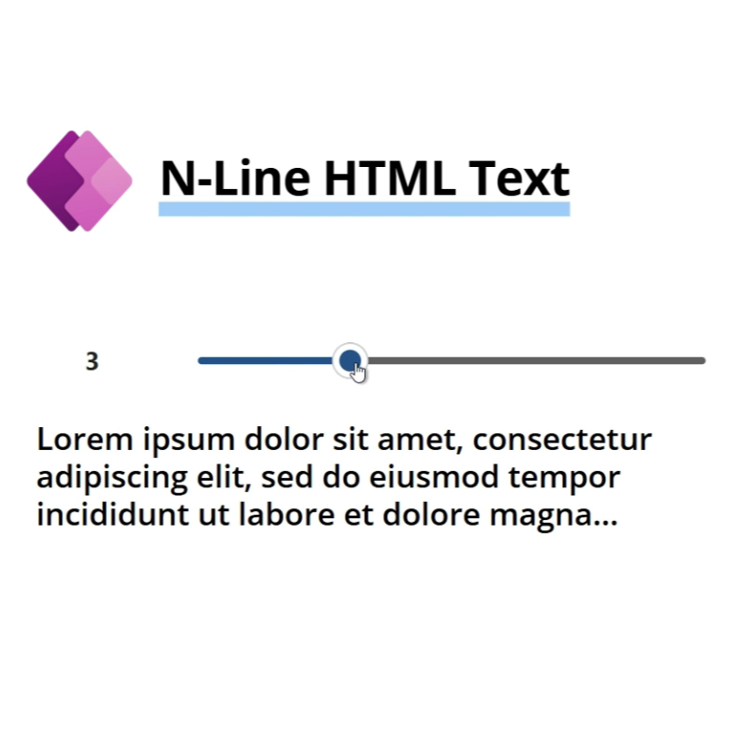
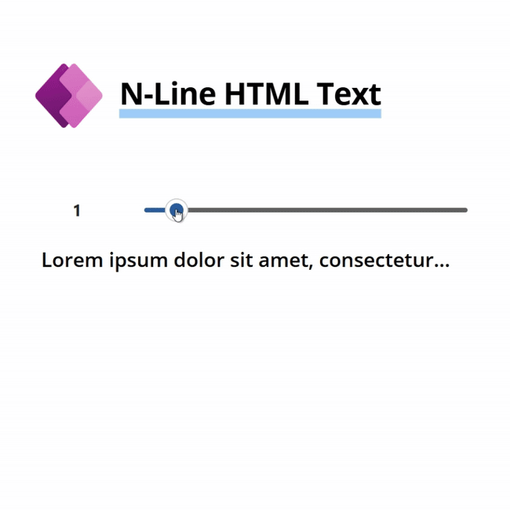

# N-Line HTML Text Truncation

This code snippet provides a solution to dynamically truncate HTML text in a Power Apps Canvas app based on the desired number of lines (n). It maintains the integrity of the HTML structure, ensuring that truncated content doesn’t cause formatting issues.

Use Cases:
- Displaying previews of long text content (e.g., blog posts, comments).
- Enhancing user interfaces with concise, readable snippets.
- Avoiding clutter in data-heavy applications.

## Authors

Author|Socials
--------|---------
Jan Chlebek | [LinkedIn](https://www.linkedin.com/in/jan-chlebek/) - [GitHub](https://github.com/jan-chlebek) 

## Minimal path to awesome

### Variant 1 - UDF Component

1. Open your Power App in edit mode
2. Make sure that UDF features are enable in your Canvas Apps Studio
- User-defined functions
- User-defined types 

3. Copy the contents of the **[udfNLineHTMLText.fx](./source/udfNLineHTMLText.fx)**
4. Add the copied code into `Formula` property on the `App` level
5. Use with HTML control with HTMLText property := `udfNLineHTMLText(Text: Your Text, Number: Amount of lines, Number: Control Width)`, example `udfNLineHTMLText("Lorem ipsum", 1, Self.Width)`

### Variant 2 - Standalone Component
1. Open your Power App in edit mode
2. Copy the contents of the **[udfNLineHTMLText.pa.yaml](./source/udfNLineHTMLText.pa.yaml)**
3. Right-click on the screen where you want to add the snippet and select `Paste`

## Disclaimer

**THIS CODE IS PROVIDED *AS IS* WITHOUT WARRANTY OF ANY KIND, EITHER EXPRESS OR IMPLIED, INCLUDING ANY IMPLIED WARRANTIES OF FITNESS FOR A PARTICULAR PURPOSE, MERCHANTABILITY, OR NON-INFRINGEMENT.**

