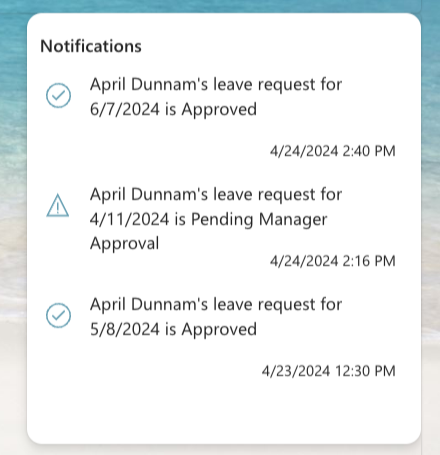
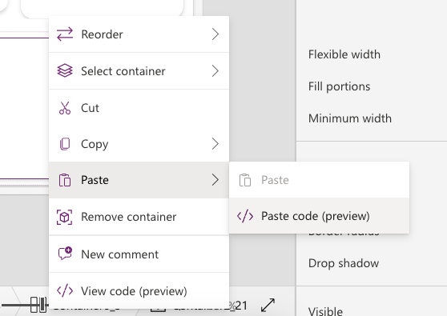

# Notifications Card

This snippet shows how to implement a notifications card in Power Apps. 

## Minimal path to awesome

1. Open your canvas app in **Power Apps**
1. Copy the contents of the **[YAML-file](./source/notifications-card.yaml)** 
1. Right click on the screen where you want to add the snippet and select "Paste YAML"

1. Replace **Items Property** in the gallery with **your data**. If the field names change you'll also need to update the text property of the two text labels and the Icon property of the icon.

