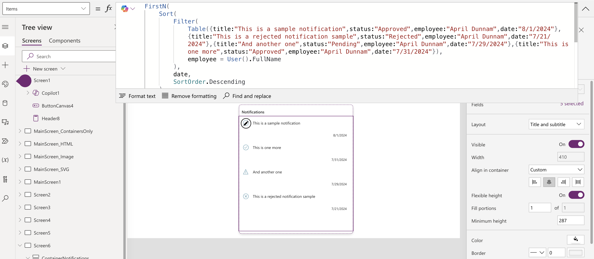
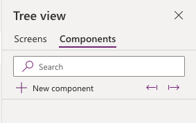

# Notifications Card

This snippet shows how to implement a notifications card in Power Apps. 

## Minimal path to awesome

> **_NOTE:_** The recommended best practice is to utilize this YAML snippet inside of a canvas component for reusability

1. Open your canvas app in **Power Apps**
1. Copy the contents of the **[YAML-file](./source/notifications-card.yaml)** 
1. Right click on the screen where you want to add the snippet and select "Paste YAML"

1. Replace **Items Property** in the gallery with **your data**. If the field names change you'll also need to update the text property of the two text labels and the Icon property of the icon.

## Steps to use as a component
1. Open your Power App in edit mode
1. Select the **components** tab in the tree view

1. Select **New component**
1. Rename your component to something relevant like **NotificationCard**
1. In the **Custom Properties** panel, select **New custom property**
1. For **Display name** input the text **Items**
1. Change the **Data type** to **Table**

1. Select **Create**
1. Right click in the component and select **Paste Code**

1. Select the **galNotifications** gallery and copy the code from the **Items** property
1. Select the **container object** and go to the **Items** property you just created and paste the code you copied

1. Select the **galNotifications** gallery and go to the **Items** property and replace the code with the **{INSERT-NAME-OF-YOUR-COMPONENT}.Items**

#### Learn more about YAML and integrating with Components

