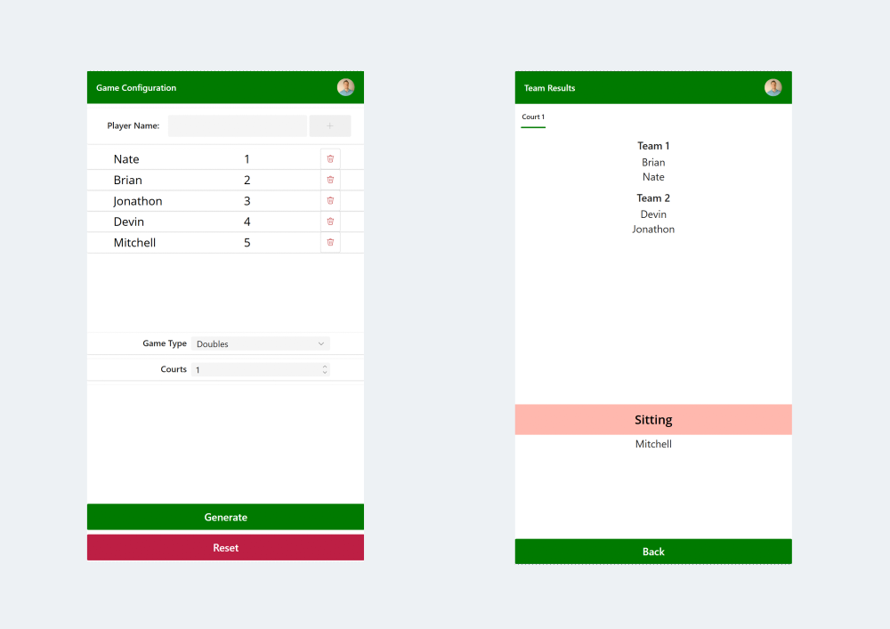

# Pickleball Team Generator

Ever been out on the courts, and want to switch things up a bit? Break up the team that keep smashing everyone?..... Have an odd number of people, and need an unbiased way to have someone sit out? Then have no fear! The Pickleball Team Generator is here!!

This code doesn't have to just be used for pickleball! It could be used for any game that has 2 teams facing each other with variable number of players per team AND variable number of simultaneous games!

## Author

<!--- 
Replace the X by the correct values in the table below.
--->

Snippet|Author
--------|---------
Nate Halliwell | [Youtube](https://www.youtube.com/playlist?list=PLlQ81_et2aJ-XKx3gVfVl0dQbJU5mUfgf) ([LinkedIn](https://www.linkedin.com/in/natehalliwell/ ))

## Minimal path to awesome

1. Open your canvas app in **Power Apps**
1. Copy the contents of the **[YAML-file](./source/team-generator.yaml)** or copy the code from above.
1. Right click on the screen where you want to add the snippet and select "Paste Code"
1. Customize to your heart's desire!

## Disclaimer

**THIS CODE IS PROVIDED *AS IS* WITHOUT WARRANTY OF ANY KIND, EITHER EXPRESS OR IMPLIED, INCLUDING ANY IMPLIED WARRANTIES OF FITNESS FOR A PARTICULAR PURPOSE, MERCHANTABILITY, OR NON-INFRINGEMENT.**

