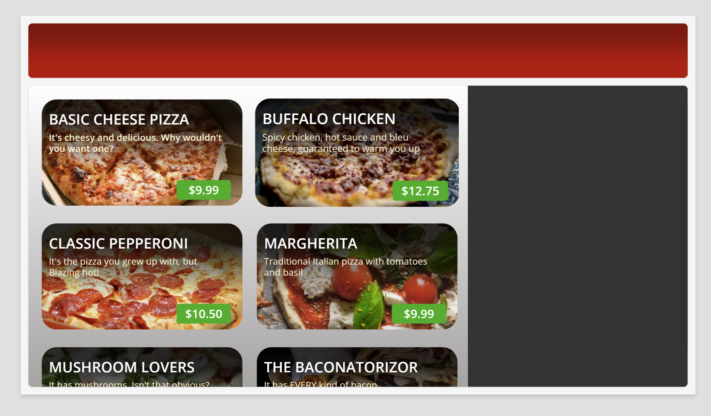
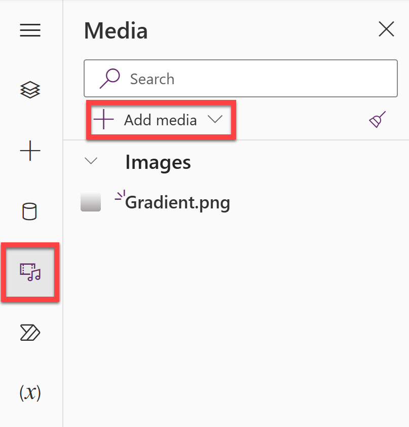
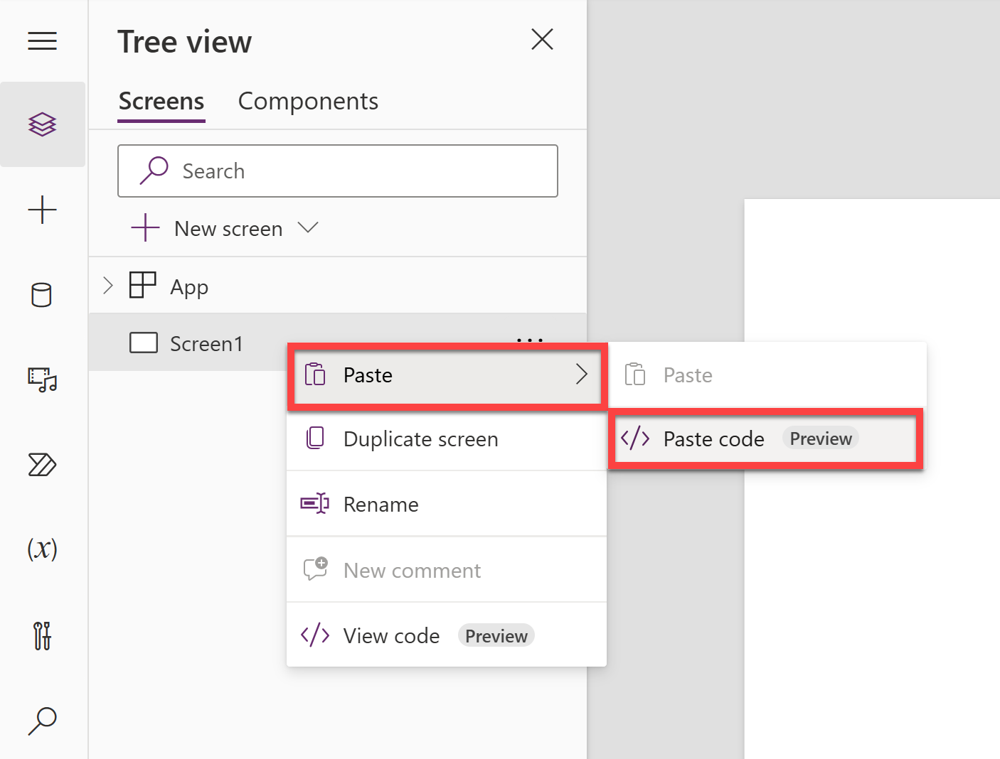

# Product Gallery

This is a simple Power Apps YAML snippet that shows a scrollable gallery of products styled in a modern way. This gallery can be customized to show any type of data for a variety of use cases.

The snippet includes a header and a side bar that can be used to add filters, a cart, or any other functionality you need.



## Minimal Path to Awesome

1. Open a new or existing canvas app in **Power Apps.**

1. Download the following image: [Gradient.png](./assets/Gradient.png) and upload it into the **Media** section of your app.

    

1. Copy the following **collection** and paste it in the **OnStart** property of the App:

    ```
    ClearCollect(
        PizzaSpecials,
        {
            Name: "Basic Cheese Pizza",
            Description: "It's cheesy and delicious. Why wouldn't you want one?",
            Price: 9.99,
            ImageUrl: "https://raw.githubusercontent.com/gomomohapi/BlazingPizzaResources/main/pizzas/cheese.jpg"
        },
        {
            Name: "Buffalo Chicken",
            Description: "Spicy chicken, hot sauce and bleu cheese, guaranteed to warm you up",
            Price: 12.75,
            ImageUrl: "https://raw.githubusercontent.com/gomomohapi/BlazingPizzaResources/main/pizzas/meaty.jpg"
        },
        {
            Name: "Classic Pepperoni",
            Description: "It's the pizza you grew up with, but Blazing hot!",
            Price: 10.50,
            ImageUrl: "https://raw.githubusercontent.com/gomomohapi/BlazingPizzaResources/main/pizzas/pepperoni.jpg"
        },
        {
            Name: "Margherita",
            Description: "Traditional Italian pizza with tomatoes and basil",
            Price: 9.99,
            ImageUrl: "https://raw.githubusercontent.com/gomomohapi/BlazingPizzaResources/main/pizzas/margherita.jpg"
        },
        {
            Name: "Mushroom Lovers",
            Description: "It has mushrooms. Isn't that obvious?",
            Price: 11.00,
            ImageUrl: "https://raw.githubusercontent.com/gomomohapi/BlazingPizzaResources/main/pizzas/mushroom.jpg"
        },
        {
            Name: "The Baconatorizor",
            Description: "It has EVERY kind of bacon",
            Price: 11.99,
            ImageUrl: "https://raw.githubusercontent.com/gomomohapi/BlazingPizzaResources/main/pizzas/bacon.jpg"
        },
        {
            Name: "The Brit",
            Description: "When in London...",
            Price: 10.25,
            ImageUrl: "https://raw.githubusercontent.com/gomomohapi/BlazingPizzaResources/main/pizzas/brit.jpg"
        },
        {
            Name: "Veggie Delight",
            Description: "It's like salad, but on a pizza",
            Price: 11.50,
            ImageUrl: "https://raw.githubusercontent.com/gomomohapi/BlazingPizzaResources/main/pizzas/salad.jpg"
        }
    )
    ```

    You can modify this collection with your own data or connect another data source.

1. **Run OnStart** to add the collection to your app.

1. Copy the contents of this [YAML-file](./source/product-gallery.yaml).

1. In the canvas app **Tree view**, right-click on an empty screen and select **Paste** > **Paste code**.

    
