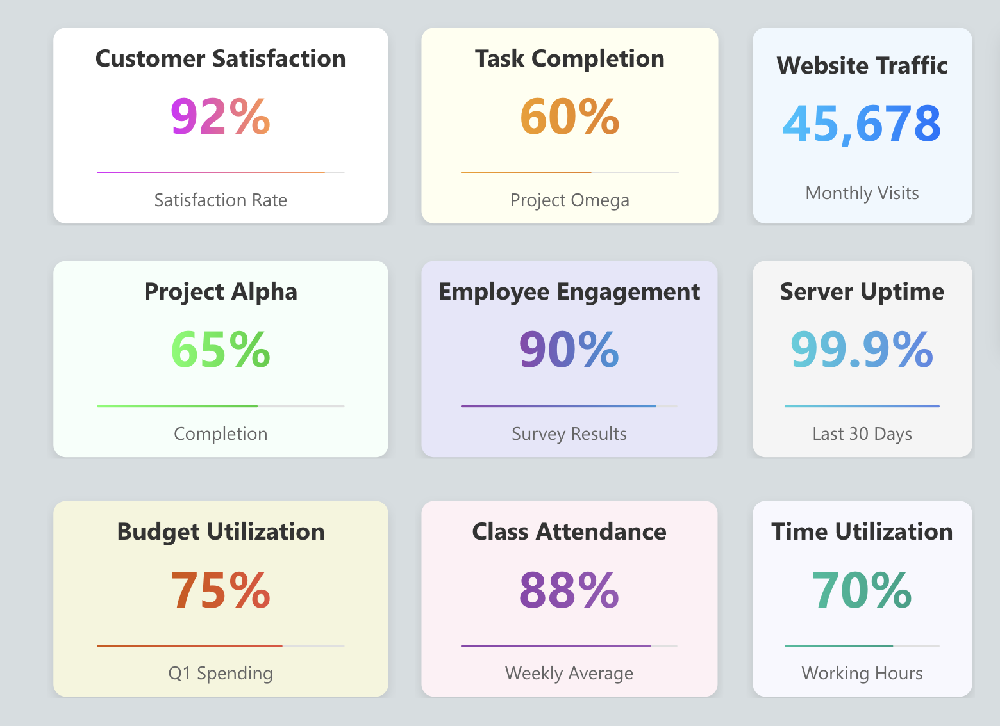
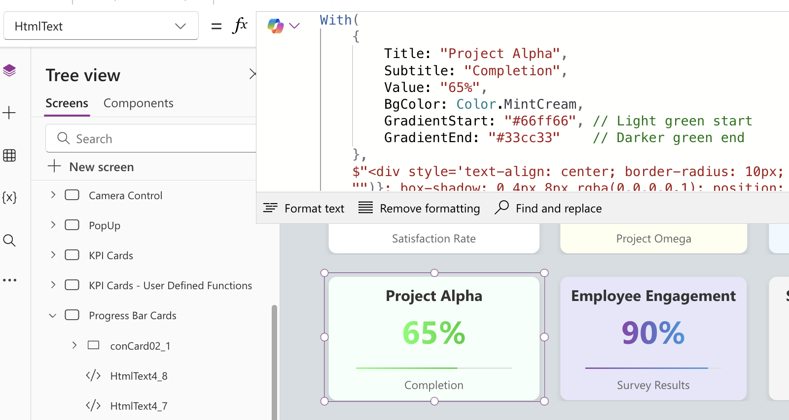

# Progress Bar Card

## Overview
The `Progress Bar Card` is a custom HTML component for Power Apps designed to display a progress bar with a title, value, and subtitle. 

This component is ideal for visualizing metrics like customer satisfaction rates in an engaging format.



## Authors

Author (s)| Socials
--------|---------
Rudimar Baesso Althof | [GitHub](https://github.com/rualthof) - [YouTube](https://www.youtube.com/@powerrudy) - [Linkedin](https://www.linkedin.com/in/rudimar/)


## Features
- Displays a title, value, and subtitle with a progress bar.
- Uses a gradient color effect for the progress bar.
- Customizable properties for title, value, background color, and gradient colors.
- Simple, clean design suitable for dashboards or report pages in Power Apps.

## Minimal path to awesome

1. Open your canvas app in **Power Apps**
1. Copy the contents of the **[YAML-file](./source/progress-bar-card.yaml)**.
1. Right click on the screen where you want to add the snippet and select "Paste YAML"


This will add the card to your screen and you can customize the item `HTMLText`property to dynamically change its data.


## YAML Configuration

### Control
The `htmlProgressBarCard` uses the `HtmlViewer` control to render HTML-based visuals.

## Configuring Properties in the `With` Function

The `htmlProgressBarCard` uses a `With` function to set key properties for customization. 

It's located in the `HTMLText` property and here’s a breakdown of each property and how to configure them:

- **Title**: The main title text displayed on the card (e.g., `"Customer Satisfaction"`).
- **Subtitle**: The text displayed below the progress bar to describe the value (e.g., `"Satisfaction Rate"`).
- **Value**: The displayed percentage value and progress bar fill level (e.g., `"92%"`).
- **BgColor**: Background color of the card. Use Power Apps color values, like `Color.White`.
- **GradientStart**: The starting color of the gradient used for the progress bar and value text (e.g., `"#da22ff"`).
- **GradientEnd**: The ending color of the gradient for the progress bar and value text (e.g., `"#ff9b44"`).

### Card Configuration Example

Below is the relevant code excerpt showing how to set these properties in the `With` function:

```yaml
=With(
    {
        Title: "Customer Satisfaction",
        Subtitle: "Satisfaction Rate",
        Value: "92%",
        BgColor: Color.White,
        GradientStart: "#da22ff", // Start color of the gradient
        GradientEnd: "#ff9b44"    // End color of the gradient
    },
    // HTML structure that builds the card
)
```

Here is an example of how it is configured in the Power Apps interface:


## Related Videos

For a complete guide on creating custom controls in Power Apps, check out my playlist on YouTube:

[Power Apps Design & Customizations Playlist 🚀](https://youtube.com/playlist?list=PLJCcpEOSXzJQlsKuP2YeHHyAYjj2x4qsZ&si=aFGKpSEJ0a8KrFpF)


This playlist contains all the videos I’ve created on custom controls, with tutorials and tips to enhance your Power Apps projects.


<br>

## Disclaimer

**THIS CODE IS PROVIDED *AS IS* WITHOUT WARRANTY OF ANY KIND, EITHER EXPRESS OR IMPLIED, INCLUDING ANY IMPLIED WARRANTIES OF FITNESS FOR A PARTICULAR PURPOSE, MERCHANTABILITY, OR NON-INFRINGEMENT.**

<br><br><br>


