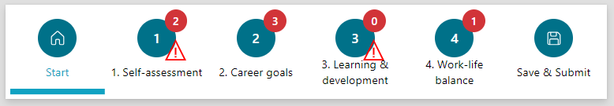
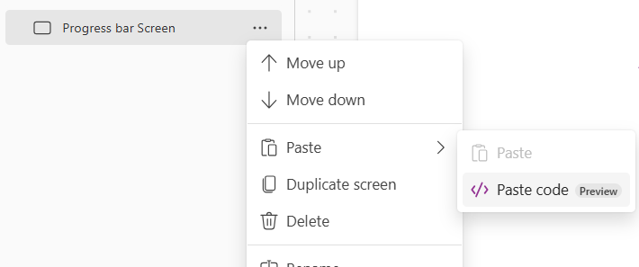
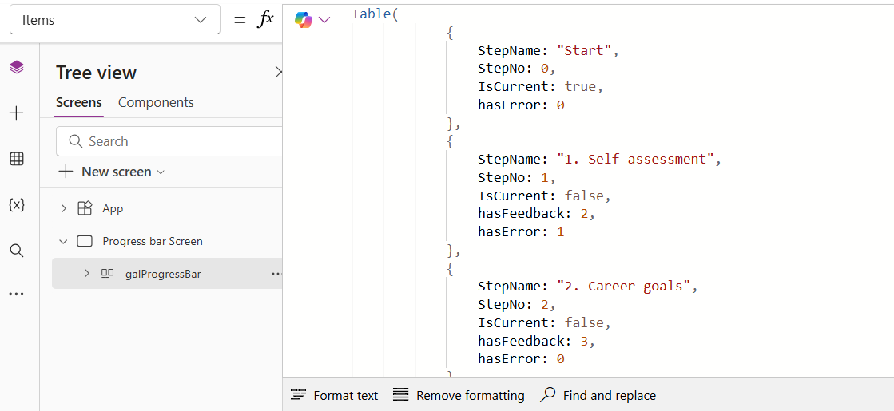

# Progress bar

This is a snippet that creates a progress bar for a canvas app. In the progress bar some icons indicates specific information on a specific step. 
It is a gallery in which some logic is added on displaying progress steps. 



## Authors

Snippet|Author
--------|---------
Elianne Burgers | [GitHub](https://github.com/Dutchy365) ([@elianne_tweets](https://twitter.com/elianne_tweets) )

## Minimal path to awesome

1. Open your canvas app in **Power Apps**
1. Copy the contents of the **[YAML-file](./source/progressbargallery.pa.yml)** 
1. Click on the three dots of the screen where you want to add the snippet and select "Paste" (previously "Paste code")

1. Replace **Items Property** in the gallery with **your data**. 


### Example data
This is the collection, used in this example. Add this code to the **OnVisible** property of the screen so the collection is populated when the screen loads.
```
ClearCollect(colSteps, Table(
            {
                StepName: "Start",
                StepNo: 0,
                IsCurrent: true,
                hasError: 0
            },
            {
                StepName: "1. Self-assessment",
                StepNo: 1,
                IsCurrent: false,
                hasFeedback: 2,
                hasError: 1
            },
            {
                StepName: "2. Career goals",
                StepNo: 2,
                IsCurrent: false,
                hasFeedback: 3,
                hasError: 0
            },
            {
                StepName: "3. Learning & development",
                StepNo: 3,
                StepScreen: "Steps Screen",
                IsCurrent: false,
                hasFeedback: 0,
                hasError: 2
            },
            {
                StepName: "4. Work-life balance",
                StepNo: 4,
                IsCurrent: false,
                hasFeedback: 1,
                hasError: 0
            },
            {
                StepName: "Save & Submit",
                StepNo: 5,
                IsCurrent: false,
                hasError: 0
            }
        )
    );
```

## Code

**[YAML-file](./source/progressbargallery.pa.yml)**


