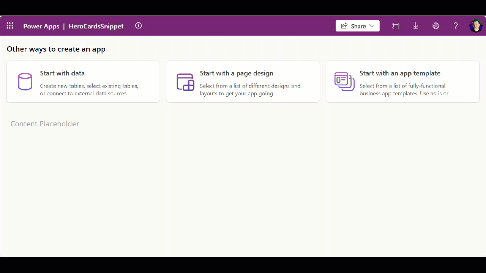

# Responsive Hero Card Gallery

This is a Power Apps YAML snippet that shows a responsive gallery of clickable hero cards similar to those you see in https://make.powerapps.com.

- The card are data driven using the Items collection.

- Each card shows an image, title, description, and has a hover effect.

- Cards are clickable.

- Cards will re-flow as the width of the app reduces. The heigh of the container is dynamically calculated to accommodate the wrapped cards.

   

## Minimal path to awesome

1. Copy the contents of the [responsive-hero-card-gallery.yaml](./source/responsive-hero-card-gallery.yaml) snippet.

1. Open an app in **Power Apps**.

1. Ensure that **Settings** - **Display** - **Scale to fit** is toggled to **Off**.

1. Inside the **Tree View**, select the *screen* or *parent container* you would like to add the snippet to.

1. **Right click** - **Paste** - **Paste code**.

1. **Note:** If you see any formula errors, you may need to edit the cut and re-paste the formula back so that the control names resolve correctly.

## Disclaimer

**THIS CODE IS PROVIDED *AS IS* WITHOUT WARRANTY OF ANY KIND, EITHER EXPRESS OR IMPLIED, INCLUDING ANY IMPLIED WARRANTIES OF FITNESS FOR A PARTICULAR PURPOSE, MERCHANTABILITY, OR NON-INFRINGEMENT.**

