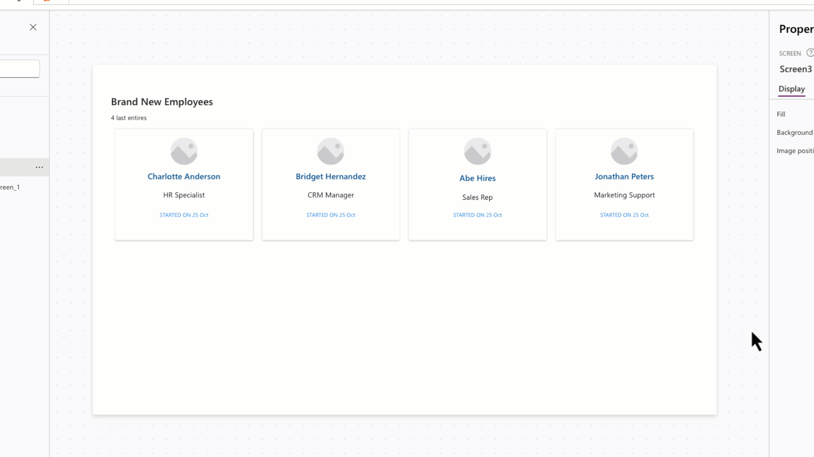
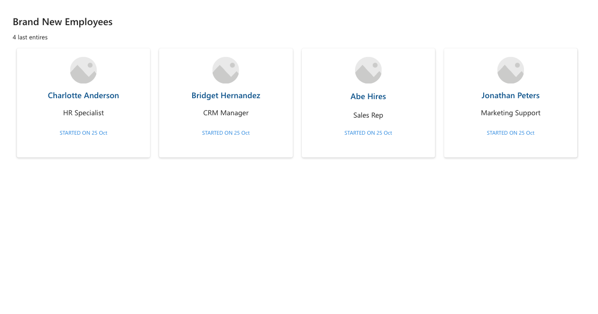

# Responsive People Cards

This snippet shows how to implement a responsive gallery of clickable people cards.

- The card are data driven using the Items collection.

- Each card shows an image, name placeholder, job title placeholder and start date placeholder.

- Cards are clickable.

- Cards will re-flow as the width of the app reduces. The heigh of the container is dynamically calculated to accommodate the wrapped cards.

   

## Authors

Snippet|Author(s)
--------|---------
April Dunnam | [GitHub](https://github.com/aprildunnam) ([@aprildunnam](https://www.twitter.com/aprildunnam) )
Jan Chlebek | [GitHub](https://github.com/jan-chlebek) ([LinkedIn](https://www.linkedin.com/in/jan-chlebek/))

## Code

```yaml
- cntResponsivePeopleCards:
    Control: GroupContainer@1.3.0
    Variant: AutoLayout
    Properties:
      DropShadow: =DropShadow.None
      Height: =600
      LayoutDirection: =LayoutDirection.Vertical
      PaddingBottom: =10
      PaddingLeft: =40
      PaddingRight: =40
      PaddingTop: =20
      Width: =1350
      Y: =35
    Children:
      - lblBrandNewEmployees:
          Control: Text@0.0.51
          Properties:
            Height: =40
            Size: =22
            Text: ="Brand New Employees"
            Weight: ='TextCanvas.Weight'.Semibold
            Width: '=Parent.Width - 50   '
      - lblNewHiresCount:
          Control: Text@0.0.51
          Properties:
            Text: =CountRows(galNewEmployees.AllItems) &" last entires"
      - galNewEmployees:
          Control: Gallery@2.15.0
          Variant: BrowseLayout_Vertical_TwoTextOneImageVariant_ver5.0
          Properties:
            BorderColor: =RGBA(0, 18, 107, 1)
            Items: =Table({Name:"Charlotte Anderson",JobTitle:"HR Specialist", Start:Today(),Image:SampleImage},{Name:"Bridget Hernandez",JobTitle:"CRM Manager", Start:Today(),Image:SampleImage}, {Name:"Abe Hires",JobTitle:"Sales Rep", Start:Today(),Image:SampleImage},{Name:"Jonathan Peters",JobTitle:"Marketing Support", Start:Today(),Image:SampleImage})
            TemplatePadding: =15
            TemplateSize: =250
            WrapCount: |-
              =IfError(RoundDown(
                              Self.Width/
                              Max(300,(Self.Width/Self.AllItemsCount))
                          ,0),3)
          Children:
            - cntNewemployeesItem:
                Control: GroupContainer@1.3.0
                Variant: ManualLayout
                Properties:
                  DropShadow: =DropShadow.Semilight
                  Height: =Parent.TemplateHeight
                  Width: =Parent.TemplateWidth
                Children:
                  - lblStartedOnDate:
                      Control: Text@0.0.51
                      Properties:
                        Align: ='TextCanvas.Align'.Center
                        FontColor: =App.Theme.Colors.Lighter10
                        Size: =12
                        Text: ="STARTED ON "& Text(ThisItem.Start,"dd mmm")
                        Width: =Parent.Width/2
                        X: =(Parent.Width - Self.Width) / 2
                        Y: =180
                  - lblEmployeeJobTitle:
                      Control: Text@0.0.51
                      Properties:
                        Align: ='TextCanvas.Align'.Center
                        Size: =16
                        Text: =ThisItem.JobTitle
                        Width: =Parent.Width
                        Y: =133
                  - lblEmployeeName:
                      Control: Text@0.0.51
                      Properties:
                        Align: ='TextCanvas.Align'.Center
                        FontColor: =App.Theme.Colors.Darker20
                        Size: =18
                        Text: =ThisItem.Name
                        Weight: ='TextCanvas.Weight'.Semibold
                        Width: =Parent.Width
                        Y: =92
                  - imgUserImage:
                      Control: Image@2.2.3
                      Properties:
                        BorderColor: =RGBA(0, 18, 107, 1)
                        Height: =60
                        Image: =ThisItem.Image
                        OnSelect: =
                        RadiusBottomLeft: =60
                        RadiusBottomRight: =60
                        RadiusTopLeft: =60
                        RadiusTopRight: =60
                        Width: =60
                        X: =(Parent.Width - Self.Width) / 2
                        Y: =19

```

## Minimal path to awesome

1. Open your canvas app in **Power Apps**
1. Copy the contents of the **[YAML-file](./source/peoplecard.pa.yaml)** or copy it from the code above.
2. Right click on the screen where you want to add the snippet and select "Paste"

This will add the gallery and header to your screen and you can customize the items property to dynamically get data.



## Disclaimer

**THIS CODE IS PROVIDED *AS IS* WITHOUT WARRANTY OF ANY KIND, EITHER EXPRESS OR IMPLIED, INCLUDING ANY IMPLIED WARRANTIES OF FITNESS FOR A PARTICULAR PURPOSE, MERCHANTABILITY, OR NON-INFRINGEMENT.**


