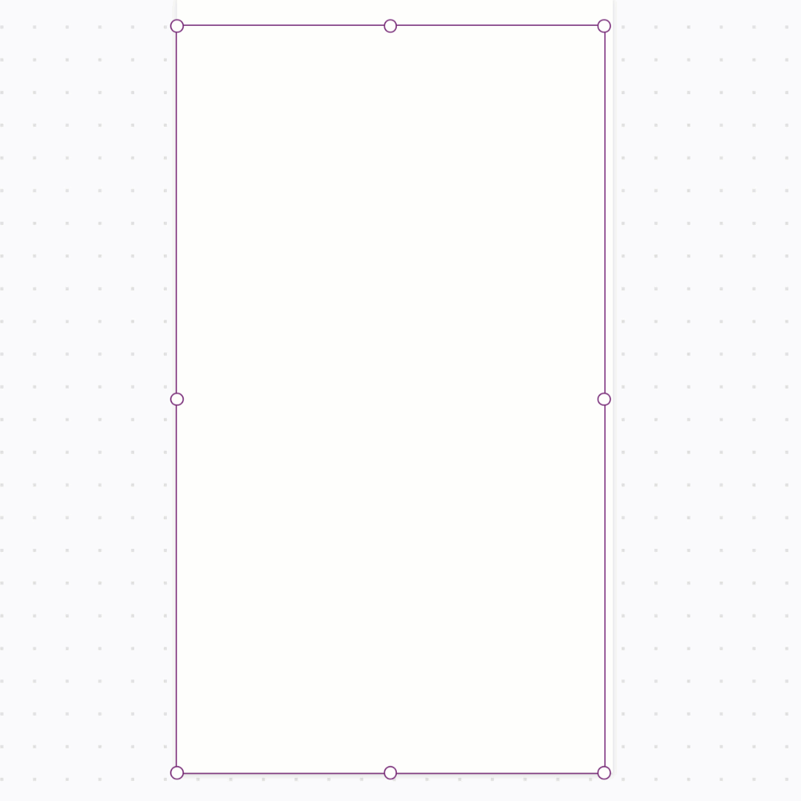
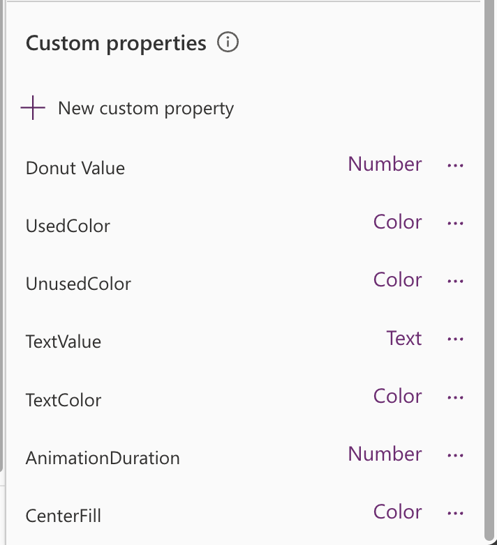
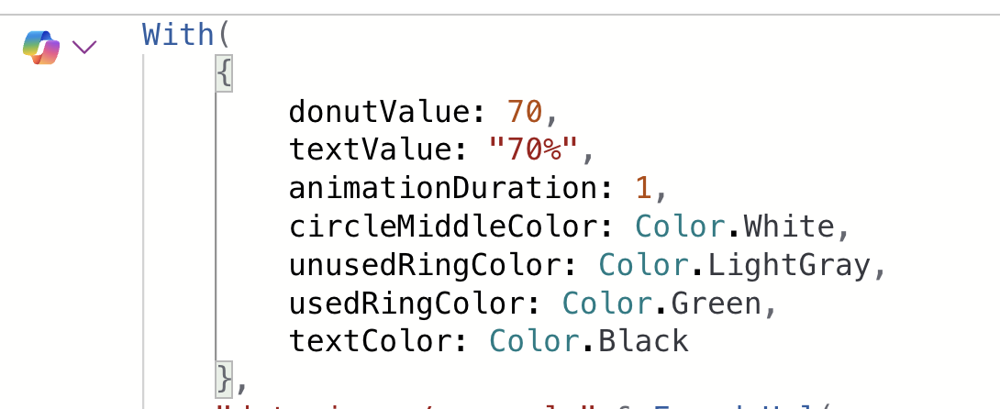

# SVG Donut

This snippet shows how to add an animated SVG donut visual that gets data dynamically from your Power App to show an amount used and amount remaining. 



This is for the donut visual only but this can be used within a gallery along with labels to accomplish a visual like shown below.


## Minimal path to awesome
1. Open your canvas app in **Power Apps**
1. Copy the contents of the **[YAML-file](./source/svg-donut.yaml)** 
1. Right click on the screen where you want to add the snippet and select "Paste YAML"

1. Select the **imgSVGDonut** control and go to the **Image** property
1. Replace the properties in the With section with your values.

## Code

``` YAML
- Image1:
    Control: Image@2.2.3
    Properties:
      BorderColor: =RGBA(0, 18, 107, 1)
      Height: =1096
      Image: |-
        =With(
            {
                donutValue: 70,
                textValue: "70%",
                animationDuration: 1,
                circleMiddleColor: Color.White,
                unusedRingColor: Color.LightGray,
                usedRingColor: Color.Green,
                textColor: Color.Black
            },
            "data:image/svg+xml," & EncodeUrl(
                "<svg width='100%' height='100%' viewBox='0 0 42 42' xmlns='http://www.w3.org/2000/svg'>
          <!-- Donut Center Fill Color. Replace Stroke value with your color value -->
          <circle cx='21' cy='21' r='15.91549430918954'  fill='" & Substitute(
                    JSON(
                        circleMiddleColor,
                        JSONFormat.IgnoreUnsupportedTypes
                    ),
                    Char(34),
                    ""
                ) & "' />
          <!-- Unused portion (full ring). Replace Stroke value with your color value -->
          <circle cx='21' cy='21' r='15.91549430918954' fill='transparent' stroke='" & Substitute(
                    JSON(
                        unusedRingColor,
                        JSONFormat.IgnoreUnsupportedTypes
                    ),
                    Char(34),
                    ""
                ) & "' stroke-width='5'/>
          <!-- Used segment with animation. Replace Stroke value with your color value -->
          <circle cx='21' cy='21' r='15.91549430918954' fill='transparent' stroke-linecap='" & If(
                    donutValue >= 90,
                    "butt",
                    "round"
                ) & "' stroke='" & Substitute(
                    JSON(
                        usedRingColor,
                        JSONFormat.IgnoreUnsupportedTypes
                    ),
                    Char(34),
                    ""
                ) & "' stroke-width='5'
            stroke-dasharray='0 100' stroke-dashoffset='25'>
            <animate attributeName='stroke-dasharray' from='0 100' to='" & donutValue & " " & (100 - donutValue) & "' dur='" & animationDuration & "s' fill='freeze' />
          </circle>
          <!-- Centered percentage text -->
          <text x='50%' y='50%' text-anchor='middle' dy='.3em' font-size='6' font-family='Segoe UI, Helvetica, sans-serif' letter-spacing='0.5px' fill='" & Substitute(
                    JSON(
                        textColor,
                        JSONFormat.IgnoreUnsupportedTypes
                    ),
                    Char(34),
                    ""
                ) & "'>" & textValue & "</text>
        </svg>"
            )
        )
      Width: =627
      Y: =40
```
> **_NOTE:_** The recommended best practice is to utilize this YAML snippet inside of a canvas component for reusability. 
  ## Steps to use as a component
1. Open your Power App in edit mode
1. Select the **components** tab in the tree view

1. Select **New component**
1. Rename your component to something relevant like **SVGDonut**
1. In the **Custom Properties** panel, select **New custom property**. Repeat this 7 times and configure the following properties.

1. Replace the values in the With section of the image property and map them to your component property values.


#### Learn more about YAML and integrating with Components
[](https://www.youtube.com/embed/WWCj1MgYlbM)


