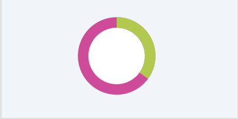
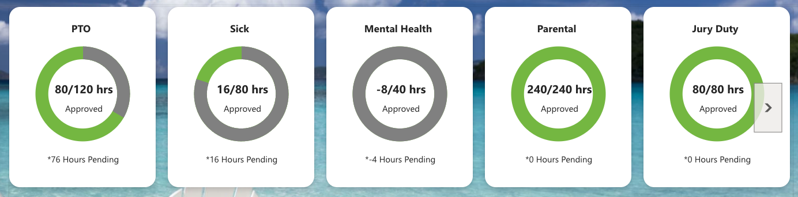
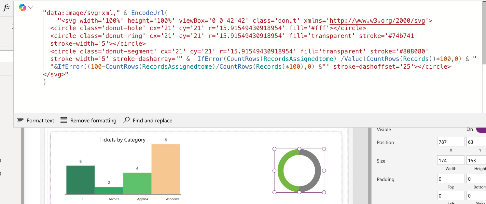
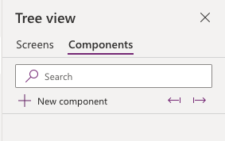
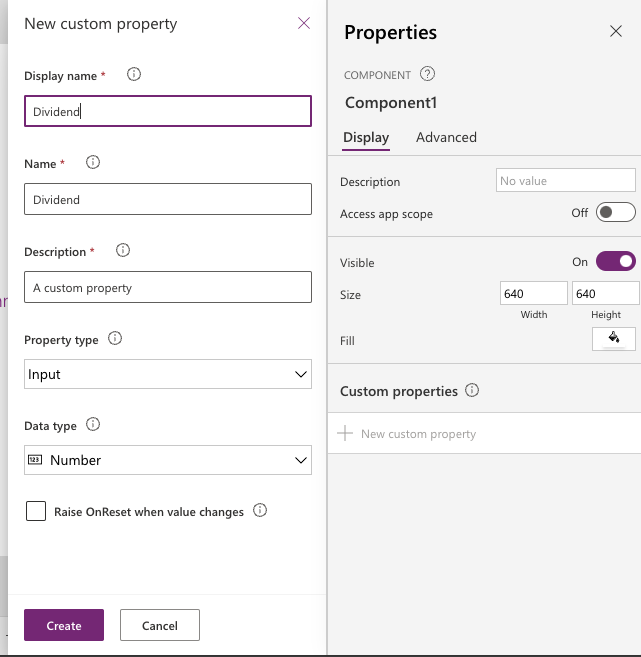
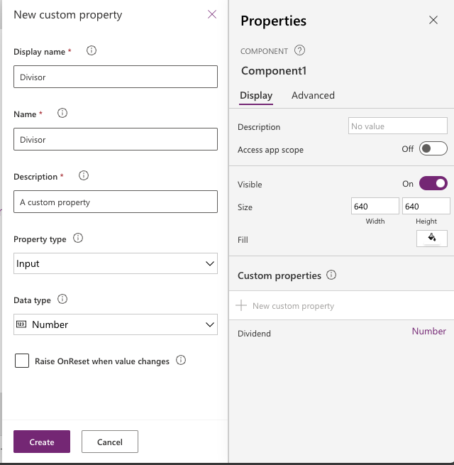
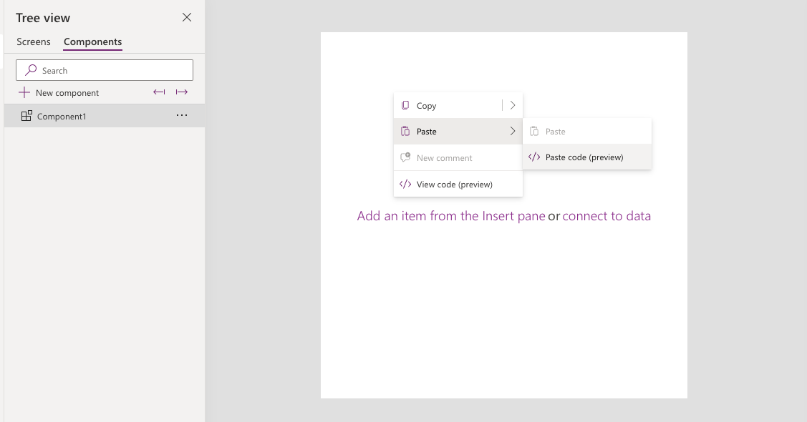
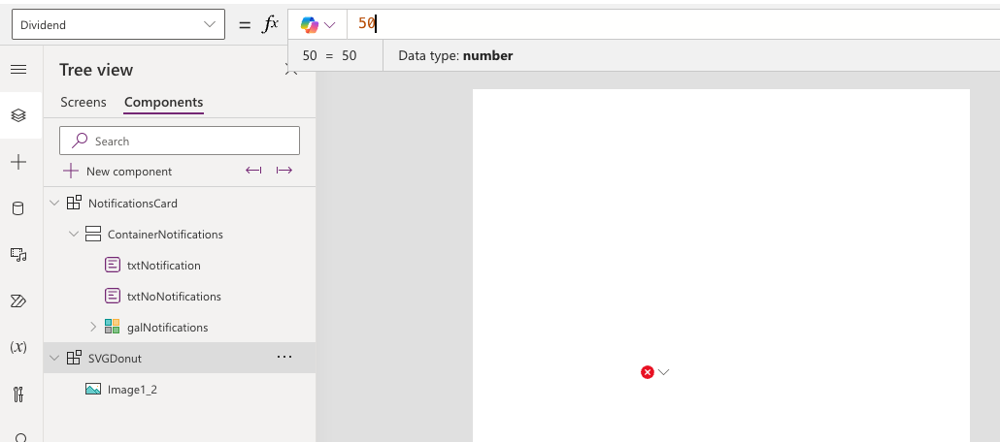
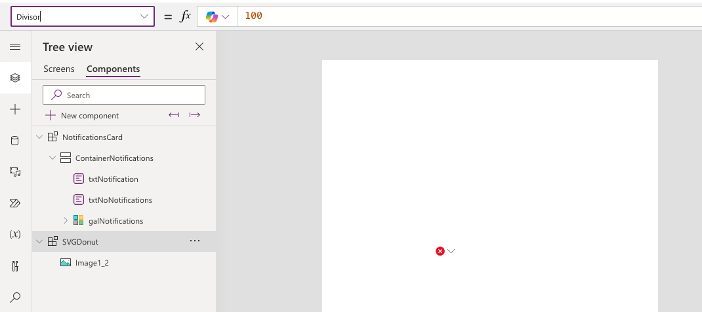
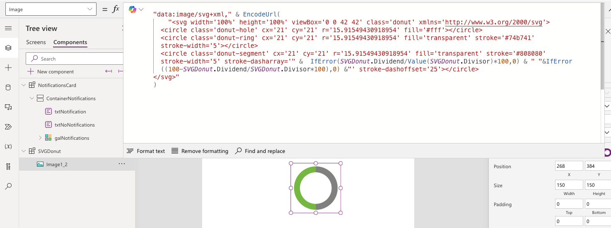

# SVG Donut

This snippet shows how to add an SVG donut visual that gets data dynamically from your Power App to fill in the donut to show an amount used and amount remaining. 

This is for the donut visual only but this can be used within a gallery along with labels to accomplish a visual like shown below.

## Minimal path to awesome
> **_NOTE:_** The recommended best practice is to utilize this YAML snippet inside of a canvas component for reusability. 

1. Open your canvas app in **Power Apps**
1. Copy the contents of the **[YAML-file](./source/svg-donut.yaml)** 
1. Right click on the screen where you want to add the snippet and select "Paste YAML"

1. Select the **imgSVGDonut** control and go to the **Image** property
1. Replace **{ Replace-With-Dividend-Value }** with the **Number value that you want in the dividend of the calculation** 
1. Replace **{ Replace-With-Divisor-Value }** with the **Number value that you want in the divisor of the calculation** 
    
1. Once you replace those values, the SVG donut will appear and be filled in
  

  ## Steps to use as a component
1. Open your Power App in edit mode
1. Select the **components** tab in the tree view

1. Select **New component**
1. Rename your component to something relevant like **SVGDonut**
1. In the **Custom Properties** panel, select **New custom property**
1. For **Display name** input the text **Dividend**
1. Change the **Data type** to **Number**

1. Select **Create**
1. In the **Custom Properties** panel, select **New custom property**
1. For **Display name** input the text **Divisor**
1. Change the **Data type** to **Number**

1. Select **Create**
1. Right click in the component and select **Paste Code**

1. Select the **container object** and go to the **Dividend** property and put in your dividend value

1. Select the **container object** and go to the **Divisor** property and put in your divisor value

1. Select the **imgSVGDonut** control and go to the **Image** property and replace **{REPLACE-WITH-DIVIDEND-VALUE}** with **{INSERT-NAME-OF-YOUR-COMPONENT}.Dividend** and **{REPLACE-WITH-DIVISOR-VALUE}** with **{INSERT-NAME-OF-YOUR-COMPONENT}.Divisor**

