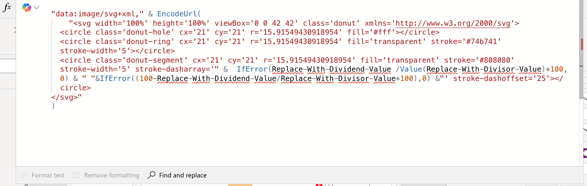

# SVG Donut

This snippet shows how to add an SVG donut visual that gets data dynamically from your Power App to fill in the donut to show an amount used and amount remaining. 

This is for the donut visual only but this can be used within a gallery along with labels to accomplish a visual like shown below.

## Minimal path to awesome

1. Open your canvas app in **Power Apps**
1. Copy the contents of the **[YAML-file](./source/svg-donut.yaml)** 
1. Right click on the screen where you want to add the snippet and select "Paste YAML"

1. Replace **{ Replace-With-Dividend-Value }** with the **Number value that you want in the dividend of the calculation** 
1. Replace **{ Replace-With-Divisor-Value }** with the **Number value that you want in the divisor of the calculation** 
    
1. Once you replace those values, the SVG donut will appear and be filled in
  

