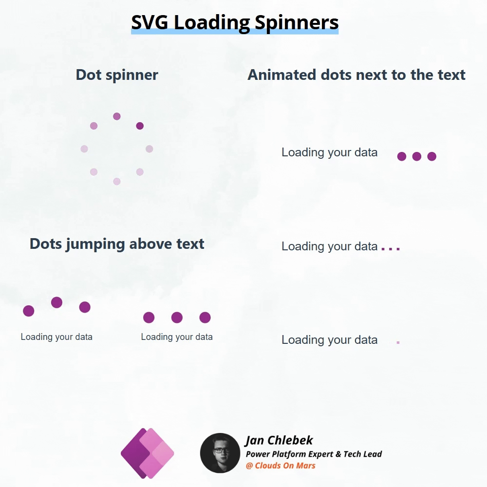
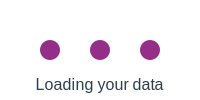

# SVG Loading Spinners

One of the best ways to learn to implement simple, static animations in Canvas Apps - learn SVG! 
SVG is a robust format that allows you to perform vector graphic animations that are compliant with any web-based technology, including Canvas Apps. The simplest way to get started? Start experimenting with loading spinners!
SVG lets you transform objects by moving, rotating, changing opacity, and much more. To best understand it, review some examples, go through some tutorials (highly recommending [w3schools](https://www.w3schools.com/graphics/svg_animation.asp)), and maybe try experimenting with LLMs!

Here are a few examples that may help you get started!

### Dot spinner
- 8 dots with animated opacity ([source](./source/dot_spinner.svg)) 

### Dots jumping above text
- Simple indefinite animation with 3 jumping dots ([source](./source/loading_jumping-above-constant.svg)) 

- Animation with 3 jumping dots, pausing after every 3rd repetition ([source](./source/loading_animation_updated.svg)) 

### Animated dots next to the text
- Jumping dots next to the text ([source](./source/loading_next_to_text.svg)) 

- Jumping dots converted to text format ([source](./source/loading_next_to_text_dot.svg)) 

- Text dots apearing next to the text ([source](./source/loading_next_to_text_dot_appearing.svg)) 

## Authors

Author|Socials
--------|---------
Jan Chlebek | [LinkedIn](https://www.linkedin.com/in/jan-chlebek/) - ([GitHub](https://github.com/jan-chlebek))

## Minimal path to awesome

1. Open your Power App in edit mode
2. Copy the contents of either the **[svg-loading-spinners.pa.yaml](./source/svg-loading-spinners.pa.yaml)**
3. Right-click on the screen where you want to add the snippet and select `Paste`

## Disclaimer

**THIS CODE IS PROVIDED *AS IS* WITHOUT WARRANTY OF ANY KIND, EITHER EXPRESS OR IMPLIED, INCLUDING ANY IMPLIED WARRANTIES OF FITNESS FOR A PARTICULAR PURPOSE, MERCHANTABILITY, OR NON-INFRINGEMENT.**

