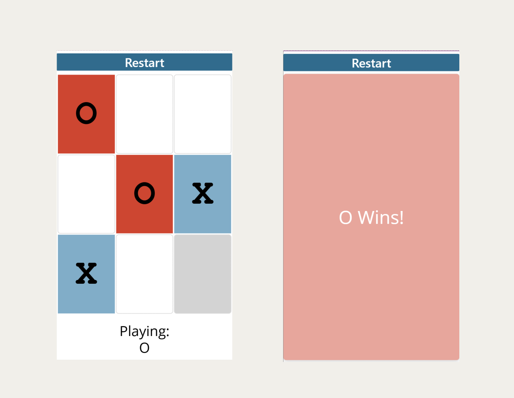

# Tic-Tac-Toe

Just a simple way to challenge your friends or family to a nice (ad-free) game of tic tac toe on your phone.

## Author

Snippet|Author
--------|---------
Nate Halliwell | [YouTube](https://www.youtube.com/playlist?list=PLlQ81_et2aJ-XKx3gVfVl0dQbJU5mUfgf) ([LinkedIn](https://www.linkedin.com/in/natehalliwell/))

## Minimal path to awesome

1. Open your canvas app in **Power Apps**
1. Copy the contents of the **[YAML-file](./source/tic-tac-toe.yaml)**.
1. Right click on the screen where you want to add the snippet and select "Paste Code"
1. Preview the app, and hit the 'Start' button in order to initialize the game.

## Disclaimer

**THIS CODE IS PROVIDED *AS IS* WITHOUT WARRANTY OF ANY KIND, EITHER EXPRESS OR IMPLIED, INCLUDING ANY IMPLIED WARRANTIES OF FITNESS FOR A PARTICULAR PURPOSE, MERCHANTABILITY, OR NON-INFRINGEMENT.**

