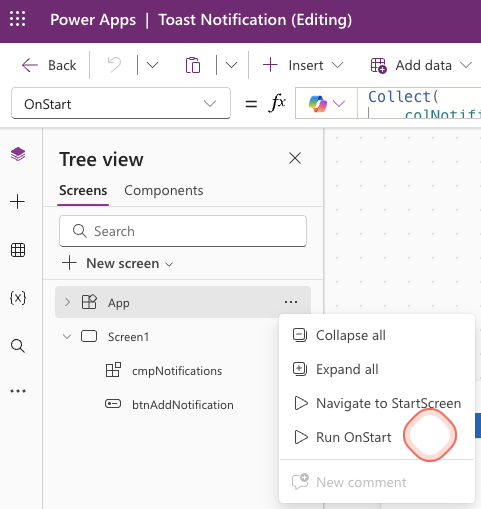

# Toast notifications

This snippet shows you how to build toast notifications for Canvas apps. In this example, we will use a component so that the functionalities are reusable on different screens within your Canvas app.


## Authors

Snippet|Author
--------|---------
Arjan Rijsdijk | [GitHub](https://github.com/arijsdijk) - [Bluesky](https://bsky.app/profile/arjanrijsdijk.com) - [LinkedIn](https://www.linkedin.com/in/arjanrijsdijk/)

## Minimal path to awesome

### Colors

Go to the Formulas property (on App level) and copy the code below

```

nfColors = {

    success: { 
        Primary: ColorValue("#198854"),
        Fill: ColorValue("#d1e8de"), 
        BorderColor: ColorValue("#a3cfbb"),
        Text: ColorValue("#0a3622")
        
    },

    danger: { 
        Primary: ColorValue("#dc3646"),
        Fill: ColorValue("#f8d8da"), 
        BorderColor: ColorValue("#f2aeb6"),
        Text: ColorValue("#0a3622")
    }, 

    warning: { 
        Primary: ColorValue("#ffc205"),
        Fill: ColorValue("#fff3cd"), 
        BorderColor: ColorValue("#ffe69c"),
        Text: ColorValue("#664d03")
        
    },  

    info: { 
        Primary: ColorValue("#0ecaf1"),
        Fill: ColorValue("#d0f4fd"), 
        BorderColor: ColorValue("#9eebf9"),
        Text: ColorValue("#055160")
        
    }   

};

```


### Example data

Go to the OnStart property (on App level) and copy the code below

```

Collect(
    colNotifications,
    {
        ID: GUID(),
        Title: "Success notification",
        Text: "This is a notification of type Success",
        Severity: "success",
        isVisible: true
    },
    {
        ID: GUID(),
        Title: "Danger notification",
        Text: "This is a notification of type Danger",
        Severity: "danger",
        isVisible: true
    },
    {
        ID: GUID(),
        Title: "Warning notification",
        Text: "This is a notification of type Warning",
        Severity: "warning",
        isVisible: true
    },
    {
        ID: GUID(),
        Title: "Info notification",
        Text: "This is a notification of type Info",
        Severity: "info",
        isVisible: true
    }
)

```


Don't forget to run OnStart, so that the collection will be created




### Component

1. Go to your canvas app in **Power Apps** 
2. Go to Tree view and click **Components**
3. Click **New component**
4. Name your component
5. Set the width and height to 400 x 700
6. Enable the Access app scope option


Now open the just created component and paste the YAML code below.

## Code

```yaml

- galNotifications:
    Control: Gallery@2.15.0
    Variant: Vertical
    Properties:
      Height: =Parent.Height
      Items: =colNotifications
      TemplatePadding: =16
      TemplateSize: |
        =104
      Width: =Parent.Width
    Children:
      - conNotification:
          Control: GroupContainer@1.3.0
          Variant: ManualLayout
          Properties:
            BorderColor: |-
              =Switch( 
                  ThisItem.Severity, 

                  "success",
                  nfColors.success.BorderColor,

                  "danger",
                  nfColors.danger.BorderColor,

                  "warning",
                  nfColors.warning.BorderColor,

                  nfColors.info.BorderColor
              )
            BorderThickness: =1
            DropShadow: =DropShadow.Regular
            Fill: |-
              =Switch( 
                  ThisItem.Severity, 

                  "success",
                  nfColors.success.Fill,

                  "danger",
                  nfColors.danger.Fill,

                  "warning",
                  nfColors.warning.Fill,

                  nfColors.info.Fill
              )
            Height: =Parent.TemplateHeight
            Width: =Parent.TemplateWidth
          Children:
            - btnNotificationHide:
                Control: Button@0.0.45
                Properties:
                  Appearance: ='ButtonCanvas.Appearance'.Transparent
                  FontColor: |-
                    =Switch( 
                        ThisItem.Severity, 

                        "success",
                        nfColors.success.Primary,

                        "danger",
                        nfColors.danger.Primary,

                        "warning",
                        nfColors.warning.Primary,

                        nfColors.info.Primary
                    )
                  Height: =24
                  Icon: ="Dismiss"
                  IconStyle: ='ButtonCanvas.IconStyle'.Filled
                  Layout: ='ButtonCanvas.Layout'.IconOnly
                  Width: =24
                  X: =Parent.Width - 40
                  Y: =16
            - lblNotificationText:
                Control: Text@0.0.51
                Properties:
                  AutoHeight: =true
                  FontColor: |-
                    =Switch( 
                        ThisItem.Severity, 

                        "success",
                        nfColors.success.Text,

                        "danger",
                        nfColors.danger.Text,

                        "warning",
                        nfColors.warning.Text,

                        nfColors.info.Text
                    )
                  Height: =24
                  Size: =13
                  Text: =ThisItem.Text
                  VerticalAlign: =VerticalAlign.Middle
                  Weight: ='TextCanvas.Weight'.Regular
                  Width: |+
                    =Parent.Width - 96

                  X: =48
                  Y: =40
            - lblNotificationTitle:
                Control: Text@0.0.51
                Properties:
                  FontColor: |-
                    =Switch( 
                        ThisItem.Severity, 

                        "success",
                        nfColors.success.Primary,

                        "danger",
                        nfColors.danger.Primary,

                        "warning",
                        nfColors.warning.Primary,

                        nfColors.info.Primary
                    )
                  Height: =24
                  Size: =13
                  Text: =ThisItem.Title
                  VerticalAlign: =VerticalAlign.Middle
                  Weight: ='TextCanvas.Weight'.Bold
                  Width: |+
                    =Parent.Width - 96

                  X: =48
                  Y: =16
            - icoNotification:
                Control: Icon@0.0.7
                Properties:
                  Height: =24
                  Icon: |-
                    =Switch( 
                        ThisItem.Severity, 

                        "success",
                        "CheckmarkCircle",

                        "danger",
                        "DismissCircle",

                        "warning",
                        "Warning",

                        "Info"
                    )
                  IconColor: |-
                    =Switch( 
                        ThisItem.Severity, 

                        "success",
                        nfColors.success.Primary,

                        "danger",
                        nfColors.danger.Primary,

                        "warning",
                        nfColors.warning.Primary,

                        nfColors.info.Primary
                    )
                  IconStyle: ='Icon.IconStyle'.Filled
                  Width: =24
                  X: =16
                  Y: =16
            - recNotification:
                Control: Rectangle@2.3.0
                Properties:
                  Fill: |-
                    =Switch( 
                        ThisItem.Severity, 

                        "success",
                        nfColors.success.Primary,

                        "danger",
                        nfColors.danger.Primary,

                        "warning",
                        nfColors.warning.Primary,

                        nfColors.info.Primary
                    )
                  Height: =104
                  Width: =6

```

Or you can use this [YAML-file](./source/toast-notification.pa.yml)

## Related

For a complete guide chech out the article on [LinkedIn](https://www.linkedin.com/pulse/toast-notifications-arjan-rijsdijk-lukee/)