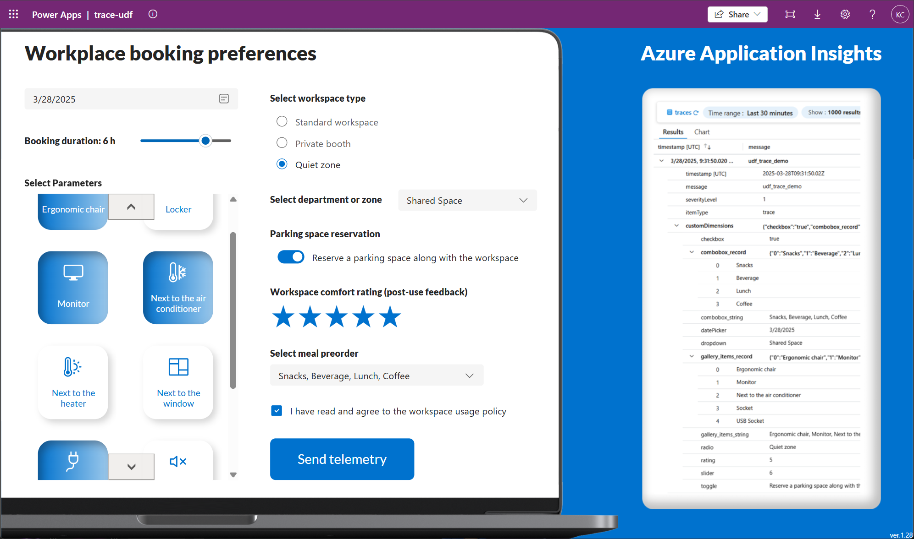
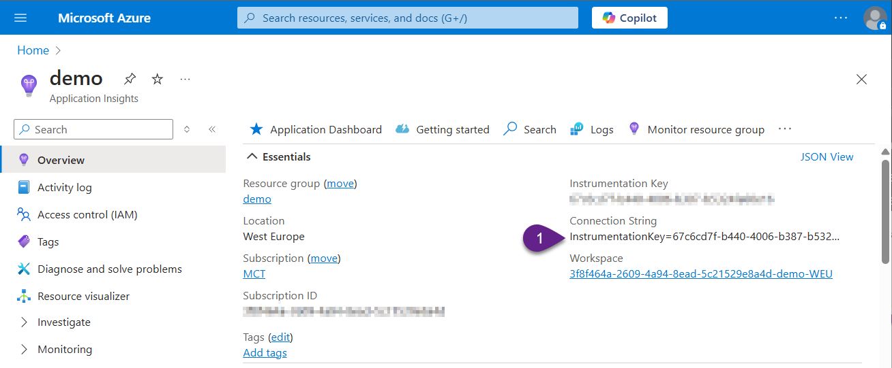
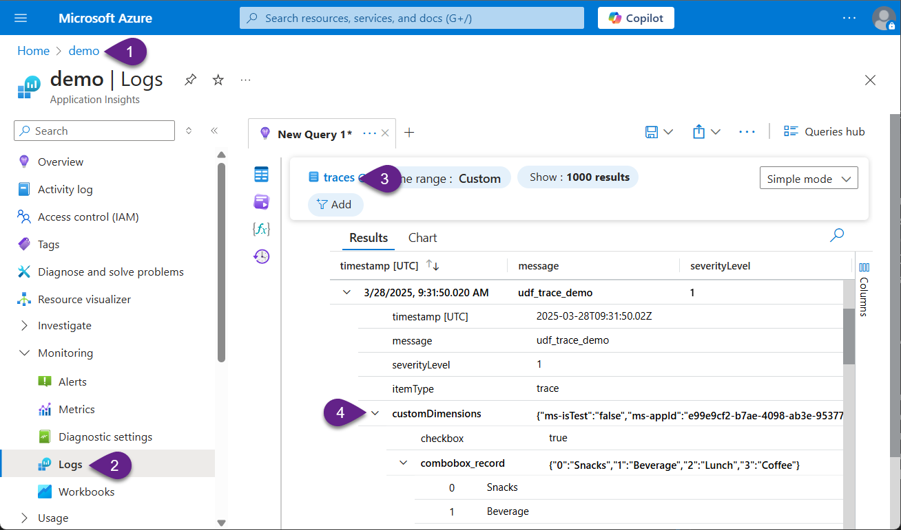

# Send telemetry logs with User Defined Functions to Azure Application Insights

This snippet demonstrates how to implement telemetry logging in Power Apps using User Defined Functions (UDFs) and Azure Application Insights. It showcases the definition and application of UDFs to efficiently manage and send telemetry data.

## Problem statement

Telemetry collection is crucial for developing and enhancing apps. In Power Apps, developers use the `Trace()` function to send telemetry logs to Azure Application Insights.

However, using this function independently often results in inconsistencies in trace parameters, message formats, and severity levels. These variations can lead to errors and lack a standardized approach, affecting the reliability and usefulness of the data collected. Additionally, without properly preparing the data for logging, it could also cause redundant nests, making the logs harder to parse and analyze effectively.

## Solution

By implementing a standardized `User Defined Function (UDF)` for telemetry, it's possible to ensure consistent data collection, minimize errors, and improve the analysis and utility of application insights.

## Authors

Author|Socials
--------|---------
Katerina Chernevskaya | [GitHub](https://github.com/Katerina-Chernevskaya/) - [LinkedIn](https://www.linkedin.com/in/katerinachernevskaya/)

## Prerequisites

1. Existing Azure Application Insights resource. Add Azure Application Insights **Connection String** into the Power Apps Canvas app.

2. Make sure that experimental features are enabled: 
   - User-defined functions
   - User-defined types
   

2. Power Apps Canvas app with the following controls (name the controls the same as in the list below):
   - DatePicker
   - Slider
   - Gallery
   - RadioGroup
   - Dropdown
   - Toggle
   - Rating
   - Combobox
   - Checkbox
   - Button

## Minimal path to awesome

1. Open your Power App in edit mode
2. Copy the contents of the **[udf.fx](./source/udf.fx)**
3. Add the copied code into `Formula` property on the `App` level
4. Copy the contents of the **[onselect.fx](./source/onselect.fx)**
5. Insert the copied code into the `OnSelect` property of the Button
6. Save the app and publish it
7. Play the app, test the button to send telemetry to Azure Application Insights
8. Navigate to the Azure Application Insights resource. Open the `Logs` under `Monitoring`. Select `trace` table. You will see the collected telemetry under the `customDimensions`

## Disclaimer

**THIS CODE IS PROVIDED *AS IS* WITHOUT WARRANTY OF ANY KIND, EITHER EXPRESS OR IMPLIED, INCLUDING ANY IMPLIED WARRANTIES OF FITNESS FOR A PARTICULAR PURPOSE, MERCHANTABILITY, OR NON-INFRINGEMENT.**

